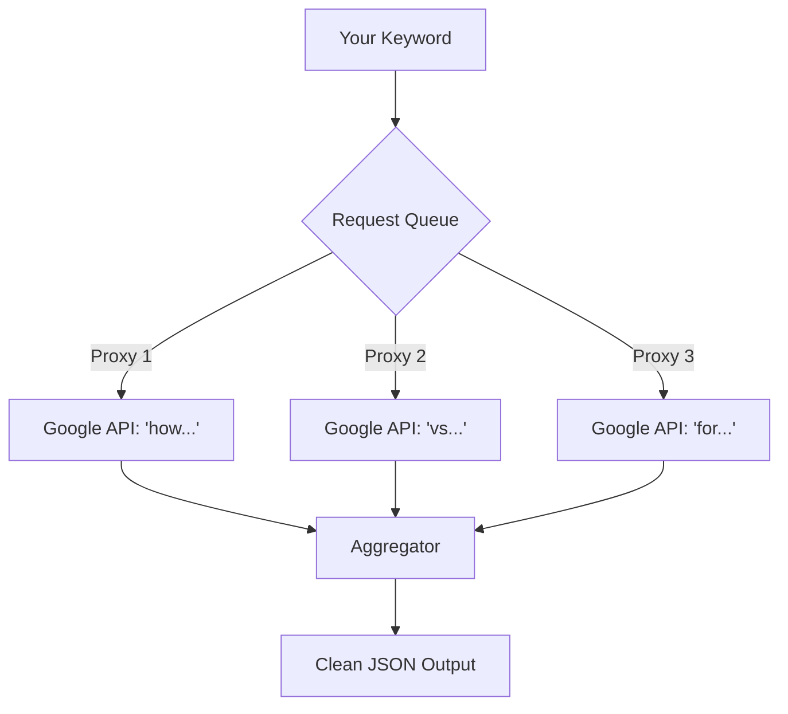

# Deep Dive: The Autocomplete Scraping Mechanism

Understanding how Answer the Public works requires looking under the hood of search engines. It relies on a feature called **Google Suggest** (or Autocomplete), which was originally designed to reduce typing latency for users.

## The Autocomplete API

When you type in Google, your browser sends a request to an endpoint similar to this:

```http
GET https://suggestqueries.google.com/complete/search?client=chrome&q=marketing%20automation
```

Google returns a JSON response with predictions based on:
1.  **Global Search Volume**: What most people search for.
2.  **Freshness**: Recent trending topics.
3.  **Localization**: Queries relevant to your IP address.

## The "Wildcard" Technique

The secret sauce of tools like ATP is the systematic use of **wildcards** and **modifiers**.

Instead of just querying `marketing automation`, the scraper iterates through:

*   `marketing automation a...`
*   `marketing automation b...`
*   `marketing automation for...`
*   `marketing automation vs...`

### The Combinatorial Explosion

For a single keyword, the system might generate:
*   26 Alphabetical variations
*   10 Question modifiers (who, what, where...)
*   12 Preposition modifiers (for, with, without...)

Total API calls = ~50 requests per keyword.

## Challenges in Scraping

Building your own scraper for this is difficult due to:

1.  **Rate Limiting**: Google will block your IP after ~50 rapid requests.
2.  **Geo-Targeting**: You need residential proxies to see what users in London vs. New York see.
3.  **Parsing**: The JSON structure changes occasionally.

## The Apify Solution

Our **Answer the Public Actor** handles this complexity for you.

*   **Proxy Rotation**: We use a pool of residential proxies to prevent IP bans.
*   **Browser Fingerprinting**: We emulate real user behavior to avoid detection.
*   **Queue Management**: We handle the concurrency of thousands of requests.



By abstracting this infrastructure, we allow you to focus on the *data*, not the *scraping*.
