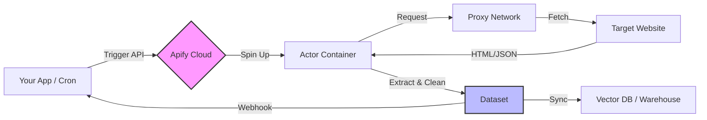

## The Automation Layer

Modern data stacks require more than just APIs; they need a robust **Automation Layer** to handle the messy reality of the web. Apify Actors are serverless cloud programs that bridge the gap between unstructured web data and your structured database.

We build and maintain production-ready Actors that solve complex data extraction challenges, allowing you to focus on analysis rather than infrastructure.

<div className="grid grid-cols-1 md:grid-cols-2 gap-6 my-8 not-prose">
  <Card title="Serverless" icon="server">
    Zero infrastructure management. Auto-scaling containers.
  </Card>
  <Card title="Bypass Limits" icon="shield-halved">
    Built-in proxy rotation and fingerprint management.
  </Card>
  <Card title="Universal API" icon="code">
    Control everything via REST API or Python/Node.js SDKs.
  </Card>
  <Card title="Integrations" icon="puzzle-piece">
    Native connectors for Pinecone, LangChain, and Zapier.
  </Card>
</div>

## Production-Ready Actors

Our public actors are engineered for reliability and scale. They handle the complexities of anti-bot systems, CAPTCHAs, and dynamic content rendering.

<CardGroup cols={2}>
  <Card
    title="Answer the Public Scraper"
    icon="magnifying-glass"
    href="/apify-actors/answer-the-public"
  >
    **SEO Intelligence**: Extract unlimited keyword visualizations, questions, and prepositions. Bypasses the 1-search daily limit.
  </Card>
  <Card
    title="Google Ads Scraper"
    icon="google"
    href="#"
  >
    **Ad Intelligence**: Monitor competitor ad copy, keywords, and landing pages across any geography.
  </Card>
</CardGroup>

## Architecture: The Data Pipeline

Apify Actors sit between the raw web and your application logic. They act as intelligent agents that fetch, process, and normalize data before it ever hits your system.



## Developer Experience

Integrating an Actor is as simple as calling an API endpoint. You don't need to worry about headless browsers, memory leaks, or IP bans.

### Python SDK Example

```python
from apify_client import ApifyClient

# Initialize the client
client = ApifyClient("YOUR_API_TOKEN")

# Prepare the Actor input
run_input = {
    "keywords": ["generative ai", "llm"],
    "country": "US",
}

# Run the Actor and wait for it to finish
run = client.actor("deadlyaccurate/answer-the-public").call(run_input=run_input)

# Fetch and print Actor results from the run's dataset (if there are any)
for item in client.dataset(run["defaultDatasetId"]).iterate_items():
    print(item)
```

## Enterprise Solutions

Need a custom automation solution? We build bespoke Actors for:

*   **Market Intelligence**: Real-time pricing and inventory monitoring.
*   **Lead Generation**: Automated enrichment pipelines.
*   **Compliance**: Automated audit and verification trails.

[Contact our engineering team](/contact) to discuss your requirements.
