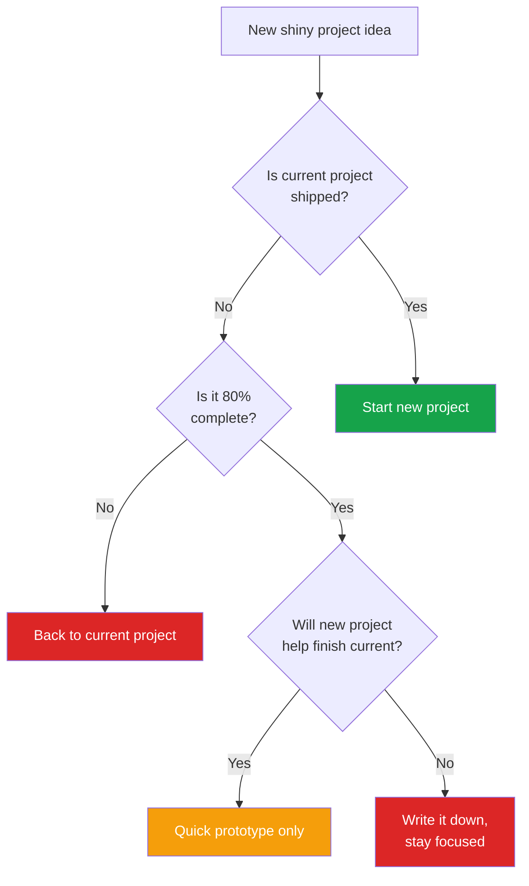

_Published: May 18, 2025_

Ten years ago, I couldn't explain what I did for a living. Today, I run a successful consultancy solving problems that don't fit in neat boxes. Here's what I've learned about building a career when you're good at many things—including the parts nobody talks about.

<Info>
"A human being should be able to change a diaper, plan an invasion, butcher a hog, conn a ship, design a building, write a sonnet, balance accounts, build a wall, set a bone, comfort the dying, take orders, give orders, cooperate, act alone, solve equations, analyze a new problem, pitch manure, program a computer, cook a tasty meal, fight efficiently, die gallantly. Specialization is for insects."
— Robert Heinlein
</Info>

## The Reality of Being Multi-Disciplinary

If you're reading this, you probably don't fit the traditional specialist mold. You code, but you also design. You strategize, but you also execute. You understand business, tech, and creative work at levels that make you dangerous in all three.

Traditional career advice doesn't work for you. Here's what does.

## First, The Dark Side Nobody Mentions

Let's be honest about what sucks before we talk solutions.

### The Curse of Infinite Optionality

<Warning>
When you can do anything, everything looks interesting. You're like someone at an all-you-can-eat buffet who keeps filling their plate because every dish looks amazing.
</Warning>

You end up:

- **Starting 10 projects, finishing 2**. That GitHub graveyard of half-built ideas? I see you.
- **Talking yourself out of perfectly good ideas** because you can see 47 different ways to execute and can't pick one
- **Analysis paralysis on steroids**. You don't just overthink—you overthink across multiple domains simultaneously
- **Decision fatigue by 10am** because you've already evaluated today's work through lenses of technical feasibility, business value, user experience, market timing, and personal interest

### The Impostor Syndrome Multiplier

Regular impostor syndrome: "Am I good enough at this?"
Multi-disciplinary impostor syndrome: "Am I good enough at this, that, those, and whatever the hell I'm doing tomorrow?"

You're comparing yourself to specialists in five different fields. Of course you feel behind—you're running five races at once.

### The Context-Switching Tax

Your brain is a browser with 73 tabs open. Sure, you can jump between design, code, strategy, and client calls, but each switch costs you 15-20 minutes of ramp-up time. By day's end, you've spent 2 hours just switching contexts.

### The "Jack of All Trades" Dismissal

People will literally use this phrase to your face, usually followed by "master of none." They'll assume you're mediocre at everything rather than excellent at integration. You'll watch less capable specialists get promoted because they're easier to categorize.

Now that we've acknowledged the elephant in the room, here's how to turn these challenges into advantages.

<Tip>
"Jack of all trades, master of none, but oftentimes better than a master of one." — The complete proverb they don't want you to know
</Tip>

## Strategy 1: Build Your Own Category (And Own It)

Instead of fitting into existing roles, I created my own. When clients asked what I do, I stopped trying to squeeze into "developer" or "consultant."

**The shift:** From "I do X, Y, and Z" to "I solve problems that require X, Y, and Z."

Here's the exact script that changed everything:

**Old way:** "I'm a developer who also does product strategy and some design work."
**New way:** "I solve complex problems that span multiple departments. Last month, I helped a fintech startup fix a retention problem that turned out to be 20% UX, 30% backend architecture, and 50% misaligned business model."

**Tactical tip:** Create a one-page "Problem Portfolio" instead of a traditional portfolio. Structure it like this:
- **The Mess:** What was broken (across departments)
- **The Discovery:** What others missed (because they only looked at one angle)
- **The Integration:** How you connected the dots
- **The Outcome:** Measurable business impact

This positioning immediately attracts the right clients—ones with messy, interesting challenges that specialists can't handle alone. They don't care about your job title; they care that you've solved something similar to their chaos.

## Strategy 2: Stack Skills Deliberately (The 70/20/10 Rule)

Being good at everything is a trap. Being exceptional at 3-4 complementary things is a superpower.

<CardGroup cols={3}>
  <Card title="70%" icon="code">
    **Deep expertise** in 2-3 core skills (systems architecture, full-stack development)
  </Card>
  <Card title="20%" icon="lightbulb">
    **Working knowledge** in adjacent fields (business strategy, data analysis, UX)
  </Card>
  <Card title="10%" icon="eye">
    **Awareness** of everything else (legal, sales, marketing basics)
  </Card>
</CardGroup>

This prevents the "shiny object syndrome" while keeping doors open.

**My current stack and why:**
- **Technical execution** (can build it) — This is my credibility anchor. When I can actually build what I strategize about, people listen differently.
- **Systems thinking** (can architect it) — This lets me see how changing one thing affects everything else. Worth its weight in gold during planning.
- **Business strategy** (can sell it) — Understanding unit economics, TAM, and burn rate means I build things that actually matter to the business.
- **Clear communication** (can explain it) — If you can't explain the technical to the CEO and the business to the engineer, your other skills are worthless.

**How to find your stack:**
1. List the last 5 problems that genuinely excited you
2. Identify which 3-4 skills showed up in all of them
3. Those are your core. Everything else is nice-to-have.

**The "Hell Yes or No" filter:** When a new skill tempts you, ask: "Will this multiply my existing stack's value by at least 2x?" If not, it's a distraction dressed as an opportunity.

## Strategy 3: Document Your Range (The Integration Story Method)

<Note>
"The polymath not only moves between different spheres or different fields and disciplines, but seeks fundamental connections between those fields, so as to give them a unique insight into each of them."
— Waqas Ahmed
</Note>

Specialists have portfolios. You need a **problem archive** that shows how your range creates value.

**The Integration Story template that gets clients calling:**

**Opening:** "The CMO wanted better conversion. The CTO wanted lower costs. They were solving different problems."

**The Twist:** "I discovered their conversion problem was actually a data pipeline issue. The checkout flow was fine—the recommendation engine was serving products from cached data that was 3 days old."

**The Integration:** "Fixed the pipeline (technical), redesigned the recommendation logic (product), and created a real-time dashboard so marketing could see what they were actually promoting (business)."

**The Outcome:** "42% conversion increase, 60% reduction in cache-related support tickets, and the CMO and CTO are finally in the same meetings."

**How to build your archive:**
1. **Keep a decision journal** - Document why you approached problems from multiple angles
2. **Screenshot the chaos** - Before/after Slack threads, confused email chains, contradictory requirements docs
3. **Track the ripple effects** - Show how solving one thing fixed three others
4. **Get specific about savings** - "Prevented 3 additional hires" hits harder than "improved efficiency"

**Pro tip:** Create a simple site with 5-6 of these stories. Don't call it a portfolio—call it "Problems I've Untangled" or "Complex Fixes." You want visitors thinking "I have that exact mess" not "nice work."

## Strategy 4: Find Your People (And Avoid the Wrong Ones)

**Where multi-disciplinary people thrive:**

<CardGroup cols={2}>
  <Card title="Series A/B Startups" icon="rocket">
    **Sweet spot:** 20-100 employees

    **Why:** Big enough for real problems, small enough for fluid roles

    **Look for:** "We need someone who can..." with 3+ departments

    **Red flag:** "Ninja/rockstar/unicorn" = wants everything, pays nothing
  </Card>

  <Card title="Innovation Teams" icon="sparkles">
    **Target:** Large corps needing transformation

    **Why:** Budget + need for corporate/startup translator

    **Titles:** Innovation Lead, Transformation Manager

    **Entry:** Consulting → full-time conversion
  </Card>

  <Card title="Technical Leadership" icon="users">
    **Formula:** 20% code, 40% architecture, 40% psychology

    **Look for:** Player-coach, Working Manager roles

    **Warning:** Verify they want actual coding, not just "staying technical"
  </Card>

  <Card title="Your Own Consultancy" icon="briefcase">
    **Why:** You define the problems

    **Reality:** First year is rough, need 6-12 months runway

    **Success metric:** Clients calling for undefined problems
  </Card>
</CardGroup>

**Where to avoid:**

- **Large companies with rigid hierarchies** - You'll suffocate in a single box
- **Pure specialist teams** - They'll resent your range as "lack of focus"
- **Companies that say "we need a generalist"** - Usually means "we need someone cheap to do everything"

**The LinkedIn hack that works:** Search for people with 3+ previous roles at their current company. They're either multi-disciplinary or the company values range. Either way, that's your target.

## Strategy 5: Price for Value, Not Hours (The Integration Premium)

Multi-disciplinary work creates exponential value. Price it accordingly.

**The math that changed my business:**

<Tabs>
  <Tab title="Traditional Approach">
    ```
    Specialist developer: $150/hour
    Specialist designer: $150/hour
    Specialist strategist: $200/hour
    Coordination overhead: $100/hour
    -----------------------------------
    Total: $600/hour + communication delays
    ```
  </Tab>
  <Tab title="Integrated Approach">
    ```
    Multi-disciplinary professional: $400/hour
    No coordination needed: $0
    No communication delays: Priceless
    -----------------------------------
    Total: $400/hour + faster delivery
    ```
  </Tab>
</Tabs>

**I'm "expensive" but cheaper than three people who don't talk to each other.**

**How I made the switch:**

1. **Stopped talking time, started talking outcomes**
   - Old: "I'll work on this for 40 hours"
   - New: "I'll solve your conversion problem. Based on similar projects, investment is $20k"

2. **The Discovery Paid Audit**
   - Charge $2-5k for a week-long audit across all departments
   - Deliver a report showing problems they didn't know were connected
   - 80% convert to full projects because you just scared the hell out of them

3. **The "Integration Tax" principle**
   - Add 30-50% to your rate for every additional domain involved
   - Justify it: "The value isn't in doing three things—it's in making them work together"

4. **Package the unsexy work**
   - Create "Problem Sprints": $15-25k for 2 weeks of intensive untangling
   - "System Audits": $5-10k to find what's broken across departments
   - "Bridge Building": $30k+ to fix communication between teams/systems

**Client script that works:**
"I don't charge by the hour because the value I provide isn't measured in time. Last client saved $200k in prevented hires and increased revenue by $1.2M because I saw connections their three agencies missed. Your investment would be..."

## Strategy 6: Embrace the Translation Work (And Get Paid For It)

Your superpower isn't just doing multiple things—it's making different specialists understand each other.

**Real examples of translation wins:**

**Engineering ↔ Design**
- Designer: "We need this animation"
- Engineer: "That's 3 weeks of work"
- You: "We can get 90% of the effect with CSS instead of canvas. Here's how..."
- Result: Ships in 2 days

**Product ↔ Sales**
- Sales: "Clients keep asking for feature X"
- Product: "That's not on the roadmap"
- You: "They don't want X, they want outcome Y. Our existing feature Z does this if we change the onboarding"
- Result: 30% increase in activation, no new features built

**CEO ↔ CTO**
- CEO: "Why is this taking so long?"
- CTO: "Technical debt and infrastructure"
- You: "We're paying 18% interest on shortcuts from 2019. Here's a visual showing how fixing this saves 3 months next year"
- Result: CEO approves refactor, CTO gets resources

**How to make translation visible and valuable:**

1. **Document prevented disasters**
   - "Caught this before design spent 2 weeks on impossible UI"
   - "Aligned teams before we built the wrong thing"

2. **Create translation artifacts**
   - Technical specs with business context
   - Business requirements with technical constraints
   - Design systems that engineering actually uses

3. **Run "Alignment Audits"**
   - Interview each department about the same project
   - Show where they're solving different problems
   - Charge $5k to prevent $500k mistakes

4. **Become the "pre-meeting"**
   - Be the person leaders talk to before the big meeting
   - They're not paying for advice—they're paying to not look stupid

**The power move:** Offer to run cross-functional workshops. $10k for a day where you get everyone in a room and translate live. Half therapy session, half strategic planning, pure value.

## How to Manage the Dark Side (Practical Tactics That Actually Work)

Remember those challenges from the beginning? Here's how I manage them:

### For Analysis Paralysis:

**The "Good Enough" Timer**
- Set 25-minute timer for decisions
- When it rings, go with your gut
- You can always iterate later (you will anyway)

**The 3-Option Cap**
- Never evaluate more than 3 approaches
- If a 4th appears, it must replace one of the existing 3
- This forces prioritization, not just addition

### For Project ADHD:



**The "One Thing Shipped" Rule**
- Can't start new project until something ships
- "Ship" = in production, published, or delivered to client
- GitHub repos don't count. Deployed products do.

**The Energy Audit**
- Track energy, not time
- Work on hard problems when fresh
- Save mindless tasks for mental valleys
- Switch contexts at natural energy breaks, not arbitrary time blocks

### For Impostor Syndrome:

**The "Compared to What?" Check**
- Stop comparing your skill #3 to someone's skill #1
- Compare integrated solutions, not individual skills
- Your 80% in three areas often beats their 95% in one

**The Teaching Test**
- Can you teach it to someone else?
- Then you know it well enough
- Perfect mastery is procrastination in disguise

### For Context-Switching:

**The Batch Protocol**
- Monday/Tuesday: Deep technical work
- Wednesday: Meetings and communication
- Thursday/Friday: Strategy and creative
- Adjust to your rhythm, but batch similar work

**The 15-Minute Bridge**
- End each work session by writing next steps
- Start each session by reading those notes
- Saves 80% of context-switching time

## The Payoff (With Real Numbers)

<Accordion title="See the actual metrics from 5 years of this approach">
  <CardGroup cols={2}>
    <Card title="70%" icon="x-mark">
      **Projects turned down** because I can afford to be picky
    </Card>
    <Card title="90%" icon="user-group">
      **Clients from referrals**, 0% from job boards
    </Card>
    <Card title="3.5x" icon="chart-line">
      **Income multiplier** vs my last specialist salary
    </Card>
    <Card title="4" icon="building">
      **Industries served** in one year (fintech, healthcare, SaaS, e-commerce)
    </Card>
  </CardGroup>
</Accordion>

But the real payoff? I no longer explain what I do. I show what I've fixed.

<Info>
"In a world that's changing faster than ever, the ability to learn across fields is invaluable. The jack of all trades is no longer a master of none but a master of many."
— David Epstein, Range
</Info>

## Your Next Steps (Do These Today)

<Steps>
  <Step title="The Immediate Win">
    Find one project where you used 3+ skills. Write a 200-word story about it. Focus on the problem, not your skills.
  </Step>

  <Step title="The Stack Decision">
    List your top 10 skills. Circle the 3-4 that appear in your favorite projects. Let the others go (for now).
  </Step>

  <Step title="The First Outreach">
    Find a company with a job posting that lists 3+ departments. Send them your cross-functional project story. Offer a specific insight about their challenge.
  </Step>

  <Step title="The Integration Project">
    Build something small that requires multiple skills. A dashboard that needs backend + frontend + design. Document the build process. Ship it this week, not next month.
  </Step>
</Steps>

## The Final Truth

Being multi-disciplinary isn't about being overlooked. It's about playing a different game entirely.

Specialists compete on depth. You compete on connections.
They solve defined problems. You solve problems that don't have names yet.
They climb ladders. You build bridges.

The world has enough specialists. What it needs—what it will pay premium for—are people who can see the whole system, understand all its parts, and make them work together.

That buffet metaphor from earlier? You're not getting too full to enjoy any meal. You're the chef who knows how to combine flavors others don't even know exist.

The specialists can have their lanes. You're building the entire highway system.

**Welcome to the intersection. Population: profitable.**