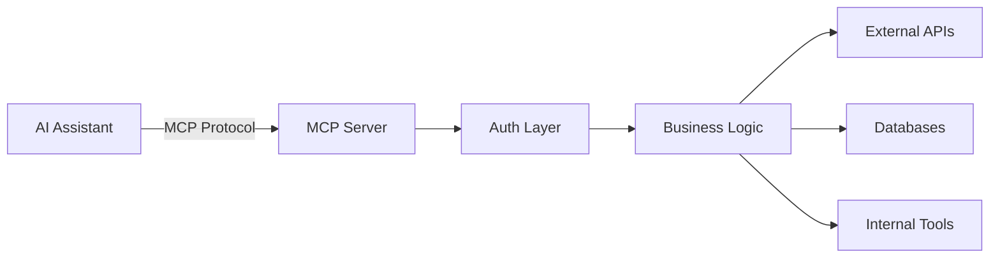

## Connect AI Directly to Your Business Systems

MCP (Model Context Protocol) is Anthropic's new standard for connecting LLMs to external tools and data sources. Instead of copy-pasting between ChatGPT and your systems, MCP servers enable AI assistants to directly interact with your databases, APIs, and business logic—transforming them from chat interfaces into automation powerhouses.

## What Are MCP Servers?

MCP servers are lightweight connectors that bridge AI assistants (like Claude Desktop) with your business systems. They expose your tools and data as functions that AI can call directly, enabling:

- **Direct Database Access**: AI reads and writes to your database
- **API Integration**: LLMs interact with any REST or GraphQL API
- **Tool Execution**: AI runs scripts, queries, and automations
- **Real-Time Data**: Fresh data access without manual updates
- **Secure Context**: Controlled access with proper authentication

Think of it as giving your AI assistant API keys to your entire tech stack—but with guardrails, permissions, and audit trails.

## Why MCP Changes Everything

### Before MCP: Manual Context Switching
- Copy data from your CRM into ChatGPT
- Paste AI responses back into your systems
- Manually trigger automations
- Context lost between conversations
- No real-time data access

### After MCP: Direct AI Integration
- AI queries your database directly
- Writes updates back to your systems
- Triggers workflows automatically
- Maintains full context across sessions
- Always working with live data

## MCP Servers We Build

### Customer Intelligence Server
Connect AI to your CRM, support tickets, and analytics:
- **Query customer data**: "Show me all enterprise customers who haven't engaged in 30 days"
- **Generate insights**: "Analyze churn patterns for Q3"
- **Update records**: "Add meeting notes to account"
- **Trigger workflows**: "Start win-back campaign for at-risk accounts"

### Content Operations Server
Give AI control over your content pipeline:
- **Content generation**: "Create 5 blog posts from this webinar transcript"
- **SEO optimization**: "Update all product pages with new keywords"
- **Publishing automation**: "Schedule this week's social posts"
- **Performance analysis**: "Which content drove most conversions?"

### Analytics & Reporting Server
Transform AI into your data analyst:
- **Custom queries**: "Compare MRR growth across customer segments"
- **Report generation**: "Create investor deck with latest metrics"
- **Anomaly detection**: "Alert me to unusual patterns"
- **Forecasting**: "Project Q4 revenue based on pipeline"

### Development Tools Server
Turn AI into your coding assistant:
- **Code search**: "Find all API endpoints that handle authentication"
- **Deployment automation**: "Deploy staging branch after tests pass"
- **Documentation**: "Update API docs with new endpoints"
- **Monitoring**: "Show me errors from the last 24 hours"

### Sales Operations Server
AI becomes your sales ops team:
- **Lead scoring**: "Score all new leads from this week's campaign"
- **Outreach automation**: "Generate personalized emails for stalled deals"
- **Pipeline analysis**: "Which deals need attention this week?"
- **Proposal generation**: "Create proposal for Acme Corp opportunity"

## Real Implementation Examples

### E-commerce: Inventory Intelligence
We built an MCP server connecting Claude to a Shopify store's entire backend:

```javascript
// Example MCP function exposed to AI
async function updateInventoryForecast(params) {
  const salesData = await db.query('SELECT * FROM sales WHERE...');
  const forecast = await ml.predictDemand(salesData);
  await shopify.updateInventoryLevels(forecast);
  return { updated: true, changes: forecast.items.length };
}
```

**Result**: AI now handles inventory forecasting, reordering, and optimization—tasks that took 10 hours weekly now run automatically.

### B2B SaaS: Support Automation
MCP server connecting AI to Zendesk, Slack, and product database:

- AI triages tickets instantly
- Suggests solutions from knowledge base
- Escalates complex issues with context
- Updates documentation from resolved tickets

**Impact**: 70% ticket deflection, 90% faster response times

### Agency: Project Management AI
MCP server integrating with Notion, Slack, and time tracking:

- AI creates project plans from briefs
- Assigns tasks based on availability
- Monitors progress and sends updates
- Generates status reports automatically

**Outcome**: 50% reduction in project management overhead

## Technical Architecture

### Core Components



### Security & Control

- **Authentication**: OAuth, API keys, JWT tokens
- **Rate Limiting**: Prevent runaway AI operations
- **Audit Logging**: Track every AI action
- **Permission Scoping**: Control what AI can access
- **Data Sanitization**: Ensure sensitive data stays protected

## MCP Development Process

### Week 1: Discovery & Design
- Map your key systems and workflows
- Identify high-impact automation opportunities
- Design MCP function interfaces
- Plan security and permissions

### Week 2: Core Development
- Build MCP server framework
- Implement authentication layer
- Create core business functions
- Set up logging and monitoring

### Week 3: Integration & Testing
- Connect to your systems
- Test with AI assistants
- Refine function behaviors
- Implement safety controls

### Week 4: Deployment & Training
- Deploy to production
- Train team on AI interactions
- Document best practices
- Monitor and optimize

## ROI of MCP Servers

### Immediate Benefits
- **80% reduction** in context switching
- **10x faster** data analysis and reporting
- **24/7 availability** of AI-powered operations
- **Consistent execution** of complex workflows

### Long-Term Value
- Transform every employee into a power user
- Eliminate repetitive data tasks entirely
- Scale operations without hiring
- Build competitive advantage through AI automation

## Why Build Custom MCP Servers?

### Generic AI Tools Are Limited
- Can't access your specific data
- Don't understand your business logic
- Require constant context updates
- Limited to public information

### Custom MCP Servers Are Powerful
- Direct access to your systems
- Understands your business context
- Maintains state across sessions
- Executes your specific workflows

## Common Use Cases

**Data Analysis & Reporting**
- Financial analysis and forecasting
- Customer behavior insights
- Performance metrics tracking
- Competitive intelligence gathering

**Content & Marketing**
- SEO optimization at scale
- Social media management
- Email campaign automation
- Content performance analysis

**Operations & Support**
- Customer support automation
- Inventory management
- Quality assurance
- Process optimization

**Sales & Growth**
- Lead qualification and scoring
- Proposal generation
- Pipeline management
- Account intelligence

## The Future of Work with MCP

MCP servers represent a fundamental shift in how we interact with AI. Instead of AI being a sophisticated chatbot, it becomes an intelligent agent that can:

- Execute complex multi-step workflows
- Maintain context across all your systems
- Learn from your business patterns
- Scale your expertise infinitely

This isn't about replacing people—it's about amplifying their capabilities 100x.

## Getting Started with MCP

Building MCP servers requires deep understanding of:
- Protocol implementation
- System integration patterns
- Security best practices
- AI behavior management
- Business process optimization

WithSeismic specializes in building MCP servers that transform how businesses operate. We've connected AI to everything from CRMs to code repositories, creating intelligent automation that feels like magic.

Ready to connect AI directly to your business systems? Let's build MCP servers that turn your AI assistants into automation powerhouses.

<Card title="Build Your MCP Server" icon="robot" href="/quickstart">
  Book Doug's 4-week sprint to build custom MCP servers that connect AI directly to your business systems. Transform ChatGPT from a chatbot into your most productive team member.
</Card>