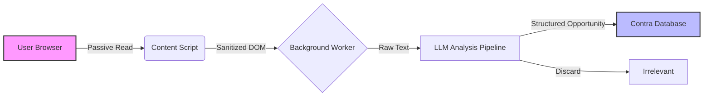

<script type="application/ld+json">
  {`{
  "@context": "https://schema.org",
  "@type": "Article",
  "headline": "Scaling Contra's Marketplace with Distributed Intelligence",
  "description": "Engineering case study: Finding 5 million opportunities using a distributed Chrome extension architecture.",
  "url": "https://withseismic.com/case-studies/contra-linkedin-automation",
  "author": {
    "@type": "Organization",
    "name": "WithSeismic"
  },
  "publisher": {
    "@type": "Organization",
    "name": "WithSeismic",
    "logo": {
      "@type": "ImageObject",
      "url": "https://withseismic.com/logo/light.svg"
    }
  }
}`}
</script>

<div className="grid grid-cols-1 md:grid-cols-3 gap-6 mb-12 not-prose">
  <Card title="5M+ Opportunities" icon="arrow-trend-up">
    Found for freelancers, driving 10x inventory growth
  </Card>
  <Card title="30k+ Nodes" icon="network-wired">
    Active distributed scraping nodes
  </Card>
  <Card title="Zero Ops" icon="server">
    Serverless architecture with no scraping infra
  </Card>
</div>

## The Inventory Bottleneck

Contra, a commission-free freelance marketplace, faced a classic chicken-and-egg problem: liquidity. To attract freelancers, they needed a massive volume of high-quality job opportunities. To attract clients, they needed active freelancers.

Traditional scraping approaches were non-viable:
1.  **Platform Defenses**: LinkedIn and X (Twitter) aggressively block data center IPs.
2.  **Cost**: Maintaining a proxy rotation infrastructure for millions of pages is prohibitively expensive.
3.  **Context**: Generic scrapers lack the "social graph" context required to find relevant opportunities.

We needed a way to ingest opportunities at scale without triggering anti-bot defenses or incurring massive infrastructure costs.

## Solution: Distributed Intelligence

We inverted the scraping model. Instead of a centralized server farm, we leveraged the users themselves. We built **Indy.ai**, a Chrome extension that acts as a distributed edge node for opportunity discovery.

### System Architecture

The system relies on a "parasitic" architecture (in the symbiotic sense) where the extension piggybacks on the user's authenticated session to read content they are already viewing or that is available to them.



### Engineering Spotlight: Invisible Authentication

One of the critical UX requirements was "zero-config". We didn't want users to have to paste API keys or cookies. We implemented a seamless session detection mechanism.

The extension monitors network requests to specific domains (`linkedin.com`, `twitter.com`) to passively detect active sessions.

```typescript
// Simplified logic for session detection
chrome.webRequest.onCompleted.addListener(
  (details) => {
    if (details.url.includes("linkedin.com/feed") && details.statusCode === 200) {
      // We have a valid session
      updateSessionStatus('linkedin', true);
      
      // Trigger passive scan of the feed content
      injectContentScript(details.tabId);
    }
  },
  { urls: ["*://*.linkedin.com/*"] }
);
```

> [!NOTE]
> **Privacy First**: All data extraction happens locally or via ephemeral processing. We strictly adhere to a "read-only" policy regarding user credentials—we never store or transmit session cookies to our servers.

## The Impact

The results were immediate and compounding. Because every new user brings their own unique social graph and IP address, the system scales linearly with user growth.

*   **5 Million+ Opportunities Found**: We successfully scaled inventory by 10x, solving the marketplace liquidity problem.
*   **30,000+ Active Nodes**: Effectively creating a massive, distributed, residential proxy network for free.
*   **High Fidelity**: Because data is sourced from real user feeds, it contains high-intent opportunities often invisible to public scrapers.
*   **4.6/5 Star Rating**: By bundling this utility with genuine value for the freelancer (automated job matching), we achieved high retention.

> "Doug operated quickly & efficiently, and even proposed ways to improve the feature to exceed our expectations. 10/10!"
>
> — **Allison Nulty**, Head of Product, Contra

## Why This Matters

This architecture demonstrates a shift from **Centralized Extraction** to **Edge Discovery**. By distributing the workload to the edge (the user's browser), we bypassed the scaling limitations of traditional scraping and built a self-reinforcing data moat.

<Card
  title="View on Chrome Web Store"
  icon="chrome"
  href="https://chromewebstore.google.com/detail/indy-ai/hgpklbhmaaajglapkgebgjjlccndmcoo"
>
  Join 30,000+ freelancers using Indy.ai
</Card>
