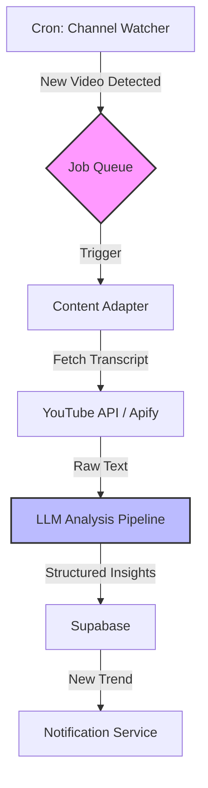

<script type="application/ld+json">
  {`{
  "@context": "https://schema.org",
  "@type": "Article",
  "headline": "Fingers on Pulse: Ingesting the Zeitgeist at Scale",
  "description": "Engineering case study: Architecting a 200x scale content pipeline using Trigger.dev and multi-level batch processing.",
  "url": "https://withseismic.com/case-studies/fingers-on-pulse-content-intelligence",
  "author": {
    "@type": "Organization",
    "name": "WithSeismic"
  },
  "publisher": {
    "@type": "Organization",
    "name": "WithSeismic",
    "logo": {
      "@type": "ImageObject",
      "url": "https://withseismic.com/logo/light.svg"
    }
  }
}`}
</script>

<div className="grid grid-cols-1 md:grid-cols-3 gap-6 mb-12 not-prose">
  <Card title="200x Speedup" icon="gauge-high">
    Parallel batch processing vs manual audit
  </Card>
  <Card title="800+ Channels" icon="tower-broadcast">
    Continuous real-time monitoring
  </Card>
  <Card title="<20min Latency" icon="stopwatch">
    From publish to processed insight
  </Card>
</div>

## The Information Firehose

In the fast-moving world of AI and MarTech, staying current is a full-time job. For educational content platforms, the "research lag"—the time between a new development and the creation of course material—is a critical vulnerability.

Our client needed to monitor over 800 YouTube channels to identify emerging trends, but manual research capped their capacity at ~25 channels. They needed a system to ingest, analyze, and synthesize thousands of hours of video content without hiring an army of analysts.

## Solution: Event-Driven Content Intelligence

We built a serverless ingestion pipeline that treats content creation as an event stream. By decoupling **Discovery** (finding new videos) from **Analysis** (processing transcripts), we achieved massive parallelism.

### System Architecture

The system leverages **Trigger.dev** for orchestration, ensuring reliability across long-running jobs.



### Engineering Spotlight: Orchestrating Chaos

We chose **Trigger.dev** over traditional queues (BullMQ) or serverless functions (Lambda) for one key reason: **Observability**.

When processing thousands of jobs, failures are inevitable (API rate limits, malformed transcripts, timeouts). Trigger.dev provides a visual dashboard for the job graph, allowing us to inspect payloads and retry specific steps without building custom admin tools.

### Multi-Level Batch Processing

To handle the volume, we implemented a two-tier concurrency model:
1.  **Channel Level**: Parallel checks across 800+ channels.
2.  **Video Level**: Concurrent processing of backlog content for new channels.

```typescript
// Tier 1: Batch Triggering Channel Scrapes
export const processYouTubeChannels = task({
  id: "process-youtube-channels",
  run: async (payload: { channels: string[] }) => {
    // Fan-out pattern: Trigger a separate job for each channel
    // with controlled concurrency to respect API limits
    const batchPayloads = payload.channels.map(url => ({
      payload: { url },
      options: { queue: { name: "youtube-scraper", concurrency: 5 } }
    }));

    return await scrapeChannel.batchTrigger(batchPayloads);
  },
});
```

### The Universal Content Adapter

To ensure the system could scale beyond YouTube (to LinkedIn, Twitter, Blogs), we implemented a strict **Adapter Pattern**.

```typescript
interface ContentAdapter<SourceType> {
  // 1. Extract raw data from the platform
  extract(source: SourceType): Promise<RawContent>;
  
  // 2. Normalize to our internal schema
  normalize(raw: RawContent): UnifiedContent;
  
  // 3. Process with LLM (Strategy Pattern)
  analyze(content: UnifiedContent): Promise<Insights>;
}
```

This abstraction allows us to plug in new sources without rewriting the core analysis logic. The `analyze` step uses OpenAI's GPT-4o with structured outputs (Zod schemas) to guarantee type safety in our database.

## Business Impact: From Lagging to Leading

The system transformed the client's workflow from reactive to proactive.

*   **Zero-Day Content**: When OpenAI releases a model, the system processes the announcement video, extracts key technical details, and drafts a curriculum update within 20 minutes.
*   **Trend Detection**: By aggregating keywords across 800 channels, we identify "rising stars" (topics gaining velocity) before they hit the mainstream.
*   **Operational Efficiency**: Research time per content piece dropped from 4 hours to 15 minutes.

> "We automated the 'boring' part of research—watching hours of video—so the team can focus on the high-value part: synthesis and teaching."

<Card
  title="Read Technical Deep Dive"
  icon="book-open"
  href="https://blog.withseismic.com/fingers-on-the-pulse-how-we-ate-thousands-of-hours-of-youtube-to-shape-the-zeitgeist-with-trigger-dev/"
>
  Full architecture breakdown on our blog
</Card>
