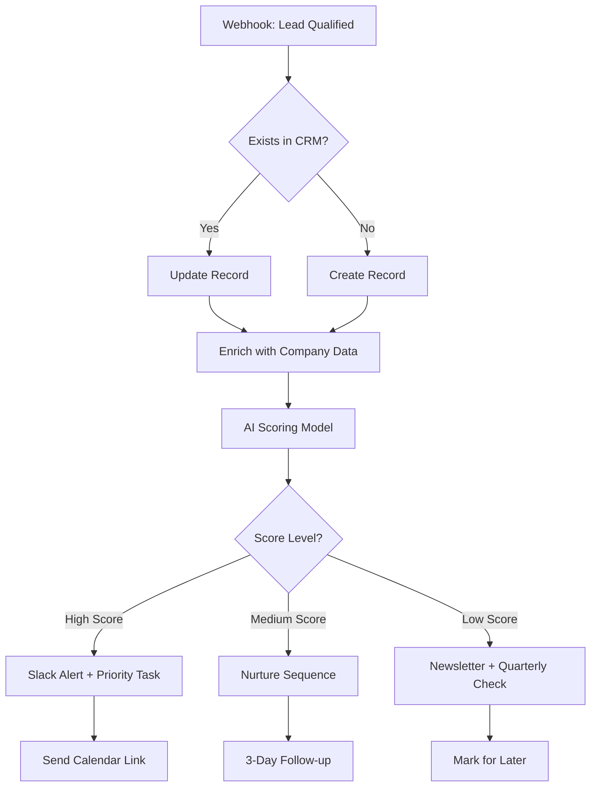

<script type="application/ld+json">
  {`{
  "@context": "https://schema.org",
  "@type": "Article",
  "headline": "Lead Qualifier: Real-Time Engagement Tracking System",
  "description": "Case study of WithSeismic's lead qualification system that scores visitor engagement in real-time",
  "url": "https://withseismic.com/case-studies/lead-qualifier",
  "author": {
    "@type": "Person",
    "name": "Doug Silkstone"
  },
  "publisher": {
    "@type": "Organization",
    "name": "WithSeismic"
  },
  "about": {
    "@type": "SoftwareApplication",
    "name": "Lead Qualifier",
    "applicationCategory": "Marketing Automation",
    "description": "Real-time visitor engagement scoring system"
  }
}`}
</script>

import { VisitorProfile } from "/snippets/profile.jsx";

Yes, you. As you read this sentence, I'm tracking your engagement. Not in a creepy way - in a smart, efficient way that respects both our time.

<VisitorProfile />

## Why I Built This

I've spent years in MarTech and engineering, building tools that qualify leads for enterprise companies. But when it came to my own consultancy, I was flying blind. I'd get inquiries, hop on calls, and often realize 10 minutes in that we weren't a fit.

That's a waste of everyone's time.

So I built what I know - a lead qualification system that runs silently in the background, scoring visitors based on genuine engagement signals. If you're reading this, exploring my tools, and spending real time understanding what I offer, I want to know about it. If you're just bouncing through, that's cool too - but neither of us needs to pretend it's more than that.

## How The Scoring Works

### The Point System

Every action you take has a value:

- **Page View**: 5 points (you showed up)
- **Scroll to 25%**: 2 points (you started reading)
- **Scroll to 50%**: 3 points (you're interested)
- **Scroll to 75%**: 5 points (you're engaged)
- **Scroll to 100%**: 7 points (you're thorough)
- **30 seconds on page**: 3 points (not a bounce)
- **60 seconds on page**: 5 points (actually reading)
- **2+ minutes on page**: 10 points (deep engagement)
- **Copy code block**: 10 points (hands-on interest)
- **Use a tool**: 15 points (practical engagement)
- **Perform calculation**: 20 points (solving real problems)
- **Visit contact page**: 50 points (high intent)

### Engagement Levels

- **Cold** (0-999 points): Just browsing
- **Warm** (1000-2499 points): Showing interest
- **Hot** (2500-4999 points): Actively engaged
- **Qualified** (5000+ points): Ready for a conversation

### Real-Time Toast Notifications

As you browse and your engagement level changes, you'll see subtle toast notifications appear in the corner of your screen. These aren't just notifications - they're real-time feedback on your engagement journey:

- **❄️ Cold Toast**: "Getting started - Keep exploring to warm things up!"
- **🔥 Warm Toast**: "You're warming up! Your engagement is growing."
- **🔥 Hot Toast**: "Things are heating up! You're highly engaged."
- **🎯 Qualified Toast**: "You're a qualified lead! We should definitely talk."

These toasts slide in from the left, stay for 6 seconds, then gracefully exit. They're color-coded to match your engagement level and only appear once per level to avoid being annoying.

## The Smart Signals

Beyond points, I track behavioral patterns that indicate real interest:

### Content Patterns

- **Multi-page visitor**: You're exploring beyond the landing page
- **Deep explorer**: 5+ unique pages viewed
- **Deep content consumer**: Reading to the bottom of multiple articles
- **Case study reader**: Looking at real examples
- **Tool user**: Actually trying the solutions

### Time Investment

- **Engaged reader**: Averaging 60+ seconds per page
- **High time investment**: 5+ minutes total on site

### Intent Signals

- **Contact visitor**: Checked out how to reach me
- **Booking intent**: Clicked on consultation links
- **Company info provided**: Shared who you are
- **Email provided**: Opened a direct line

## Why This Matters

For you, this means no time wasted on calls that won't go anywhere. By the time we connect, I already understand your level of interest and what you're looking for. Our first conversation can skip the basics and dive straight into solving your actual problems. You're not just another "lead" in a CRM - you're someone whose specific interests and challenges I understand.

From my perspective, I can prioritize high-intent prospects and understand what content resonates. I know which problems you're trying to solve based on the pages you've explored and the tools you've tested. This means I can prepare for our conversation properly, with relevant case studies and solutions that match your needs.

## The Technical Implementation

This system is built with:

- **Pure JavaScript**: No heavy analytics platforms
- **LocalStorage**: Your data stays in your browser
- **Real-time tracking**: Updates as you browse
- **Session awareness**: Handles tab switches and returns
- **Page-centric data**: Detailed engagement per page

Every page visit creates a session record with:

- Time spent
- Scroll depth
- Links clicked
- Actions taken
- Content categories viewed

## What Happens When You're Qualified

When you hit 5000 points (qualified lead), I get a notification with:

- Your engagement score and signals
- Top pages you've spent time on
- Tools you've used
- Content categories that interest you
- Your overall journey through the site

This isn't about surveillance - it's about preparation. When we do connect, I'll already understand:

- What you're looking for
- Which solutions resonate
- Where you're spending time
- What problems you're solving

## The Philosophy

This is the same approach I help companies implement:

1. **Respect the visitor's time**: Don't make them fill out forms for basic content
2. **Measure real engagement**: Not just pageviews, but meaningful interaction
3. **Qualify through behavior**: Actions speak louder than form fields
4. **Focus on fit**: Not every visitor needs to be a lead
5. **Prepare for success**: When someone is ready, be ready for them

## Try It Yourself

Want to see your scoring in action? Here's what to do:

1. Open your browser console (F12)
2. Type: `WithSeismicTracker.enableDebug()`
3. Browse around and watch your score update
4. Type: `WithSeismicTracker.getProfile()` to see your full profile

### Testing the Toast Notifications

Want to see all the toast notifications in action? Open your console and run:

```javascript
// Test all engagement level toasts in sequence
WithSeismicTracker.testToasts();

// Or trigger individual toasts
WithSeismicTracker.showToast("Custom message!", "warm", 5000);
WithSeismicTracker.showToast("You're on fire!", "hot", 5000);
WithSeismicTracker.showToast("Welcome aboard!", "qualified", 5000);
```

The toasts will appear in the bottom-left corner with smooth animations. They stack if multiple are shown, and each has its own color theme matching the engagement level.

Or just keep reading, exploring, and using the tools. If what I'm building resonates with you, your score will reflect that - and you'll see the toasts appear naturally as you progress through the engagement levels. When you're ready to talk, I'll be ready too.

### Gamification & Achievement System

Beyond just scoring, I've added a full achievement system that makes browsing more engaging. You're not just accumulating points - you're unlocking badges for different behaviors. Check your achievements displayed at the top of your profile card above!

#### Available Achievements

```javascript
// See all available achievements and your progress
WithSeismicTracker.showAllAchievements();

// Test an achievement notification
WithSeismicTracker.testAchievement("deep_diver");

// Check what you've unlocked so far
WithSeismicTracker.getUnlockedAchievements();
```

Here are some achievements you can unlock:

- **👣 First Steps**: Visit your first page (you already have this!)
- **🗺️ Explorer**: Visit 5 different pages
- **🤿 Deep Diver**: Scroll to 100% on 3 pages
- **⚡ Speed Reader**: Visit 10 pages in under 5 minutes
- **📚 Dedicated Reader**: Spend over 10 minutes reading
- **📊 Case Study Enthusiast**: Read 3 case studies
- **🔧 Tool Tester**: Try at least one tool
- **🦉 Night Owl**: Browse after midnight
- **🐦 Early Bird**: Browse before 7 AM
- **🔄 Return Visitor**: Come back for a second visit
- **💼 Serious Buyer**: Visit pricing and contact pages
- **📋 Code Copier**: Copy a code block
- **🕵️ Tracker Detective**: Discover this lead qualifier case study (you have this!)
- **📈 Insider Trading**: Read 100% of how I'm tracking you (scroll to the bottom of this page!)
- **🏆 Engagement Champion**: Reach 'Hot' engagement level
- **👑 Qualified Legend**: Become a qualified lead (5000 points)

Each achievement unlocks with a purple toast notification. Your unlocked achievements are saved and displayed with timestamps. It's a small touch that makes the experience more memorable.

#### Why Gamification?

This isn't just for fun (though it is fun). Gamification serves real business purposes:

1. **Increased Engagement**: Achievements give visitors reasons to explore more content
2. **Behavioral Insights**: Achievement patterns reveal visitor interests and intent
3. **Memorable Experience**: People remember sites that surprise and delight them
4. **Qualification Signals**: Achievement combinations indicate buying readiness
5. **Return Incentive**: Unfinished achievements encourage return visits

For example, someone who unlocks "Tool Tester," "Case Study Enthusiast," and "Serious Buyer" is showing clear product evaluation behavior. That's more valuable than any form field.

#### Implementation Notes

The achievement system is lightweight and runs entirely client-side:

- Achievements check conditions in real-time as you browse
- Unlocked achievements persist in localStorage
- Toast notifications appear with a 1.5-second stagger for multiple unlocks
- Each achievement has an icon, name, and description for clarity
- The profile component displays your achievement collection

This same gamification approach can be applied to any business:

- **SaaS**: Unlock features through exploration
- **E-commerce**: Reward browsing patterns with discounts
- **Content Sites**: Badge readers for completion milestones
- **B2B**: Identify champions through engagement achievements

## How to Build It Yourself

### Step 1: Set Up Your Storage Layer

Start with a visitor profile structure in localStorage that persists across sessions:

```javascript
// Initialize visitor profile with unique ID and session tracking
const initVisitorProfile = () => {
  const stored = localStorage.getItem("visitor_profile");
  if (stored) return JSON.parse(stored);

  return {
    visitorId: `visitor_${Math.random().toString(36).substring(2)}`,
    firstVisit: new Date().toISOString(),
    behavior: {
      pages: {}, // Page-specific data
      totalPageViews: 0,
      uniquePagesViewed: 0,
      totalTimeSpent: 0,
      toolsUsed: [],
      contentCategories: [],
    },
    engagement: {
      score: 0,
      level: "cold",
      signals: [],
    },
    currentSession: {
      sessionId: generateSessionId(),
      startTime: Date.now(),
      currentPage: window.location.pathname,
    },
  };
};

const profile = initVisitorProfile();
localStorage.setItem("visitor_profile", JSON.stringify(profile));
```

### Step 2: Track Page Views and Navigation

Set up page tracking that works with SPAs and traditional sites:

```javascript
class PageTracker {
  constructor() {
    this.pagePath = window.location.pathname;
    this.startTime = Date.now();
    this.scrollDepth = 0;
    this.initializePage();
  }

  initializePage() {
    const profile = getVisitorProfile();

    // Create or update page data
    if (!profile.behavior.pages[this.pagePath]) {
      profile.behavior.pages[this.pagePath] = {
        path: this.pagePath,
        firstVisit: new Date().toISOString(),
        visitCount: 1,
        totalTimeSpent: 0,
        maxScrollDepth: 0,
        sessions: [],
      };
      profile.behavior.uniquePagesViewed++;
    } else {
      profile.behavior.pages[this.pagePath].visitCount++;
    }

    profile.behavior.totalPageViews++;
    this.updateEngagement("pageView", 5);
    saveProfile(profile);
  }
}

// Listen for SPA navigation
let currentPath = window.location.pathname;
setInterval(() => {
  if (window.location.pathname !== currentPath) {
    currentPath = window.location.pathname;
    new PageTracker();
  }
}, 500);
```

### Step 3: Implement Scroll Tracking

Track how deeply users engage with your content:

```javascript
const trackScrollDepth = () => {
  let maxScroll = 0;
  let ticking = false;

  const updateScroll = () => {
    const windowHeight = window.innerHeight;
    const documentHeight = document.documentElement.scrollHeight;
    const scrollTop = window.pageYOffset;
    const scrollPercent = Math.round(
      (scrollTop / (documentHeight - windowHeight)) * 100
    );

    if (scrollPercent > maxScroll) {
      maxScroll = scrollPercent;

      // Award points at milestones
      [25, 50, 75, 100].forEach((milestone) => {
        if (scrollPercent >= milestone && maxScroll < milestone + 25) {
          const points = { 25: 2, 50: 3, 75: 5, 100: 7 };
          updateEngagement(`scroll${milestone}`, points[milestone]);
        }
      });
    }
    ticking = false;
  };

  window.addEventListener(
    "scroll",
    () => {
      if (!ticking) {
        window.requestAnimationFrame(updateScroll);
        ticking = true;
      }
    },
    { passive: true }
  );
};
```

### Step 4: Track Time on Page

Measure real engagement time, accounting for tab switches:

```javascript
class TimeTracker {
  constructor() {
    this.startTime = Date.now();
    this.totalTime = 0;
    this.isActive = true;
    this.setupTracking();
  }

  setupTracking() {
    // Track when tab loses/gains focus
    document.addEventListener("visibilitychange", () => {
      if (document.hidden) {
        this.pause();
      } else {
        this.resume();
      }
    });

    // Set up time milestones
    [30, 60, 120].forEach((seconds) => {
      setTimeout(() => {
        if (this.isActive) {
          const points = { 30: 3, 60: 5, 120: 10 };
          updateEngagement(`time${seconds}s`, points[seconds]);
        }
      }, seconds * 1000);
    });

    // Update time every 10 seconds
    setInterval(() => {
      if (this.isActive) {
        this.updateTimeSpent();
      }
    }, 10000);
  }

  updateTimeSpent() {
    const profile = getVisitorProfile();
    const delta = Math.floor((Date.now() - this.startTime) / 1000);

    profile.behavior.totalTimeSpent += delta;
    profile.behavior.pages[window.location.pathname].totalTimeSpent += delta;

    saveProfile(profile);
    this.startTime = Date.now();
  }
}
```

### Step 5: Track High-Intent Actions

Capture actions that indicate buying intent:

```javascript
// Track tool usage
const trackToolUsage = (toolName, data = {}) => {
  const profile = getVisitorProfile();

  if (!profile.behavior.toolsUsed.includes(toolName)) {
    profile.behavior.toolsUsed.push(toolName);
  }

  updateEngagement("toolUsed", 15);

  // Store calculation results if applicable
  if (data.calculation) {
    profile.behavior.calculations = profile.behavior.calculations || [];
    profile.behavior.calculations.push({
      tool: toolName,
      result: data.result,
      timestamp: new Date().toISOString(),
    });
    updateEngagement("calculationPerformed", 20);
  }

  saveProfile(profile);
};

// Track code copying (high intent for developers)
document.addEventListener("copy", () => {
  const selection = window.getSelection();
  if (selection?.anchorNode?.parentElement?.closest("pre, code")) {
    updateEngagement("codeBlockCopy", 10);
    trackAction("code_copied", {
      snippet: selection.toString().substring(0, 100),
    });
  }
});

// Track contact page visits and form interactions
if (window.location.pathname.includes("/contact")) {
  updateEngagement("contactPageVisit", 50);

  // Track form field interactions
  document.querySelectorAll("input, textarea").forEach((field) => {
    field.addEventListener("focus", () => {
      updateEngagement("formInteraction", 5);
    });
  });
}
```

### Step 6: Implement the Scoring System

Create a flexible scoring system with configurable weights:

```javascript
const SCORING_CONFIG = {
  events: {
    pageView: 5,
    scroll25: 2,
    scroll50: 3,
    scroll75: 5,
    scroll100: 7,
    time30s: 3,
    time60s: 5,
    time120s: 10,
    linkClick: 2,
    codeBlockCopy: 10,
    toolUsed: 15,
    calculationPerformed: 20,
    contactPageVisit: 50,
    formInteraction: 5,
    bookingInitiated: 100,
  },
  thresholds: {
    cold: 0,
    warm: 1000,
    hot: 2500,
    qualified: 5000,
  },
};

const updateEngagement = (eventType, customPoints = null) => {
  const profile = getVisitorProfile();
  const points = customPoints || SCORING_CONFIG.events[eventType] || 0;

  profile.engagement.score += points;

  // Update engagement level
  const { score } = profile.engagement;
  const previousLevel = profile.engagement.level;

  if (score >= SCORING_CONFIG.thresholds.qualified) {
    profile.engagement.level = "qualified";
  } else if (score >= SCORING_CONFIG.thresholds.hot) {
    profile.engagement.level = "hot";
  } else if (score >= SCORING_CONFIG.thresholds.warm) {
    profile.engagement.level = "warm";
  } else {
    profile.engagement.level = "cold";
  }

  // Trigger notifications on level change
  if (previousLevel !== profile.engagement.level) {
    onEngagementLevelChange(profile);
  }

  saveProfile(profile);
  return profile;
};
```

### Step 7: Detect Behavioral Signals

Identify patterns that indicate real interest:

```javascript
const detectEngagementSignals = (profile) => {
  const signals = [];

  // Page engagement patterns
  if (profile.behavior.uniquePagesViewed >= 3) {
    signals.push("multi_page_visitor");
  }
  if (profile.behavior.uniquePagesViewed >= 5) {
    signals.push("deep_explorer");
  }

  // Time investment
  if (profile.behavior.totalTimeSpent >= 300) {
    signals.push("high_time_investment");
  }
  const avgTimePerPage =
    profile.behavior.totalTimeSpent / profile.behavior.totalPageViews;
  if (avgTimePerPage >= 60) {
    signals.push("engaged_reader");
  }

  // Content depth
  const deepPages = Object.values(profile.behavior.pages).filter(
    (page) => page.maxScrollDepth >= 75
  );
  if (deepPages.length >= 3) {
    signals.push("deep_content_consumer");
  }

  // Tool engagement
  if (profile.behavior.toolsUsed.length > 0) {
    signals.push("tool_user");
  }

  // High-intent pages
  const pageKeys = Object.keys(profile.behavior.pages);
  if (pageKeys.some((p) => p.includes("/pricing"))) {
    signals.push("price_aware");
  }
  if (pageKeys.some((p) => p.includes("/contact"))) {
    signals.push("contact_visitor");
  }
  if (pageKeys.some((p) => p.includes("/case-studies"))) {
    signals.push("case_study_reader");
  }

  profile.engagement.signals = [...new Set(signals)];
  return signals;
};
```

### Step 8: Add Notifications and Webhooks

Alert your team when someone becomes qualified:

```javascript
const notifyQualifiedLead = async (profile) => {
  // Get top pages by time spent
  const topPages = Object.values(profile.behavior.pages)
    .sort((a, b) => b.totalTimeSpent - a.totalTimeSpent)
    .slice(0, 5)
    .map((p) => ({
      path: p.path,
      time: p.totalTimeSpent,
      depth: p.maxScrollDepth,
    }));

  const leadData = {
    visitorId: profile.visitorId,
    score: profile.engagement.score,
    level: profile.engagement.level,
    signals: profile.engagement.signals,
    stats: {
      pagesViewed: profile.behavior.uniquePagesViewed,
      totalTime: Math.floor(profile.behavior.totalTimeSpent / 60),
      toolsUsed: profile.behavior.toolsUsed,
    },
    topPages,
    timestamp: new Date().toISOString(),
  };

  // Send to your webhook endpoint
  try {
    await fetch("/api/qualified-lead", {
      method: "POST",
      headers: { "Content-Type": "application/json" },
      body: JSON.stringify(leadData),
    });
  } catch (error) {
    console.error("Failed to notify about qualified lead:", error);
  }

  // Also track in Google Analytics if available
  if (window.gtag) {
    window.gtag("event", "qualified_lead", {
      value: profile.engagement.score,
      engagement_level: profile.engagement.level,
      signals: profile.engagement.signals.join(","),
    });
  }
};
```

### Step 9: Create a Debug Interface

Add console commands for testing and monitoring:

```javascript
// Expose API for debugging and testing
window.LeadTracker = {
  // Get current profile
  getProfile: () => getVisitorProfile(),

  // Get specific page data
  getPageData: (path) => {
    const profile = getVisitorProfile();
    return profile.behavior.pages[path || window.location.pathname];
  },

  // Manually track events
  trackEvent: (eventName, data) => {
    updateEngagement(eventName);
    console.log(`Event tracked: ${eventName}`, data);
  },

  // Reset tracking data
  reset: () => {
    localStorage.removeItem("visitor_profile");
    console.log("Tracking data reset");
    location.reload();
  },

  // Enable debug mode
  enableDebug: () => {
    window.LEAD_TRACKER_DEBUG = true;
    console.log("Debug mode enabled");
    console.log("Current profile:", getVisitorProfile());
  },

  // Test scoring
  testScoring: () => {
    const testEvents = ["pageView", "scroll50", "time60s", "toolUsed"];
    testEvents.forEach((event) => {
      updateEngagement(event);
      console.log(`Added ${SCORING_CONFIG.events[event]} points for ${event}`);
    });
    console.log("New score:", getVisitorProfile().engagement.score);
  },
};
```

### Key Implementation Decisions

When building your own system, you'll face several architectural choices. Client-side tracking (like mine) is faster and more privacy-friendly, but server-side tracking gives you better data persistence and cross-device capabilities. For storage, localStorage offers simplicity, cookies enable cross-subdomain tracking, while a server database provides permanence and better analytics capabilities.

Start with conservative scoring weights and adjust based on actual conversion correlation data. Most importantly, always respect GDPR and CCPA requirements - track behavior patterns, not personal data without explicit consent.

## Supercharging with N8N Workflows

### Real-Time Lead Routing

Connect your tracker to N8N to trigger automated workflows when someone qualifies:

```javascript
// When a visitor becomes qualified
if (profile.engagement.score >= 5000) {
  // Trigger N8N webhook
  fetch("https://your-n8n.com/webhook/qualified-lead", {
    method: "POST",
    headers: { "Content-Type": "application/json" },
    body: JSON.stringify({
      visitorId: profile.visitorId,
      score: profile.engagement.score,
      behaviors: Array.from(profile.behaviors),
      topPages: profile.topPages,
      timestamp: new Date().toISOString(),
    }),
  });
}
```

### N8N Workflow Ideas

<CardGroup cols={2}>
  <Card title="🔄 Instant Slack Alert" icon="slack">
    Notify sales team immediately when someone hits qualified status with context
    about what they've been viewing
  </Card>

{" "}
<Card title="📧 Smart Email Sequence" icon="envelope">
  Trigger personalized email campaigns based on specific page combinations
  viewed
</Card>

{" "}
<Card title="🎯 CRM Enrichment" icon="database">
  Create or update CRM records with behavioral data before the first call
</Card>

{" "}
<Card title="🤖 AI Lead Scoring" icon="robot">
  Feed behavior patterns to AI to predict conversion probability and suggest
  next best action
</Card>

{" "}
<Card title="📊 Custom Audiences" icon="chart">
  Sync qualified visitors to ad platforms for retargeting with specific offers
</Card>

  <Card title="📅 Calendar Automation" icon="calendar">
    Auto-schedule follow-ups based on engagement patterns and timezone
  </Card>
</CardGroup>

### Qualified Lead Workflow



## Sales & Marketing Benefits

### For Sales Teams

Sales teams get pre-qualified conversations where they already know the prospect's interests before the first call. This enables behavior-based talking points - imagine starting a conversation with "I noticed you spent time on our API docs and ran three calculations in our pricing tool." The timing intelligence means reaching out when engagement is highest, not just when a form is filled. Marketing provides context-rich handoffs with complete journey data, so sales knows exactly which problems the prospect is trying to solve.

### For Marketing Teams

Marketing teams can finally see which pages drive real engagement, not just vanity pageview metrics. You'll understand the actual paths visitors take to conversion, giving you true journey mapping insights. Attribution becomes clearer when you track multi-touch engagement across sessions, and you can trigger dynamic content based on specific behavior patterns. It's the difference between guessing what works and knowing what converts.

### ROI Metrics You Can Track

The system gives you concrete metrics to optimize: Lead velocity shows how fast visitors progress through engagement levels, helping you identify content that accelerates the journey. Content ROI reveals which pieces correlate with qualified leads, not just traffic. You can measure engagement decay to understand how long before engaged visitors go cold, and find the exact score threshold that predicts actual conversions.

## Industry-Specific Applications

### SaaS Companies

For SaaS businesses, you can track feature page visits to understand exactly what functionality prospects are looking for. Score visitors based on their documentation reading patterns and pricing calculator usage - someone who reads your API docs and uses your ROI calculator is far more qualified than someone who just browses features. You can even identify expansion opportunities in existing accounts by tracking which advanced features they're researching.

### E-commerce

E-commerce sites can score based on category depth and return visit patterns. Track cart abandonment with full context of what they viewed before leaving, and identify high-value customers before they make their first purchase based on their browsing intensity and product research depth.

### Agencies & Consultancies

Agencies can qualify prospects based on which case studies they read and how deeply they explore your process pages. Tool usage reveals technical sophistication - are they just browsing or actually testing your solutions? Their behavior on pricing pages can indicate budget range without asking a single question.

### Content Publishers

Publishers can identify super readers who are prime candidates for premium subscriptions based on article completion rates and session frequency. Track topic preferences to personalize content recommendations, and provide advertisers with real engagement metrics, not just impressions.

## Advanced Tracking Techniques

### Multi-Domain Tracking

To track visitors across multiple domains or subdomains, you can share the visitor ID through cookies set at the root domain level, or pass it via URL parameters for true cross-domain tracking. This maintains context as prospects move between your marketing site, app, and documentation.

### Predictive Scoring

```javascript
// Use engagement velocity to predict conversion
const engagementVelocity = {
  calculate(profile) {
    const timeElapsed = Date.now() - new Date(profile.firstVisit);
    const velocityScore = profile.engagement.score / (timeElapsed / 1000 / 60);

    // High velocity = hot lead
    if (velocityScore > 10) return "high-intent";
    if (velocityScore > 5) return "exploring";
    return "browsing";
  },
};
```

## Privacy & Ethics Considerations

### Best Practices

Transparency is key - tell visitors you're tracking engagement, just like I'm doing here. Respect privacy by never tracking personal data without explicit consent, and always provide control through opt-out mechanisms and data deletion options. Use secure storage with encryption for any sensitive data, and implement automatic data expiration to comply with GDPR requirements. Remember, the goal is to understand interest and intent, not to surveil individuals.

## The Bottom Line

This lead qualifier is exactly what I build for clients - intelligent, behavioral tracking that identifies real interest without being intrusive. It's the difference between "spray and pray" marketing and actually understanding who's interested in what you offer.

If you've made it this far, you're already at "warm" or higher. That tells me this approach resonates with you. Maybe you're thinking about your own lead qualification challenges. Maybe you're wondering how this could work for your business.

Either way, your behavior is telling a story. And I'm listening.

---

**Want to implement this for your business?** I help companies build intelligent lead qualification systems that actually work. [Let's talk about your use case →](/contact/book-consultation)
