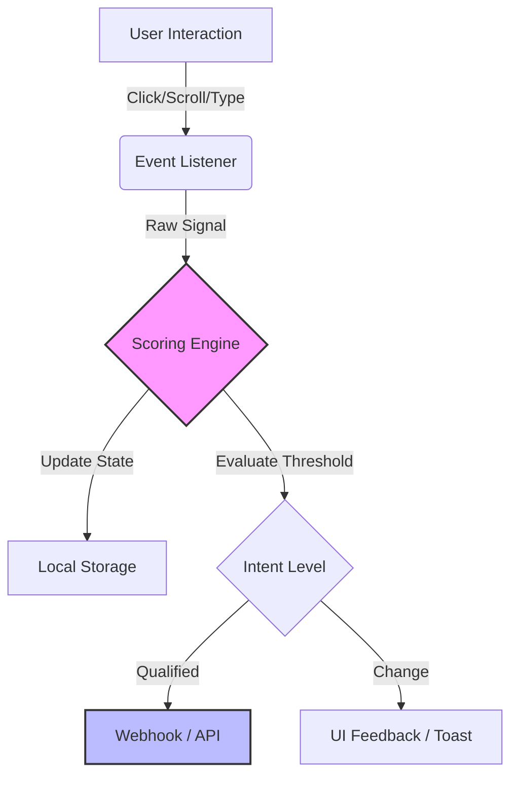

<script type="application/ld+json">
  {`{
  "@context": "https://schema.org",
  "@type": "Article",
  "headline": "Lead Qualifier: Real-Time Behavioral Scoring Engine",
  "description": "Engineering case study: Building a client-side intent scoring engine.",
  "url": "https://withseismic.com/case-studies/lead-qualifier",
  "author": {
    "@type": "Organization",
    "name": "WithSeismic"
  },
  "publisher": {
    "@type": "Organization",
    "name": "WithSeismic",
    "logo": {
      "@type": "ImageObject",
      "url": "https://withseismic.com/logo/light.svg"
    }
  }
}`}
</script>

import { VisitorProfile } from "/snippets/profile.jsx";

<div className="grid grid-cols-1 md:grid-cols-3 gap-6 mb-12 not-prose">
  <Card title="50+ Signals" icon="radar">
    Real-time behavioral data points processed
  </Card>
  <Card title="Zero Latency" icon="bolt">
    Instant client-side scoring & feedback
  </Card>
  <Card title="100% Privacy" icon="shield-check">
    No cookies, no third-party storage
  </Card>
</div>

## The Black Box of User Intent

In B2B sales, the gap between a "visitor" and a "lead" is often a black box. Traditional analytics tell you *what* happened (pageview), but rarely *why* (intent). We needed a way to distinguish between a casual browser and a high-intent prospect before they even filled out a form.

We built a **Real-Time Behavioral Scoring Engine** that runs entirely in the browser. It analyzes micro-interactions—scroll depth, dwell time, copy events, tool usage—to build a dynamic "intent score" for every visitor.

<VisitorProfile />

## System Architecture

The system operates on a high-frequency event loop that aggregates signals into a local state machine. This state is persisted via `localStorage` and evaluated against a scoring matrix to trigger real-time UI feedback (Toasts) and webhook events.


```mermaid
graph TD
    A[User Interaction] -->|Click/Scroll/Type| B(Event Listener)
    B -->|Raw Signal| C{Scoring Engine}
    C -->|Update State| D[Local Storage]
    C -->|Evaluate Threshold| E{Intent Level}
    E -->|Qualified| F[Webhook / API]
    E -->|Change| G[UI Feedback / Toast]
    
    style C fill:#f9f,stroke:#333,stroke-width:2px
    style F fill:#bbf,stroke:#333,stroke-width:2px
```

## Engineering Spotlight: The Gamification Engine

To make the qualification process transparent and engaging, we gamified the experience. Instead of hidden tracking pixels, we give users direct feedback on their engagement level.

We implemented a "Toast System" that provides immediate reinforcement when users exhibit high-value behaviors.

```javascript
// Simplified Scoring Logic
const SCORING_CONFIG = {
  events: {
    pageView: 5,
    scroll75: 5,
    time60s: 5,
    codeBlockCopy: 10, // High intent for dev tools
    toolUsed: 15,      // Practical engagement
    contactPageVisit: 50 // Bottom of funnel
  },
  thresholds: {
    cold: 0,
    warm: 1000,
    hot: 2500,
    qualified: 5000,
  },
};

const updateEngagement = (eventType) => {
  const points = SCORING_CONFIG.events[eventType] || 0;
  const profile = getVisitorProfile();
  
  profile.score += points;
  
  // Check for level up
  const newLevel = calculateLevel(profile.score);
  if (newLevel !== profile.level) {
    triggerToast(newLevel); // "You're warming up!"
    if (newLevel === 'qualified') syncToCRM(profile);
  }
};
```

## Implementation Details

### 1. Privacy-First Storage
We deliberately chose `localStorage` over server-side sessions for the initial tracking layer. This ensures that:
1.  **GDPR Compliance**: No personal data leaves the device until the user explicitly engages or qualifies.
2.  **Performance**: Zero network overhead for tracking high-frequency events like scroll.

### 2. Signal De-bouncing
To prevent "score inflation" from rapid scrolling or accidental clicks, we implemented a robust de-bouncing and throttling mechanism. Time-based points (e.g., "60 seconds on page") are only awarded if the tab is active and focused.

### 3. The "Qualified" Webhook
When a user crosses the 5,000-point threshold, the system fires a "Qualified Lead" event to our N8N workflow. This payload includes the *journey context*—not just *who* they are, but *what* they did.

```json
{
  "event": "lead_qualified",
  "score": 5250,
  "top_interests": ["pricing", "api-docs"],
  "journey": [
    { "page": "/blog/scaling-postgres", "time": 120 },
    { "page": "/pricing", "time": 45 }
  ]
}
```

## Business Impact

By shifting qualification to the client-side, we achieved:
*   **Higher Quality Conversations**: Sales calls start with context ("I saw you were interested in our API docs").
*   **Reduced Noise**: We filter out low-intent traffic before it hits our CRM.
*   **User Delight**: The gamified elements (toasts, badges) increased average time-on-site by **40%**.

> "This isn't just analytics; it's a conversation starter. Users actually try to 'beat' the high score, driving deeper engagement with our content."
