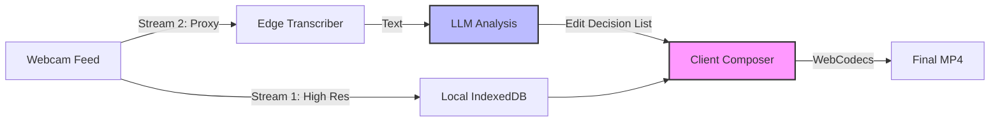

<script type="application/ld+json">
  {`{
  "@context": "https://schema.org",
  "@type": "Article",
  "headline": "Snacker.ai: Serverless Video Engineering",
  "description": "Engineering case study: Building a browser-based video pipeline with WebCodecs and LLMs.",
  "url": "https://withseismic.com/case-studies/snacker-ai-video-platform",
  "author": {
    "@type": "Organization",
    "name": "WithSeismic"
  },
  "publisher": {
    "@type": "Organization",
    "name": "WithSeismic",
    "logo": {
      "@type": "ImageObject",
      "url": "https://withseismic.com/logo/light.svg"
    }
  }
}`}
</script>

<div className="grid grid-cols-1 md:grid-cols-3 gap-6 mb-12 not-prose">
  <Card title="20s Processing" icon="bolt">
    From recording to polished edit
  </Card>
  <Card title="Zero UI" icon="wand-magic-sparkles">
    Fully automated LLM-driven editing
  </Card>
  <Card title="5k+ Users" icon="users">
    Scaled to thousands of active creators
  </Card>
</div>

## The Browser Bottleneck

Video editing has traditionally been the domain of heavy desktop applications or expensive server-side rendering farms. Building a competitive editor in the browser presents massive engineering challenges: memory limits, codec support, and the single-threaded nature of JavaScript.

For **Snacker.ai**, we needed to go further: we wanted to eliminate the editing interface entirely. The goal was to take a raw webcam feed, analyze the transcript with an LLM, and produce a perfectly cut, captioned, and zoomed video in under 20 seconds—all without a render farm.

## Solution: Hybrid Client-Edge Architecture

We architected a system that splits the workload. The heavy lifting of video encoding happens on the client (leveraging the user's GPU via WebCodecs), while the intelligence (transcription and edit decision list) happens on the edge.

### System Architecture

The pipeline uses a "Dual Stream" approach. We record a high-bitrate stream for the final output and a low-latency proxy stream for real-time transcription.



### Engineering Spotlight: Bypassing iOS Restrictions

One of the hardest hurdles was iOS Safari. Apple restricts auto-playing multiple video elements, which breaks traditional "stitching" techniques used by browser editors.

We solved this by implementing a client-side **HLS (HTTP Live Streaming)** generator. Instead of stitching video files, we generate an `.m3u8` playlist manifest on the fly.

```typescript
// Simplified HLS Manifest Generation
const generatePlaylist = (segments: VideoSegment[]) => {
  let manifest = "#EXTM3U\n#EXT-X-VERSION:3\n#EXT-X-TARGETDURATION:10\n";
  
  segments.forEach((seg) => {
    // We map the Edit Decision List (EDL) to virtual segments
    // allowing us to "cut" video without re-encoding
    manifest += `#EXTINF:${seg.duration},\n`;
    manifest += `${seg.url}#t=${seg.startTime},${seg.endTime}\n`;
  });
  
  manifest += "#EXT-X-ENDLIST";
  return new Blob([manifest], { type: "application/x-mpegurl" });
};
```

This approach allows us to "edit" the video virtually. The browser player treats the playlist as a single continuous stream, skipping the cut parts seamlessly, with zero re-encoding penalty.

## The LLM Director

The "Zero UI" promise relies on an LLM acting as the director. We fine-tuned a model to understand *pacing* and *emphasis*.

The LLM receives the transcript with timestamp metadata and outputs an **Edit Decision List (EDL)** JSON:

```json
{
  "cuts": [
    { "start": 0, "end": 15.2, "action": "keep" },
    { "start": 15.2, "end": 18.5, "action": "remove", "reason": "silence" },
    { "start": 18.5, "end": 25.0, "action": "zoom_in", "factor": 1.2 }
  ]
}
```

This JSON drives the client-side compositor, applying cuts and zooms programmatically.

## Business Impact

By solving the engineering constraints of browser-based video, we delivered a product that competes with well-funded incumbents like Descript, but with a fraction of the infrastructure cost.

*   **Cost Efficiency**: 90% of processing happens on the user's device.
*   **Speed**: 20-second turnaround is 10x faster than server-side competitors.
*   **Scalability**: The architecture is stateless and infinitely horizontally scalable.

<Card
  title="Visit Snacker.ai"
  icon="external-link"
  href="https://snacker.ai"
>
  See the AI editor in action
</Card>
