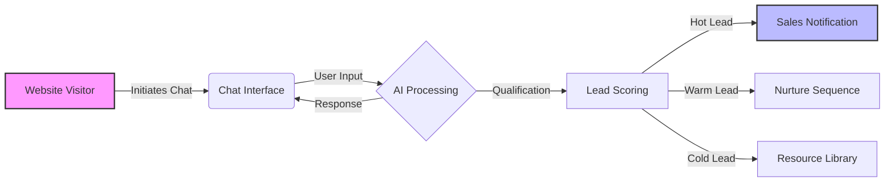

  <Card title="AI-Powered" icon="robot">
    Intelligent conversation flows
  </Card>
  <Card title="Lead Qualification" icon="filter">
    Automated prospect scoring
  </Card>
  <Card title="24/7 Engagement" icon="clock">
    Always-on customer interaction
  </Card>

## The Challenge

In a competitive digital landscape, STRV faced a pivotal challenge: how to transform their lead generation process into a powerhouse of efficiency and effectiveness.

Traditional contact forms and sales processes were creating friction:

- **Response Delays**: Prospects waited hours or days for human follow-up
- **Qualification Overhead**: Sales team spent time on unqualified leads
- **Missed Opportunities**: After-hours inquiries went cold
- **Inconsistent Experience**: Quality varied by who handled the inquiry

## The Solution

Enter an AI and automation expert armed with cutting-edge technology and a vision for the future.

We built an AI-powered chat interface that serves as the first touchpoint for potential clients. The system:

1. **Engages Immediately**: No waiting for human availability
2. **Qualifies Intelligently**: Asks the right questions to understand fit
3. **Routes Appropriately**: Connects hot leads to sales, nurtures others
4. **Learns Continuously**: Improves responses based on outcomes

### Your AI Guide to the Perfect STRV Solution

The chat interface presents itself as a helpful guide, not a bot. It understands:

- **Project Requirements**: Scope, timeline, budget
- **Technical Needs**: Mobile, web, AI, design
- **Company Context**: Industry, size, stage
- **Urgency Signals**: When to escalate to human sales

## Technical Architecture

## Key Features

<CardGroup cols={2}>
  <Card title="Natural Conversation" icon="message">
    LLM-powered responses that feel human
  </Card>
  <Card title="Smart Routing" icon="sitemap">
    Automatic assignment to right team member
  </Card>
  <Card title="CRM Integration" icon="database">
    Syncs leads directly to sales pipeline
  </Card>
  <Card title="Analytics Dashboard" icon="chart-bar">
    Conversation metrics and conversion tracking
  </Card>
</CardGroup>

## Technical Stack

<CardGroup cols={3}>
  <Card title="Next.js" icon="n">
    React framework
  </Card>
  <Card title="OpenAI" icon="brain">
    GPT-powered responses
  </Card>
  <Card title="Figma" icon="figma">
    Design system
  </Card>
  <Card title="React" icon="react">
    Chat interface
  </Card>
  <Card title="Vercel" icon="triangle">
    Edge deployment
  </Card>
  <Card title="HubSpot" icon="hubspot">
    CRM integration
  </Card>
</CardGroup>

## The Impact

The AI chat interface revolutionized STRV's approach to customer engagement and lead qualification:

- **Instant Response**: Every inquiry gets immediate attention
- **Higher Quality Leads**: Better qualification means sales focuses on real opportunities
- **Scalable Engagement**: Handle 10x more inquiries without adding headcount
- **Data-Driven Insights**: Every conversation informs strategy

## Why It Matters

Sales teams are expensive. Most inquiries aren't ready to buy. AI chat interfaces bridge this gap by providing immediate, intelligent engagement that qualifies and routes leads efficiently.

This isn't about replacing human sales - it's about ensuring humans spend time on conversations that matter.

<Card
  title="View on Contra"
  icon="arrow-up-right-from-square"
  href="https://contra.com/p/ELmkMmgZ-strv-ai-lead-generation-chat-interface"
>
  See the full project showcase
</Card>
