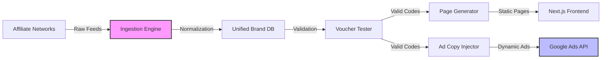

<script type="application/ld+json">
  {`{
  "@context": "https://schema.org",
  "@type": "Article",
  "headline": "Vouchernaut: Programmatic AdTech Engine",
  "description": "Engineering case study: Building a programmatic PPC automation engine handling 100,000+ brands.",
  "url": "https://withseismic.com/case-studies/vouchernaut-programmatic-ppc",
  "author": {
    "@type": "Organization",
    "name": "WithSeismic"
  },
  "publisher": {
    "@type": "Organization",
    "name": "WithSeismic",
    "logo": {
      "@type": "ImageObject",
      "url": "https://withseismic.com/logo/light.svg"
    }
  }
}`}
</script>

<div className="grid grid-cols-1 md:grid-cols-3 gap-6 mb-12 not-prose">
  <Card title="100k+ Brands" icon="building-store">
    Managed programmatically with zero ops
  </Card>
  <Card title="90s Cycle" icon="stopwatch">
    From brand approval to live PPC ads
  </Card>
  <Card title="65% CTR Lift" icon="arrow-up-right-dots">
    Via real-time dynamic ad injection
  </Card>
</div>

## The Scale Bottleneck

In affiliate marketing, the "long tail" is where the profit lies. But managing the long tail is an operational nightmare. Managing 50 brands manually is easy; managing 100,000 is impossible without automation.

At VoucherCloud (acquired by Groupon), we hit a wall: creating a single PPC campaign took 3-5 minutes. To scale to 100,000 brands, we would have needed an army of 500+ marketers. We needed a way to decouple revenue growth from headcount.

## Solution: Feed-Driven Autopilot

We built **Vouchernaut**, a fully autonomous AdTech engine. It treats affiliate data feeds as a source of truth, programmatically generating landing pages, validating voucher codes, and pushing campaigns to Google Ads and Facebook APIs.

### System Architecture

The system operates as a unidirectional data pipeline, transforming raw affiliate feeds into live ad inventory.



### Engineering Spotlight: Dynamic Ad Injection

Standard PPC ads are static. We wanted ads that felt "alive". We engineered a system to inject real-time inventory data directly into the ad copy.

Instead of:
> "Save at Nike. Discount Codes Available."

Our system generated:
> "Save 20% at Nike. **14 Verified Codes** available today (**Dec 15**)."

This required a tightly coupled sync between our voucher database and the Google Ads API.

```typescript
// Simplified Ad Update Logic
async function updateAdCopy(brandId: string, codes: Voucher[]) {
  const activeCount = codes.filter(c => c.isValid).length;
  const bestDiscount = Math.max(...codes.map(c => c.discountPercent));
  
  const dynamicHeadline = `Save ${bestDiscount}% at ${brandName}`;
  const dynamicDescription = `${activeCount} Verified Codes available today (${formatDate(new Date())}).`;
  
  await googleAds.updateAd({
    adGroupId: brandId,
    headline: dynamicHeadline,
    description: dynamicDescription
  });
}
```

This dynamic injection resulted in a **65% increase in Click-Through Rate (CTR)**, significantly lowering our Cost Per Click (CPC) and widening the arbitrage margin.

### Automated Quality Assurance

The biggest risk in automation is scaling errors. To prevent "fake code" pollution, we built a headless browser fleet (Puppeteer) that actually *tested* codes on retailer checkouts before promoting them.

*   **Input**: "SAVE20"
*   **Process**: Headless browser adds item to cart -> applies code -> checks total.
*   **Output**: Valid/Invalid.

Only validated codes triggered the ad spend pipeline.

## Business Impact

This system allowed a team of one to outcompete enterprise teams with hundreds of staff.

*   **Acquisition**: The technology and methodology were key drivers in VoucherCloud's acquisition by Groupon.
*   **Efficiency**: Reduced campaign creation time from 5 minutes to **10 seconds**.
*   **Profitability**: Ran at 90% profit margins due to near-zero operational overhead.

> "We didn't just automate the work; we automated the decision-making. The system decided what to bid, when to pause, and what copy to run based on real-time profitability."

<Card
  title="Watch the Story"
  icon="youtube"
  href="https://www.youtube.com/watch?v=Kk7RQS3By4o&t=360s"
>
  See the automation in action
</Card>
