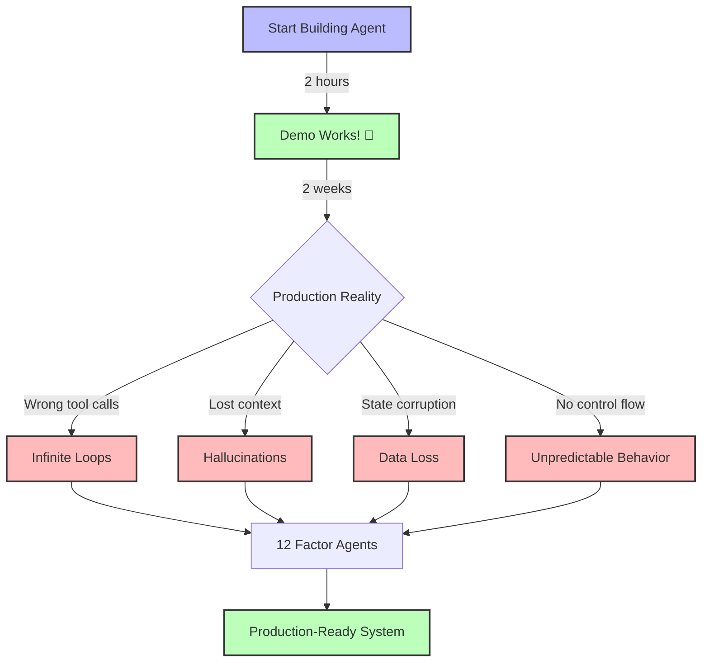

<script type="application/ld+json">
  {`{
  "@context": "https://schema.org",
  "@type": "TechArticle",
  "headline": "The 12 Factor Agents Methodology",
  "description": "Production patterns for building reliable AI agents based on lessons from 100+ SaaS builders",
  "author": {
    "@type": "Organization",
    "name": "WithSeismic"
  }
}`}
</script>

<div className="grid grid-cols-1 md:grid-cols-3 gap-6 mb-12 not-prose">
  <Card title="Production-Tested" icon="check-double">
    Patterns from 100+ SaaS implementations
  </Card>
  <Card title="Framework-Agnostic" icon="code">
    Works with any stack, optimized for TypeScript
  </Card>
  <Card title="Reliability-Focused" icon="shield">
    Get from 80% to production-ready
  </Card>
</div>

## What Is 12 Factor Agents?

The **12 Factor Agents** methodology is a set of best practices for building reliable, production-ready LLM applications. Created by [Dex Horthy](https://github.com/dexhorthy) at [HumanLayer](https://www.humanlayer.dev/), it distills lessons from building agentic systems for 100+ SaaS companies.

**The core insight:** Most "AI agent" frameworks get you to 70-80% functionality quickly, then the last 20-30% becomes a debugging nightmare. The 12 factors help you bridge that gap systematically.

### The Challenge



## The Philosophy

**Key principle:** The best agentic systems are **70-80% deterministic code + 20-30% LLM decision-making**.

LLMs excel at:
- Converting natural language to structured data
- Deciding which action to take next
- Summarizing and analyzing information
- Generating human-like responses

LLMs struggle with:
- Maintaining consistent state
- Following complex control flow
- Handling errors gracefully
- Coordinating multiple systems

**The solution:** Use TypeScript for control flow, state management, and error handling. Use LLMs only for decisions and natural language processing.

## The 12 Factors

### I. Natural Language to Tool Calls

**Principle:** Use LLMs to convert user intent into structured function calls, then execute those calls deterministically.

```typescript
// LLM decides WHAT to do
const response = await anthropic.messages.create({
  model: 'claude-3-5-sonnet-20241022',
  tools: [sendEmailTool, createTaskTool, searchTool],
  messages: [{ role: 'user', content: 'Email John about the Q4 report' }],
});

// Your code controls HOW it's done
const toolCall = response.content.find(b => b.type === 'tool_use');
const result = await executeToolSafely(toolCall); // Your validation, retry logic, etc.
```

**Why it matters:** This separation gives you control over execution while leveraging LLM reasoning.

[Read Factor 1 Deep Dive →](/universities/agentic-workflows/factor-01-natural-language-to-tools)

---

### II. Own Your Prompts

**Principle:** Maintain direct control over prompt engineering rather than relying on framework defaults.

```typescript
// DON'T: Hidden framework prompt
const chain = new AgentExecutor({ agent: 'chat-conversational-react' });

// DO: Explicit prompt you control
const systemPrompt = `You are a customer support agent for Acme Corp.

Your responsibilities:
1. Classify issues by severity (low/medium/high/critical)
2. Look up customer data before responding
3. Escalate refunds over $100 to humans

Always use tools to verify data before making claims.`;
```

**Why it matters:** Prompts are your primary control mechanism. Framework defaults are generic and often suboptimal.

[Read Factor 2 Deep Dive →](/universities/agentic-workflows/factor-02-own-your-prompts)

---

### III. Own Your Context Window

**Principle:** Actively manage what information the LLM receives. Pre-fetch relevant data and strategically summarize history.

```typescript
async function buildContext(userId: string, currentQuery: string) {
  // Pre-fetch only relevant data
  const user = await db.users.findUnique({ where: { id: userId } });
  const recentTickets = await db.tickets.findMany({
    where: { userId, createdAt: { gte: thirtyDaysAgo } },
    take: 5,
  });

  // Summarize if needed
  const history = conversationHistory.length > 10
    ? await summarizeHistory(conversationHistory)
    : conversationHistory;

  return {
    user: { id: user.id, tier: user.tier, joinedDate: user.createdAt },
    recentTickets: recentTickets.map(t => ({ id: t.id, subject: t.subject })),
    history,
  };
}
```

**Why it matters:** Context engineering is the difference between accurate and hallucinated responses.

[Read Factor 3 Deep Dive →](/universities/agentic-workflows/factor-03-own-your-context)

---

### IV. Tools Are Just Structured Outputs

**Principle:** Treat tool definitions as schemas for constraining LLM output, not as magical abstractions.

```typescript
// Tool calling is just structured output with runtime validation
const CustomerDataSchema = z.object({
  name: z.string(),
  email: z.string().email(),
  priority: z.enum(['low', 'medium', 'high']),
});

// Same as:
const tool = {
  name: 'extract_customer_data',
  input_schema: zodToJsonSchema(CustomerDataSchema),
};

// Validate LLM output
const validated = CustomerDataSchema.parse(llmOutput);
```

**Why it matters:** Understanding this removes the magic and gives you full control over validation.

[Read Factor 4 Deep Dive →](/universities/agentic-workflows/factor-04-structured-outputs)

---

### V. Unify Execution State and Business State

**Principle:** Don't duplicate state between your agent and your database. Your database is the source of truth.

```typescript
// WRONG: Duplicated state
class Agent {
  private memory = {
    userId: '123',
    userName: 'Alice', // ❌ Also in database
    userEmail: 'alice@example.com', // ❌ Also in database
  };
}

// RIGHT: Database as source of truth
class Agent {
  async execute(userId: string) {
    // Fetch fresh data every time
    const user = await db.users.findUnique({ where: { id: userId } });

    // Agent execution is ephemeral
    const result = await this.llm.call({
      context: { userId: user.id, tier: user.tier },
    });

    // Persist only execution history
    await db.agentRuns.create({ data: { userId, result } });
  }
}
```

**Why it matters:** Prevents state drift and data inconsistency bugs.

[Read Factor 5 Deep Dive →](/universities/agentic-workflows/factor-05-unify-state)

---

### VI. Launch/Pause/Resume with Simple APIs

**Principle:** Design agents to be pausable and resumable without losing context.

```typescript
interface AgentRun {
  id: string;
  status: 'running' | 'paused' | 'completed' | 'failed';
  checkpoint: AgentCheckpoint;
}

class PausableAgent {
  async launch(input: string): Promise<string> {
    const runId = await this.createRun(input);
    return runId;
  }

  async pause(runId: string): Promise<void> {
    await this.saveCheckpoint(runId);
    await this.updateStatus(runId, 'paused');
  }

  async resume(runId: string): Promise<void> {
    const checkpoint = await this.loadCheckpoint(runId);
    await this.continueFromCheckpoint(checkpoint);
  }
}
```

**Why it matters:** Essential for human-in-the-loop workflows and long-running tasks.

[Read Factor 6 Deep Dive →](/universities/agentic-workflows/factor-06-pause-resume)

---

### VII. Contact Humans with Tool Calls

**Principle:** Model human interaction as tool invocations, not special cases.

```typescript
// Human approval is just another tool
const requestApprovalTool = {
  name: 'request_human_approval',
  description: 'Request approval from a human for sensitive actions',
  input_schema: {
    type: 'object',
    properties: {
      action: { type: 'string' },
      reason: { type: 'string' },
      urgency: { enum: ['low', 'medium', 'high'] },
    },
  },
};

// LLM calls it like any other tool
// Your code handles the human loop
async function executeRequestApproval(params) {
  const approval = await createApprovalRequest(params);
  await notifyHuman(approval); // Slack, email, etc.
  return await waitForResponse(approval.id);
}
```

**Why it matters:** Keeps your agent architecture consistent and testable.

[Read Factor 7 Deep Dive →](/universities/agentic-workflows/factor-07-human-in-loop)

---

### VIII. Own Your Control Flow

**Principle:** Implement explicit control flow logic with state machines rather than letting the LLM orchestrate.

```typescript
import { createMachine } from 'xstate';

// LLM decides individual steps
// State machine controls transitions
const agentMachine = createMachine({
  id: 'supportAgent',
  initial: 'classifying',
  states: {
    classifying: {
      on: {
        LOW_PRIORITY: 'autoResponding',
        HIGH_PRIORITY: 'escalating',
        NEEDS_DATA: 'fetchingData',
      },
    },
    fetchingData: {
      on: {
        DATA_READY: 'classifying',
        ERROR: 'failed',
      },
    },
    autoResponding: {
      on: {
        SUCCESS: 'completed',
        ERROR: 'failed',
      },
    },
    escalating: {
      on: {
        HUMAN_ASSIGNED: 'completed',
        TIMEOUT: 'failed',
      },
    },
    completed: { type: 'final' },
    failed: { type: 'final' },
  },
});
```

**Why it matters:** Predictable behavior and easy debugging.

[Read Factor 8 Deep Dive →](/universities/agentic-workflows/factor-08-control-flow)

---

### IX. Compact Errors into Context Window

**Principle:** Summarize error information concisely when feeding back to the LLM.

```typescript
// WRONG: Full stack trace
const errorContext = `Error: ${error.stack}`; // Wastes tokens, confuses LLM

// RIGHT: Actionable summary
function compactError(error: Error): string {
  return `[Error: ${error.message}] Suggested fix: ${suggestFix(error)}`;
}

// Even better: Structured error handling
const toolResult = {
  success: false,
  error_code: 'INVALID_EMAIL',
  message: 'Email validation failed',
  suggestion: 'Use format: name@domain.com',
};
```

**Why it matters:** Token efficiency and better LLM understanding of what went wrong.

[Read Factor 9 Deep Dive →](/universities/agentic-workflows/factor-09-error-handling)

---

### X. Small, Focused Agents

**Principle:** Build agents with narrow, well-defined scopes (< 20 tools, < 100 steps).

```typescript
// WRONG: Monolithic agent
const superAgent = {
  tools: [
    // 50+ tools for every possible task
    ...salesTools,
    ...supportTools,
    ...engineeringTools,
    ...analyticsTools,
  ],
};

// RIGHT: Specialized agents
const supportAgent = {
  tools: [
    lookupCustomerTool,
    searchKnowledgeBaseTool,
    createTicketTool,
    escalateTool,
  ], // 4 focused tools
};

const salesAgent = {
  tools: [lookupProspectTool, scheduleMeetingTool, updateCRMTool],
};
```

**Why it matters:** Reliability increases dramatically with smaller scope. Easier to test and debug.

[Read Factor 10 Deep Dive →](/universities/agentic-workflows/factor-10-focused-agents)

---

### XI. Trigger from Anywhere, Meet Users Where They Are

**Principle:** Decouple agent triggers from platforms. Agents should work via API, webhook, schedule, or UI.

```typescript
class UniversalAgent {
  async execute(input: AgentInput): Promise<AgentResult> {
    // Platform-agnostic execution
    const result = await this.run(input);
    return result;
  }
}

// Trigger from anywhere
app.post('/api/agent', async (req, res) => {
  const result = await agent.execute(req.body);
  res.json(result);
});

slackBot.on('message', async (msg) => {
  const result = await agent.execute({ text: msg.text, source: 'slack' });
  await slackBot.reply(msg, result.text);
});

cron.schedule('0 9 * * *', async () => {
  const result = await agent.execute({ trigger: 'daily_report' });
  await sendEmail(result);
});
```

**Why it matters:** Maximizes reusability and reach.

[Read Factor 11 Deep Dive →](/universities/agentic-workflows/factor-11-flexible-triggers)

---

### XII. Make Your Agent a Stateless Reducer

**Principle:** Design agents as pure functions: `(state, input) => (newState, output)`.

```typescript
// Agent is a pure function
function agentReducer(
  state: AgentState,
  input: AgentInput
): AgentState {
  // Given same state and input, always produces same output
  const decision = llm.decide(state, input);

  return {
    ...state,
    history: [...state.history, input, decision],
    lastAction: decision.action,
  };
}

// Benefits:
// 1. Deterministic (testable)
// 2. Replayable (debugging)
// 3. Cacheable (performance)
// 4. Time-travel debugging
```

**Why it matters:** Enables testing, debugging, and understanding agent behavior.

[Read Factor 12 Deep Dive →](/universities/agentic-workflows/factor-12-stateless-reducer)

---

## Implementation Strategy

### Phase 1: Foundation (Factors 1-4)

Start here. These are the core patterns.

1. **Natural Language to Tool Calls** - Get LLM calling functions
2. **Own Your Prompts** - Write explicit instructions
3. **Own Your Context Window** - Manage what LLM sees
4. **Structured Outputs** - Validate everything with Zod

**Goal:** Reliable single-turn interactions.

### Phase 2: State & Control (Factors 5-8)

Add complexity once basics work.

5. **Unify State** - Single source of truth
6. **Pause/Resume** - Handle long-running tasks
7. **Human-in-Loop** - Escalate when needed
8. **Control Flow** - State machines for predictability

**Goal:** Multi-turn workflows with proper state management.

### Phase 3: Production (Factors 9-12)

Polish for real-world use.

9. **Error Compaction** - Graceful failure handling
10. **Focused Agents** - Keep scope small
11. **Flexible Triggers** - Omnichannel support
12. **Stateless Reducer** - Testable, debuggable design

**Goal:** Production-ready, maintainable system.

## Quick Start Example

Here's a minimal agent following all 12 factors:

```typescript
import Anthropic from '@anthropic-ai/sdk';
import { z } from 'zod';
import { createMachine, interpret } from 'xstate';
import { create } from 'zustand';

// Factor 10: Small, focused agent (one job: customer lookup)
class CustomerLookupAgent {
  constructor(
    private client: Anthropic,
    private db: Database
  ) {}

  // Factor 12: Stateless reducer
  async execute(input: { query: string }): Promise<CustomerData> {
    // Factor 3: Own context window - pre-fetch only what's needed
    const relevantCustomers = await this.db.customers.search(input.query, {
      limit: 5,
    });

    // Factor 2: Own your prompts
    const systemPrompt = `You help find customer records.
Given a search query, use the lookup_customer tool to find the right customer.
Always verify the match before returning.`;

    // Factor 4: Structured outputs with Zod validation
    const CustomerSchema = z.object({
      id: z.string().uuid(),
      name: z.string(),
      email: z.string().email(),
    });

    // Factor 1: Natural language to tool calls
    const response = await this.client.messages.create({
      model: 'claude-3-5-sonnet-20241022',
      max_tokens: 1024,
      system: systemPrompt,
      tools: [{
        name: 'lookup_customer',
        description: 'Find a customer by ID',
        input_schema: {
          type: 'object',
          properties: {
            customerId: { type: 'string', format: 'uuid' },
          },
          required: ['customerId'],
        },
      }],
      messages: [
        {
          role: 'user',
          content: `Find customer: ${input.query}\n\nAvailable: ${
            relevantCustomers.map(c => `${c.id}: ${c.name}`).join(', ')
          }`
        }
      ],
    });

    // Factor 9: Compact errors
    const toolUse = response.content.find(b => b.type === 'tool_use');
    if (!toolUse) {
      throw new Error('No customer found matching query');
    }

    // Factor 5: Unify state - database is source of truth
    const customer = await this.db.customers.findUnique({
      where: { id: toolUse.input.customerId },
    });

    // Factor 4: Validate output
    return CustomerSchema.parse(customer);
  }
}

// Factor 11: Trigger from anywhere
const agent = new CustomerLookupAgent(anthropic, db);

// Via API
app.post('/api/customer/lookup', async (req, res) => {
  const result = await agent.execute({ query: req.body.query });
  res.json(result);
});

// Via Slack
slackBot.on('slash_command', async (cmd) => {
  if (cmd.command === '/customer') {
    const result = await agent.execute({ query: cmd.text });
    await slackBot.respond(cmd, formatCustomer(result));
  }
});
```

## Common Pitfalls

### Over-reliance on Frameworks

**Problem:** Using LangChain/etc for everything, losing control.

**Solution:** Use frameworks for prototyping, custom TypeScript for production.

### LLM-Controlled Orchestration

**Problem:** Letting the LLM decide the workflow (ReAct loops with no guardrails).

**Solution:** Use state machines (XState) for control flow.

### Memory/State Confusion

**Problem:** Storing business data in agent "memory" separate from database.

**Solution:** Database is source of truth. Agent just reads it.

### Generic Prompts

**Problem:** Using framework default prompts that don't fit your domain.

**Solution:** Write explicit, domain-specific system prompts.

### Unbounded Context

**Problem:** Sending entire conversation history every time.

**Solution:** Strategically summarize and pre-fetch only relevant data.

## Next Steps

Ready to implement? Start with the deep dives:

<CardGroup cols={2}>
  <Card title="Factor 1: Tool Calls" icon="wrench" href="/universities/agentic-workflows/factor-01-natural-language-to-tools">
    Convert natural language to structured actions
  </Card>
  <Card title="Building Your First Agent" icon="rocket" href="/universities/agentic-workflows/building-first-agent">
    Hands-on tutorial implementing all 12 factors
  </Card>
  <Card title="Production Deployment" icon="server" href="/universities/agentic-workflows/production-deployment">
    Checklist for going live
  </Card>
  <Card title="Use Cases" icon="lightbulb" href="/universities/agentic-workflows/usecase-customer-support">
    Real-world implementation examples
  </Card>
</CardGroup>

## Additional Resources

- **Original Source:** [12-factor-agents GitHub Repository](https://github.com/humanlayer/12-factor-agents)
- **Creator:** [Dex Horthy](https://github.com/dexhorthy) at [HumanLayer](https://www.humanlayer.dev/)
- **Video:** [12-Factor Agents Talk - AI Engineer World's Fair](https://home.mlops.community/public/videos/12-factor-agents-patterns-of-reliable-llm-applications-dexter-horthy-agents-in-production-2025-2025-08-06)

<Card
  title="Join the Discussion"
  icon="users"
  href="https://www.skool.com/entrepreneurs-in-residence-8755/about"
>
  Share your agentic workflow implementations in our Skool community
</Card>
