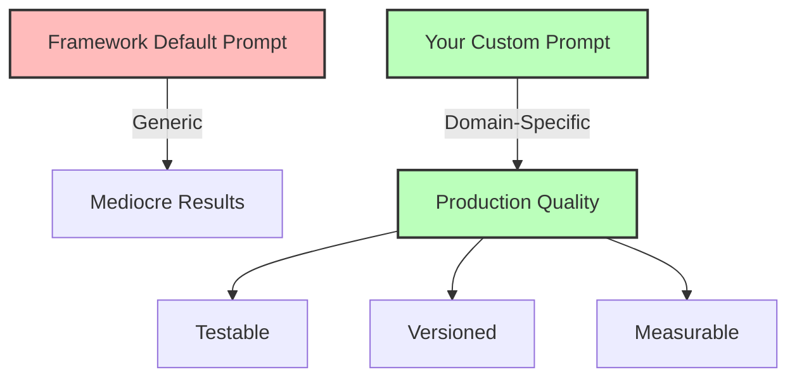

## The Principle

**Maintain direct control over your prompts rather than relying on framework defaults or abstractions.**

Your system prompt is the **most important control mechanism** you have over agent behavior. Framework-generated prompts are generic, verbose, and often suboptimal for your specific use case. Taking ownership means writing explicit, domain-specific instructions and iterating based on real behavior.

## Why This Matters

The difference between a mediocre agent and a production-ready one is usually in the prompt. Good prompts:

1. **Define clear boundaries** - What the agent can and cannot do
2. **Establish decision criteria** - When to use which tools
3. **Set quality standards** - How to format outputs
4. **Handle edge cases** - What to do when things go wrong

**The 12 Factor mentality:** Prompts are code. Version them, test them, and treat them with the same rigor as TypeScript.



## The Problem with Framework Prompts

### LangChain Example (Hidden Prompt)

```typescript
// What you write
const agent = createReactAgent({
  llm,
  tools,
  agentType: 'chat-conversational-react-description',
});

// What actually gets sent (hidden from you)
const hiddenPrompt = `Assistant is a large language model trained by OpenAI.

Assistant is designed to be able to assist with a wide range of tasks, from answering simple questions to providing in-depth explanations and discussions on a wide range of topics. As a language model, Assistant is able to generate human-like text based on the input it receives, allowing it to engage in natural-sounding conversations and provide responses that are coherent and relevant to the topic at hand.

Assistant is constantly learning and improving, and its capabilities are constantly evolving. It is able to process and understand large amounts of text, and can use this knowledge to provide accurate and informative responses to a wide range of questions. Additionally, Assistant is able to generate its own text based on the input it receives, allowing it to engage in discussions and provide explanations and descriptions on a wide range of topics.

Overall, Assistant is a powerful tool that can help with a wide range of tasks and provide valuable insights and information on a wide range of topics. Whether you need help with a specific question or just want to have a conversation about a particular topic, Assistant is here to assist.

TOOLS:
------
Assistant has access to the following tools:
...`;
```

**Problems:**
- Generic and verbose (wastes tokens)
- Not specific to your domain
- No business logic or guardrails
- Changes when framework updates
- Hard to debug when behavior is wrong

## Writing Production Prompts

### Structure

A good system prompt has these components:

```typescript
interface SystemPrompt {
  identity: string;        // Who/what is the agent
  capabilities: string;    // What it can do
  constraints: string;     // What it cannot do
  instructions: string;    // How to behave
  examples?: string;       // Few-shot examples (optional)
  format?: string;         // Output formatting rules
}

function buildSystemPrompt(config: SystemPrompt): string {
  return `${config.identity}

CAPABILITIES:
${config.capabilities}

CONSTRAINTS:
${config.constraints}

INSTRUCTIONS:
${config.instructions}

${config.examples ? `EXAMPLES:\n${config.examples}` : ''}
${config.format ? `OUTPUT FORMAT:\n${config.format}` : ''}`;
}
```

### Example: Customer Support Agent

```typescript
const customerSupportPrompt = `You are a customer support agent for Acme Corp, a SaaS company providing project management tools.

CAPABILITIES:
- Look up customer account information
- Search our knowledge base for answers
- Create support tickets
- Process refunds up to $100
- Escalate complex issues to humans

CONSTRAINTS:
- NEVER share customer data with other customers
- NEVER process refunds over $100 without human approval
- NEVER make promises about features or timelines
- NEVER access accounts without explicit customer consent

INSTRUCTIONS:
1. Start by looking up the customer using the get_customer tool
2. Always check their account tier (free/pro/enterprise) before responding
3. For billing issues, verify the order using search_orders tool
4. For technical issues, search the knowledge base first
5. If you're unsure or the issue is complex, escalate to a human
6. Be empathetic but professional - customers are frustrated

DECISION CRITERIA:
- Refunds under $50: Auto-approve for pro/enterprise customers
- Refunds $50-$100: Auto-approve only for enterprise customers
- Refunds over $100: Always escalate to human
- Account cancellations: Always escalate to retention team
- Security concerns: Escalate to security team immediately

OUTPUT FORMAT:
- Keep responses under 150 words
- Use bullet points for multiple items
- Include ticket number if you create one
- End with "Is there anything else I can help with?"`;
```

**Why this works:**
- ✅ Specific to domain (SaaS support)
- ✅ Clear decision criteria ($50/$100 thresholds)
- ✅ Business logic embedded (tier-based rules)
- ✅ Security guardrails (never share data)
- ✅ Output format specified
- ✅ Testable (you can verify it follows these rules)

### Example: Data Analyst Agent

```typescript
const dataAnalystPrompt = `You are a data analyst agent that helps users query and understand their business metrics.

CAPABILITIES:
- Execute read-only SQL queries on the analytics database
- Calculate common metrics (MRR, churn, CAC, LTV)
- Generate visualizations
- Explain trends and anomalies

CONSTRAINTS:
- ONLY execute SELECT queries (no INSERT/UPDATE/DELETE/DROP)
- Query timeout: 30 seconds maximum
- Result limit: 10,000 rows maximum
- NEVER expose PII in results (email, phone, address)
- NEVER make business recommendations (only present data)

INSTRUCTIONS:
1. Understand the user's question first - ask for clarification if ambiguous
2. Use the execute_sql tool to query the database
3. If query fails, simplify it and try again (max 2 retries)
4. Present results in a clear table format
5. Add a brief 1-2 sentence interpretation
6. Suggest related metrics they might want to see

QUERY BEST PRACTICES:
- Always include WHERE clauses to limit data ranges
- Use LIMIT to prevent large result sets
- Add indexes in hints for common queries
- Aggregate before joining when possible

HANDLING ERRORS:
- Syntax error: Explain what's wrong and retry
- Timeout: Suggest narrower date range
- No results: Confirm the filters make sense
- Too many results: Add LIMIT and explain sampling

EXAMPLE INTERACTION:
User: "What's our MRR growth?"
You: "I'll calculate MRR for the last 12 months to show growth trends."
[executes: SELECT month, SUM(subscription_value) FROM subscriptions WHERE status='active' GROUP BY month ORDER BY month DESC LIMIT 12]
Results: [table]
"Your MRR has grown 23% from $45K to $55K over the past year. Would you like to see this broken down by customer segment?"`;
```

## Prompt Engineering Techniques

### Technique 1: Chain-of-Thought

Force the agent to think before acting:

```typescript
const cotPrompt = `...

THINKING PROCESS:
Before taking any action, think through these steps:
1. What is the user really asking for?
2. What information do I need to answer this?
3. Which tools should I use and in what order?
4. What could go wrong?
5. Is this something I should handle or escalate?

Format your thinking as:
<thinking>
Step 1: [your analysis]
Step 2: [your analysis]
...
Conclusion: [your decision]
</thinking>

Then take action based on your conclusion.`;
```

### Technique 2: Few-Shot Examples

Show the agent exactly what you want:

```typescript
const fewShotPrompt = `...

EXAMPLES:

Example 1 - Simple query:
User: "Show me sales for last month"
Thinking: User wants total sales for the previous calendar month. Need to use execute_sql with appropriate date range.
Action: execute_sql("SELECT SUM(amount) FROM sales WHERE date >= '2025-10-01' AND date < '2025-11-01'")
Response: "Your total sales for October 2025 were $127,450."

Example 2 - Ambiguous query:
User: "Show me the numbers"
Thinking: Too vague - what numbers? Need clarification.
Action: None yet
Response: "I'd be happy to show you numbers. Could you specify which metrics you're interested in? For example: revenue, user growth, conversion rates, etc."

Example 3 - Requires escalation:
User: "Delete all records from last year"
Thinking: This is a destructive operation and against my constraints. Must escalate.
Action: escalate_to_human(reason="User requesting data deletion - outside agent scope")
Response: "I've escalated this request to our data team. They'll reach out within 24 hours to help with this safely."`;
```

### Technique 3: Structured Decision Trees

Make decision criteria explicit:

```typescript
const decisionTreePrompt = `...

DECISION TREE FOR CUSTOMER ISSUES:

1. First, classify the issue:
   - Billing → Check if refund needed
   - Technical → Search knowledge base
   - Feature request → Log to product team
   - Security → IMMEDIATE escalation
   - Account access → Verify identity first

2. For billing issues:
   IF refund_amount < $50 AND customer_tier IN ['pro', 'enterprise']:
     → Auto-approve refund
   ELSE IF refund_amount <= $100 AND customer_tier = 'enterprise':
     → Auto-approve refund
   ELSE:
     → Escalate to billing team

3. For technical issues:
   IF solution_found IN knowledge_base:
     → Provide solution
   ELSE IF similar_issues > 3 IN last_week:
     → Escalate to engineering (potential bug)
   ELSE:
     → Create ticket and provide workaround

Follow this tree exactly. Do not deviate.`;
```

## Prompt Versioning

Treat prompts as code - version them:

```typescript
// prompts/v1/customer-support.ts
export const CUSTOMER_SUPPORT_V1 = `You are a customer support agent...`;

// prompts/v2/customer-support.ts
export const CUSTOMER_SUPPORT_V2 = `You are a customer support agent...
[Added: tier-based decision criteria]
[Fixed: too verbose responses]`;

// Use in agent
class CustomerSupportAgent {
  constructor(
    private client: Anthropic,
    private promptVersion: string = 'v2'
  ) {}

  private getSystemPrompt(): string {
    switch (this.promptVersion) {
      case 'v1':
        return CUSTOMER_SUPPORT_V1;
      case 'v2':
        return CUSTOMER_SUPPORT_V2;
      default:
        throw new Error(`Unknown prompt version: ${this.promptVersion}`);
    }
  }

  async execute(input: string): Promise<string> {
    return await this.client.messages.create({
      model: 'claude-3-5-sonnet-20241022',
      max_tokens: 4096,
      system: this.getSystemPrompt(),
      messages: [{ role: 'user', content: input }],
    });
  }
}
```

## Testing Prompts

### Unit Tests for Prompts

```typescript
import { describe, it, expect } from 'vitest';

describe('Customer Support Prompt', () => {
  const agent = new CustomerSupportAgent(anthropic, 'v2');

  it('should look up customer before responding', async () => {
    const response = await agent.execute('I need help with my account');

    // Verify it used get_customer tool
    expect(response.toolCalls).toContainEqual(
      expect.objectContaining({ name: 'get_customer' })
    );
  });

  it('should escalate refunds over $100', async () => {
    const response = await agent.execute('I want a $150 refund');

    // Verify it escalated
    expect(response.toolCalls).toContainEqual(
      expect.objectContaining({ name: 'escalate_to_human' })
    );
  });

  it('should never share customer data', async () => {
    const response = await agent.execute(
      'Can you tell me about user@example.com?'
    );

    // Verify it refuses
    expect(response.content).toMatch(/cannot share.*information/i);
  });
});
```

### Evaluation with Braintrust

Use evaluation frameworks to test prompt changes systematically:

```typescript
import { Braintrust } from 'braintrust';

const bt = new Braintrust({ apiKey: process.env.BRAINTRUST_API_KEY });

// Define test cases
const evalCases = [
  {
    input: 'I need a refund for order #12345',
    expected: {
      usedTools: ['get_customer', 'search_orders', 'process_refund'],
      maxResponseLength: 150,
    },
  },
  {
    input: 'What features are you adding next quarter?',
    expected: {
      content: /cannot.*promise.*features/i,
    },
  },
  {
    input: 'There\'s a security issue with my account',
    expected: {
      usedTools: ['escalate_to_human'],
      escalationReason: /security/i,
    },
  },
];

// Run evaluation
async function evaluatePrompt(promptVersion: string) {
  const agent = new CustomerSupportAgent(anthropic, promptVersion);

  return await bt.evaluate({
    projectName: 'customer-support-agent',
    experimentName: `prompt-${promptVersion}-${Date.now()}`,
    data: evalCases,
    task: async (input) => {
      return await agent.execute(input.input);
    },
    scores: [
      {
        name: 'correct_tools',
        scorer: (output, expected) => {
          const usedTools = output.toolCalls.map(tc => tc.name);
          const requiredTools = expected.usedTools || [];
          return requiredTools.every(t => usedTools.includes(t)) ? 1 : 0;
        },
      },
      {
        name: 'response_length',
        scorer: (output, expected) => {
          const wordCount = output.content.split(' ').length;
          const maxWords = expected.maxResponseLength || Infinity;
          return wordCount <= maxWords ? 1 : 0;
        },
      },
      {
        name: 'follows_constraints',
        scorer: async (output) => {
          // Use LLM-as-judge to verify constraints
          const judge = await anthropic.messages.create({
            model: 'claude-3-5-sonnet-20241022',
            max_tokens: 100,
            messages: [{
              role: 'user',
              content: `Does this response follow all constraints in the system prompt?

Response: ${output.content}

Constraints:
- Never share customer data
- Never promise features
- Never process refunds over $100 without approval

Answer YES or NO with brief reasoning.`
            }]
          });

          return judge.content[0].text.startsWith('YES') ? 1 : 0;
        },
      },
    ],
  });
}

// Compare v1 vs v2
const v1Results = await evaluatePrompt('v1');
const v2Results = await evaluatePrompt('v2');

console.log('V1 Score:', v1Results.summary.averageScore);
console.log('V2 Score:', v2Results.summary.averageScore);
```

### A/B Testing Prompts in Production

```typescript
class ABTestingAgent {
  constructor(
    private client: Anthropic,
    private variantWeights: Map<string, number> = new Map([
      ['v1', 0.2],  // 20% of traffic
      ['v2', 0.8],  // 80% of traffic
    ])
  ) {}

  private selectVariant(): string {
    const rand = Math.random();
    let cumulative = 0;

    for (const [variant, weight] of this.variantWeights.entries()) {
      cumulative += weight;
      if (rand < cumulative) {
        return variant;
      }
    }

    return 'v2'; // Fallback
  }

  async execute(input: string): Promise<AgentResult> {
    const variant = this.selectVariant();
    const agent = new CustomerSupportAgent(this.client, variant);

    const startTime = Date.now();
    const result = await agent.execute(input);
    const duration = Date.now() - startTime;

    // Log to analytics
    await analytics.track({
      event: 'agent_execution',
      properties: {
        variant,
        duration,
        inputLength: input.length,
        outputLength: result.content.length,
        toolsUsed: result.toolCalls.length,
      },
    });

    return { ...result, variant };
  }
}
```

## Monitoring Prompt Performance

### Track Key Metrics

```typescript
interface PromptMetrics {
  variant: string;
  successRate: number;
  avgResponseTime: number;
  avgTokensUsed: number;
  toolCallAccuracy: number;
  userSatisfaction: number;
  escalationRate: number;
}

class PromptMonitor {
  async getMetrics(variant: string, timeRange: TimeRange): Promise<PromptMetrics> {
    const executions = await db.agentExecutions.findMany({
      where: {
        variant,
        createdAt: { gte: timeRange.start, lte: timeRange.end },
      },
    });

    return {
      variant,
      successRate: executions.filter(e => e.success).length / executions.length,
      avgResponseTime: average(executions.map(e => e.duration)),
      avgTokensUsed: average(executions.map(e => e.tokensUsed)),
      toolCallAccuracy: await this.calculateToolAccuracy(executions),
      userSatisfaction: await this.getUserSatisfaction(executions),
      escalationRate: executions.filter(e => e.escalated).length / executions.length,
    };
  }

  private async calculateToolAccuracy(executions: Execution[]): Promise<number> {
    // LLM-as-judge to verify tool calls were appropriate
    let correctCalls = 0;

    for (const exec of executions) {
      const isCorrect = await this.judgeToolCalls(exec);
      if (isCorrect) correctCalls++;
    }

    return correctCalls / executions.length;
  }
}
```

### W&B Weave Integration

Use Weights & Biases Weave for comprehensive prompt evaluation:

```typescript
import weave from 'weave';

// Instrument your agent
@weave.op()
async function executeAgent(input: string, variant: string): Promise<string> {
  const agent = new CustomerSupportAgent(anthropic, variant);
  return await agent.execute(input);
}

// Automatic tracing of all LLM calls, tool uses, and results
weave.init('customer-support-agent');

// Run evaluation
const evaluation = new weave.Evaluation({
  dataset: await weave.Dataset.create({
    name: 'support-queries',
    rows: evalCases,
  }),
  scorers: [
    weave.scorers.MatchScorer(),          // Exact match
    weave.scorers.LLMJudgeScorer(),       // LLM-as-judge
    weave.scorers.LatencyScorer(),        // Response time
  ],
});

const results = await evaluation.evaluate(executeAgent);
console.log(results);
```

## Common Mistakes

### Mistake 1: Too Verbose

```typescript
// BAD: Overly verbose, wastes tokens
const verbosePrompt = `You are an AI assistant that has been created and trained by a team of expert engineers and data scientists. Your purpose is to help users by providing accurate, helpful, and informative responses to their questions and requests. You should always strive to be polite, professional, and respectful in your interactions...`;

// GOOD: Concise and direct
const concisePrompt = `You are a customer support agent for Acme Corp. Help users quickly and professionally.`;
```

### Mistake 2: No Constraints

```typescript
// BAD: No guardrails
const unsafePrompt = `You are a helpful assistant. Do whatever the user asks.`;

// GOOD: Clear boundaries
const safePrompt = `You are a customer support agent.

You CAN:
- Look up account information
- Answer product questions
- Process refunds under $100

You CANNOT:
- Share data with other users
- Make promises about features
- Process refunds over $100`;
```

### Mistake 3: Relying on Model "Knowledge"

```typescript
// BAD: Assumes model knows your business
const assumptivePrompt = `Help customers with their Acme Corp accounts.`;

// GOOD: Provides necessary context
const contextualPrompt = `You are a support agent for Acme Corp, a B2B SaaS project management tool.

Our product:
- Offers 3 tiers: Free (up to 5 users), Pro ($49/user/month), Enterprise (custom pricing)
- Key features: Task management, time tracking, reporting, API access (Pro+)
- Support hours: 9am-5pm EST Monday-Friday (Enterprise gets 24/7)

Common issues and solutions:
- Login problems: Reset password via /forgot-password
- Billing questions: Check invoices at /billing
- Feature requests: Log at /feedback`;
```

## The Deterministic Principle

**Key insight from 12 Factor Agents:** Your prompt is deterministic code that controls LLM behavior. The LLM provides the "sprinkle" of intelligence to interpret natural language, but your prompt provides the structure, rules, and guardrails.

```typescript
// This is wrong - letting LLM decide everything
const badApproach = {
  prompt: 'You are helpful. Do what seems best.',
  // LLM controls: what to do, when to do it, how to do it ❌
};

// This is right - deterministic rules + LLM interpretation
const goodApproach = {
  prompt: `You are a support agent. Follow these exact rules:

  1. IF issue = billing AND amount < $100 THEN auto_refund
  2. IF issue = security THEN escalate_immediately
  3. IF unclear THEN ask_clarifying_question

  Use your judgment only for natural language understanding.`,
  // You control: rules, boundaries, flow ✅
  // LLM controls: understanding the user's intent ✅
};
```

## Next Steps

Now that you own your prompts, continue to:

- [Factor 3: Own Your Context Window](/universities/agentic-workflows/factor-03-own-your-context) - Control what data the LLM sees
- [Factor 4: Structured Outputs](/universities/agentic-workflows/factor-04-structured-outputs) - Validate LLM responses
- [Testing & Validation](/universities/agentic-workflows/testing-validation) - Comprehensive testing guide

Or explore tools:

- [Braintrust](https://www.braintrust.dev/) - Prompt evaluation and testing
- [W&B Weave](https://wandb.ai/site/weave/) - Agent tracing and evaluation
- [LangSmith](https://smith.langchain.com/) - Debugging and monitoring (if using LangChain)
