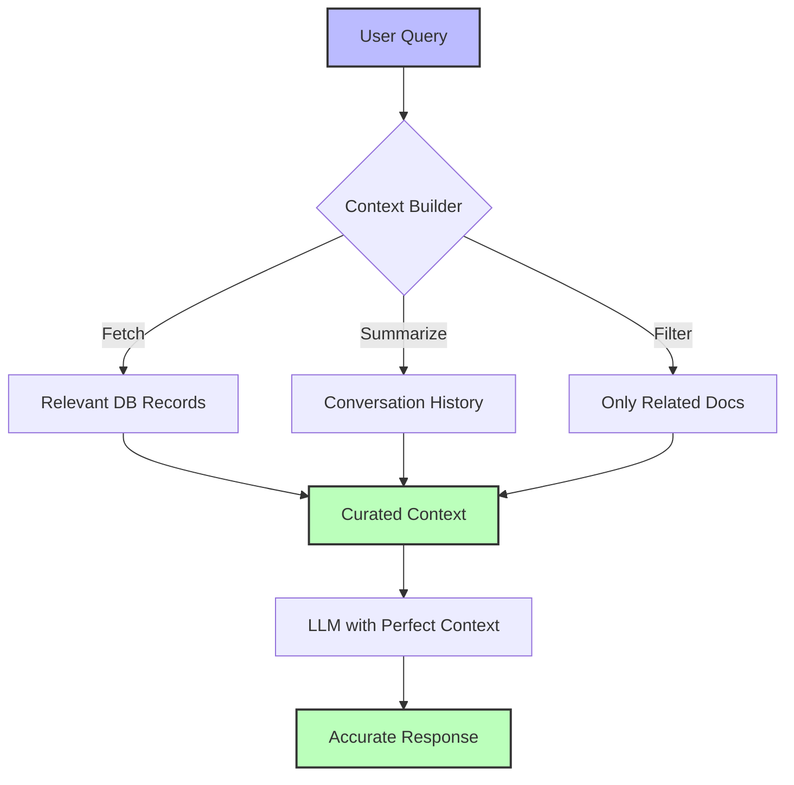

## The Principle

**Actively manage what information the LLM receives in each request. Pre-fetch relevant data and strategically curate conversation history to maximize performance within token limits.**

Context is everything for LLM performance. Too little context and the agent hallucinates. Too much and you waste tokens, increase latency, and dilute important information. The key is **intentional context engineering**.

## Why This Matters

Poor context management leads to:

1. **Hallucinations** - LLM invents information it doesn't have
2. **Wasted tokens** - Sending irrelevant conversation history
3. **High latency** - Processing unnecessary context
4. **Lost information** - Important details pushed out of window
5. **Inconsistent behavior** - Different results based on arbitrary context

**The 12 Factor mentality:** Context is a deterministic input you control. Don't dump everything—curate strategically.



## Understanding Context Windows

### Token Limits (2025)

| Model | Context Window | Cost per 1M Tokens (Input) |
|-------|---------------|---------------------------|
| Claude 3.5 Sonnet | 200K tokens | $3.00 |
| GPT-4 Turbo | 128K tokens | $10.00 |
| GPT-4o | 128K tokens | $5.00 |
| Gemini 1.5 Pro | 2M tokens | $7.00 |

**Key insight:** Just because you *can* use 200K tokens doesn't mean you *should*. Costs add up fast, and larger contexts increase latency.

### What Uses Tokens?

```typescript
interface TokenUsage {
  systemPrompt: number;      // Your instructions
  toolDefinitions: number;   // Tool schemas
  conversationHistory: number; // Past messages
  currentInput: number;      // User's query
  retrievedData: number;     // DB records, docs, etc.
  total: number;
}

// Example breakdown for a support agent query
const exampleUsage: TokenUsage = {
  systemPrompt: 500,         // "You are a support agent..."
  toolDefinitions: 1200,     // 8 tools × ~150 tokens each
  conversationHistory: 3000, // Last 10 messages
  currentInput: 50,          // "I need a refund"
  retrievedData: 800,        // Customer record + last 3 orders
  total: 5550,              // Total input tokens
};

// At $3/1M tokens: $0.01665 per query
// At 10K queries/day: $166.50/day = $5K/month just on input
```

## Pre-Fetching Strategy

### The Anti-Pattern: Letting the Agent Fetch

```typescript
// BAD: Agent decides what to fetch (multiple round-trips)
async function badApproach(userQuery: string) {
  const response1 = await llm.call({
    system: 'You are a support agent. Use tools to help users.',
    tools: [getCustomerTool, getOrdersTool, getTicketsTool],
    messages: [{ role: 'user', content: userQuery }],
  });

  // Agent says: "I need customer info"
  const customer = await getCustomer(response1.toolCalls[0].params);

  const response2 = await llm.call({
    // Send customer data back
    messages: [...previousMessages, customerData],
  });

  // Agent says: "Now I need order history"
  const orders = await getOrders(response2.toolCalls[0].params);

  // 3-4 LLM calls just to gather context! Expensive and slow.
}
```

### The Pattern: Pre-Fetch Intelligently

```typescript
// GOOD: You decide what's relevant (one LLM call)
async function goodApproach(userQuery: string, userId: string) {
  // Analyze query intent BEFORE calling LLM
  const intent = analyzeIntent(userQuery); // Simple keyword matching

  // Pre-fetch ALL potentially relevant data
  const context = await Promise.all([
    db.customers.findUnique({ where: { id: userId } }),
    intent.includes('billing') ? db.orders.findMany({
      where: { userId },
      orderBy: { createdAt: 'desc' },
      take: 5,
    }) : null,
    intent.includes('technical') ? db.tickets.findMany({
      where: { userId, status: 'open' },
    }) : null,
  ]);

  // One LLM call with complete context
  const response = await llm.call({
    system: 'You are a support agent...',
    messages: [{
      role: 'user',
      content: buildContextualPrompt(userQuery, context),
    }],
  });

  // Agent has everything it needs on first call!
}

function analyzeIntent(query: string): string[] {
  const intents: string[] = [];

  if (/refund|billing|payment|charge|invoice/i.test(query)) {
    intents.push('billing');
  }

  if (/bug|error|broken|not working|issue/i.test(query)) {
    intents.push('technical');
  }

  if (/cancel|close|delete/i.test(query)) {
    intents.push('account');
  }

  return intents;
}
```

### Structured Pre-Fetching

```typescript
interface ContextFetcher {
  name: string;
  condition: (query: string) => boolean;
  fetch: (userId: string) => Promise<unknown>;
  format: (data: unknown) => string;
}

const contextFetchers: ContextFetcher[] = [
  {
    name: 'customer_info',
    condition: () => true, // Always fetch
    fetch: async (userId) => db.customers.findUnique({ where: { id: userId } }),
    format: (data: Customer) => `Customer: ${data.name} (${data.tier} tier, joined ${data.joinedDate})`,
  },
  {
    name: 'recent_orders',
    condition: (query) => /order|purchase|billing|refund/i.test(query),
    fetch: async (userId) => db.orders.findMany({
      where: { userId },
      orderBy: { createdAt: 'desc' },
      take: 3,
    }),
    format: (data: Order[]) => {
      return `Recent orders:\n${data.map(o =>
        `- Order ${o.id}: $${o.amount} (${o.status}) on ${o.date}`
      ).join('\n')}`;
    },
  },
  {
    name: 'open_tickets',
    condition: (query) => /ticket|issue|problem|bug/i.test(query),
    fetch: async (userId) => db.tickets.findMany({
      where: { userId, status: 'open' },
    }),
    format: (data: Ticket[]) => {
      if (data.length === 0) return 'No open tickets.';
      return `Open tickets:\n${data.map(t =>
        `- #${t.id}: ${t.subject} (${t.priority})`
      ).join('\n')}`;
    },
  },
];

async function buildContext(query: string, userId: string): Promise<string> {
  const relevantFetchers = contextFetchers.filter(f => f.condition(query));

  const results = await Promise.all(
    relevantFetchers.map(async (fetcher) => {
      const data = await fetcher.fetch(userId);
      return fetcher.format(data);
    })
  );

  return results.join('\n\n');
}

// Usage
const context = await buildContext(
  'I need a refund for my last order',
  'user-123'
);

// Context includes: customer info + recent orders (skips tickets)
```

## Managing Conversation History

### The Problem: Unbounded History

```typescript
// BAD: Send entire conversation every time
class NaiveAgent {
  private messages: Message[] = [];

  async execute(input: string) {
    this.messages.push({ role: 'user', content: input });

    const response = await llm.call({
      messages: this.messages, // ❌ Grows forever
    });

    this.messages.push({ role: 'assistant', content: response });
    return response;
  }
}

// After 100 interactions:
// - 100 user messages × ~50 tokens = 5,000 tokens
// - 100 assistant messages × ~200 tokens = 20,000 tokens
// - Total: 25,000 tokens of history per request!
```

### Solution 1: Sliding Window

```typescript
class SlidingWindowAgent {
  private messages: Message[] = [];
  private readonly MAX_MESSAGES = 20; // Last 10 exchanges

  async execute(input: string) {
    this.messages.push({ role: 'user', content: input });

    // Keep only recent messages
    const recentMessages = this.messages.slice(-this.MAX_MESSAGES);

    const response = await llm.call({
      messages: recentMessages,
    });

    this.messages.push({ role: 'assistant', content: response });

    // Trim if needed
    if (this.messages.length > this.MAX_MESSAGES) {
      this.messages = this.messages.slice(-this.MAX_MESSAGES);
    }

    return response;
  }
}
```

### Solution 2: Intelligent Summarization

```typescript
class SummarizingAgent {
  private messages: Message[] = [];
  private summary: string = '';
  private readonly SUMMARIZE_THRESHOLD = 20;

  async execute(input: string) {
    this.messages.push({ role: 'user', content: input });

    // Summarize old messages when threshold reached
    if (this.messages.length > this.SUMMARIZE_THRESHOLD) {
      await this.summarizeHistory();
    }

    const contextMessages = this.summary
      ? [
          { role: 'system', content: `Previous conversation summary:\n${this.summary}` },
          ...this.messages.slice(-10), // Recent messages
        ]
      : this.messages;

    const response = await llm.call({
      messages: contextMessages,
    });

    this.messages.push({ role: 'assistant', content: response });
    return response;
  }

  private async summarizeHistory() {
    const oldMessages = this.messages.slice(0, -10);

    const summaryResponse = await llm.call({
      model: 'claude-3-haiku-20240307', // Use cheaper model for summaries
      max_tokens: 500,
      messages: [{
        role: 'user',
        content: `Summarize this conversation concisely, focusing on key decisions and unresolved issues:\n\n${
          oldMessages.map(m => `${m.role}: ${m.content}`).join('\n')
        }`
      }],
    });

    this.summary = summaryResponse.content;

    // Keep only recent messages
    this.messages = this.messages.slice(-10);
  }
}
```

### Solution 3: Semantic Compression

```typescript
class SemanticAgent {
  private embeddings: { content: string; vector: number[]; timestamp: Date }[] = [];

  async execute(input: string) {
    // Get embedding for current input
    const inputEmbedding = await getEmbedding(input);

    // Find most relevant past messages
    const relevantHistory = this.findRelevantMessages(inputEmbedding, 5);

    const response = await llm.call({
      messages: [
        ...relevantHistory,
        { role: 'user', content: input },
      ],
    });

    // Store new messages with embeddings
    await this.storeMessage(input, 'user');
    await this.storeMessage(response.content, 'assistant');

    return response;
  }

  private findRelevantMessages(queryVector: number[], topK: number): Message[] {
    // Calculate cosine similarity with all stored messages
    const similarities = this.embeddings.map(item => ({
      content: item.content,
      score: cosineSimilarity(queryVector, item.vector),
    }));

    // Return top K most relevant
    return similarities
      .sort((a, b) => b.score - a.score)
      .slice(0, topK)
      .map(item => ({ role: 'user', content: item.content }));
  }

  private async storeMessage(content: string, role: 'user' | 'assistant') {
    const vector = await getEmbedding(content);

    this.embeddings.push({
      content,
      vector,
      timestamp: new Date(),
    });

    // Keep only last 100 messages to prevent unbounded growth
    if (this.embeddings.length > 100) {
      this.embeddings = this.embeddings.slice(-100);
    }
  }
}
```

## Retrieval-Augmented Generation (RAG)

### Basic RAG Implementation

```typescript
class RAGAgent {
  constructor(
    private llm: Anthropic,
    private vectorStore: VectorStore
  ) {}

  async execute(query: string): Promise<string> {
    // 1. Search for relevant documents
    const relevantDocs = await this.vectorStore.similaritySearch(query, {
      topK: 3,
      threshold: 0.7, // Minimum similarity score
    });

    // 2. Build context from retrieved docs
    const context = relevantDocs
      .map((doc, i) => `[Source ${i + 1}]: ${doc.content}`)
      .join('\n\n');

    // 3. Query LLM with context
    const response = await this.llm.messages.create({
      model: 'claude-3-5-sonnet-20241022',
      max_tokens: 1024,
      messages: [{
        role: 'user',
        content: `Answer the question using ONLY the information in these sources. If the sources don't contain the answer, say "I don't have enough information."

Sources:
${context}

Question: ${query}

Answer:`
      }],
    });

    return response.content[0].text;
  }
}
```

### Advanced RAG: Hybrid Search

```typescript
class HybridRAGAgent {
  async execute(query: string): Promise<string> {
    // Combine semantic search with keyword search
    const [semanticResults, keywordResults] = await Promise.all([
      this.vectorStore.similaritySearch(query, { topK: 5 }),
      this.fullTextSearch(query, { topK: 5 }),
    ]);

    // Merge and deduplicate results
    const allResults = [...semanticResults, ...keywordResults];
    const uniqueResults = this.deduplicateByContent(allResults);

    // Rerank by relevance
    const reranked = await this.rerankResults(query, uniqueResults);

    // Take top 3 after reranking
    const topResults = reranked.slice(0, 3);

    return await this.queryWithContext(query, topResults);
  }

  private async rerankResults(
    query: string,
    results: Document[]
  ): Promise<Document[]> {
    // Use LLM to score relevance
    const scores = await Promise.all(
      results.map(async (doc) => {
        const scoreResponse = await this.llm.messages.create({
          model: 'claude-3-haiku-20240307', // Cheaper model for reranking
          max_tokens: 10,
          messages: [{
            role: 'user',
            content: `On a scale of 0-10, how relevant is this document to the query?

Query: ${query}

Document: ${doc.content.slice(0, 500)}

Score (0-10):`
          }],
        });

        const score = parseInt(scoreResponse.content[0].text);
        return { doc, score };
      })
    );

    return scores
      .sort((a, b) => b.score - a.score)
      .map(item => item.doc);
  }
}
```

### RAG Evaluation with RAGAS

```typescript
import { Ragas } from 'ragas';

async function evaluateRAG() {
  const ragas = new Ragas();

  const testCases = [
    {
      question: 'What is our refund policy?',
      groundTruth: 'Full refunds within 30 days, no questions asked.',
      retrievedDocs: await vectorStore.search('refund policy'),
    },
    // ... more test cases
  ];

  for (const testCase of testCases) {
    const answer = await ragAgent.execute(testCase.question);

    const metrics = await ragas.evaluate({
      question: testCase.question,
      answer,
      contexts: testCase.retrievedDocs.map(d => d.content),
      groundTruth: testCase.groundTruth,
    });

    console.log({
      question: testCase.question,
      faithfulness: metrics.faithfulness,      // Is answer grounded in context?
      answerRelevancy: metrics.answerRelevancy, // Does answer address question?
      contextPrecision: metrics.contextPrecision, // Are retrieved docs relevant?
      contextRecall: metrics.contextRecall,    // Did we retrieve all needed context?
    });
  }
}
```

## Context Optimization Patterns

### Pattern 1: Lazy Loading

```typescript
class LazyContextAgent {
  async execute(query: string, userId: string) {
    // Start with minimal context
    let context = await this.getMinimalContext(userId);

    let attempt = 0;
    const MAX_ATTEMPTS = 3;

    while (attempt < MAX_ATTEMPTS) {
      const response = await this.llm.call({
        messages: [{ role: 'user', content: this.buildPrompt(query, context) }],
      });

      // Check if agent needs more information
      if (response.content.includes('I need more information about')) {
        // Extract what it needs and fetch it
        const needed = this.extractNeededInfo(response.content);
        context = { ...context, ...(await this.fetchAdditionalContext(needed, userId)) };
        attempt++;
      } else {
        // Agent has enough context
        return response;
      }
    }

    throw new Error('Could not gather sufficient context');
  }

  private async getMinimalContext(userId: string) {
    // Just customer name and tier
    const customer = await db.customers.findUnique({
      where: { id: userId },
      select: { name: true, tier: true },
    });

    return { customer };
  }
}
```

### Pattern 2: Tiered Context

```typescript
class TieredContextAgent {
  async execute(query: string, userId: string) {
    // Tier 1: Always included (most relevant)
    const tier1 = await this.getTier1Context(userId);

    // Tier 2: Conditionally included (if space permits)
    const tier2 = this.shouldIncludeTier2(query)
      ? await this.getTier2Context(userId)
      : null;

    // Tier 3: Rarely included (only for specific queries)
    const tier3 = this.shouldIncludeTier3(query)
      ? await this.getTier3Context(userId)
      : null;

    const context = this.combineContext(tier1, tier2, tier3);

    return await this.llm.call({
      messages: [{ role: 'user', content: this.buildPrompt(query, context) }],
    });
  }

  private async getTier1Context(userId: string) {
    // Essential: customer info, account status
    return {
      customer: await db.customers.findUnique({ where: { id: userId } }),
      accountStatus: await this.getAccountStatus(userId),
    };
  }

  private async getTier2Context(userId: string) {
    // Useful: recent activity, preferences
    return {
      recentOrders: await db.orders.findMany({
        where: { userId },
        take: 5,
        orderBy: { createdAt: 'desc' },
      }),
      preferences: await db.preferences.findUnique({ where: { userId } }),
    };
  }

  private async getTier3Context(userId: string) {
    // Nice-to-have: full history, analytics
    return {
      allOrders: await db.orders.findMany({ where: { userId } }),
      usageAnalytics: await analytics.getUserMetrics(userId),
    };
  }
}
```

### Pattern 3: Dynamic Context Budgeting

```typescript
class BudgetedContextAgent {
  private readonly TOKEN_BUDGET = 8000; // Reserve 8K for context

  async execute(query: string, userId: string) {
    const contextSources: Array<{
      name: string;
      priority: number;
      estimatedTokens: number;
      fetch: () => Promise<string>;
    }> = [
      {
        name: 'customer_info',
        priority: 1,
        estimatedTokens: 100,
        fetch: async () => this.getCustomerInfo(userId),
      },
      {
        name: 'recent_orders',
        priority: 2,
        estimatedTokens: 500,
        fetch: async () => this.getRecentOrders(userId),
      },
      {
        name: 'ticket_history',
        priority: 3,
        estimatedTokens: 800,
        fetch: async () => this.getTicketHistory(userId),
      },
      {
        name: 'product_docs',
        priority: 4,
        estimatedTokens: 2000,
        fetch: async () => this.searchDocs(query),
      },
    ];

    // Sort by priority
    contextSources.sort((a, b) => a.priority - b.priority);

    let remainingBudget = this.TOKEN_BUDGET;
    const includedContext: string[] = [];

    // Include sources until budget exhausted
    for (const source of contextSources) {
      if (source.estimatedTokens <= remainingBudget) {
        includedContext.push(await source.fetch());
        remainingBudget -= source.estimatedTokens;
      }
    }

    return await this.llm.call({
      messages: [{
        role: 'user',
        content: `${includedContext.join('\n\n')}\n\nQuery: ${query}`,
      }],
    });
  }
}
```

## Monitoring Context Performance

```typescript
interface ContextMetrics {
  avgTokensUsed: number;
  avgRetrievalTime: number;
  hallucinationRate: number;
  relevanceScore: number;
}

class ContextMonitor {
  async trackContextUsage(agentExecution: AgentExecution) {
    await db.contextMetrics.create({
      data: {
        executionId: agentExecution.id,
        inputTokens: agentExecution.inputTokens,
        contextBreakdown: {
          systemPrompt: this.estimateTokens(agentExecution.systemPrompt),
          history: this.estimateTokens(agentExecution.history),
          retrievedData: this.estimateTokens(agentExecution.retrievedData),
        },
        retrievalTime: agentExecution.contextFetchDuration,
        wasHallucination: await this.detectHallucination(agentExecution),
      },
    });
  }

  private async detectHallucination(execution: AgentExecution): Promise<boolean> {
    // LLM-as-judge to detect hallucinations
    const judge = await this.llm.call({
      messages: [{
        role: 'user',
        content: `Does this response contain information NOT present in the provided context?

Context: ${execution.retrievedData}

Response: ${execution.output}

Answer YES or NO.`
      }],
    });

    return judge.content.startsWith('YES');
  }
}
```

## The Deterministic Principle

**Key insight:** Context is your deterministic input. You control what the LLM sees, how much, and in what format. The LLM just interprets it.

```typescript
// Wrong: Let LLM fetch whatever it wants
const badApproach = {
  tools: [getAllCustomersTool, getAllOrdersTool, getAllTicketsTool],
  // LLM might fetch everything! Expensive and slow ❌
};

// Right: You decide what's relevant
const goodApproach = async (query: string, userId: string) => {
  // You analyze the query (deterministic)
  const needsBilling = query.includes('refund');
  const needsTechnical = query.includes('bug');

  // You fetch exactly what's needed (deterministic)
  const context = {
    customer: await getCustomer(userId), // Always needed
    orders: needsBilling ? await getOrders(userId) : null,
    tickets: needsTechnical ? await getTickets(userId) : null,
  };

  // LLM just processes what you give it ✅
  return await llm.call({ context });
};
```

## Next Steps

Now that you own your context, continue to:

- [Factor 4: Structured Outputs](/universities/agentic-workflows/factor-04-structured-outputs) - Validate LLM responses
- [Factor 5: Unify State](/universities/agentic-workflows/factor-05-unify-state) - Single source of truth
- [Production Deployment](/universities/agentic-workflows/production-deployment) - Context optimization for scale

Or explore tools:

- [RAGAS](https://github.com/explodinggradients/ragas) - RAG evaluation framework
- [LangSmith](https://smith.langchain.com/) - Context debugging and tracing
- [W&B Weave](https://wandb.ai/site/weave/) - Monitor token usage and context performance
