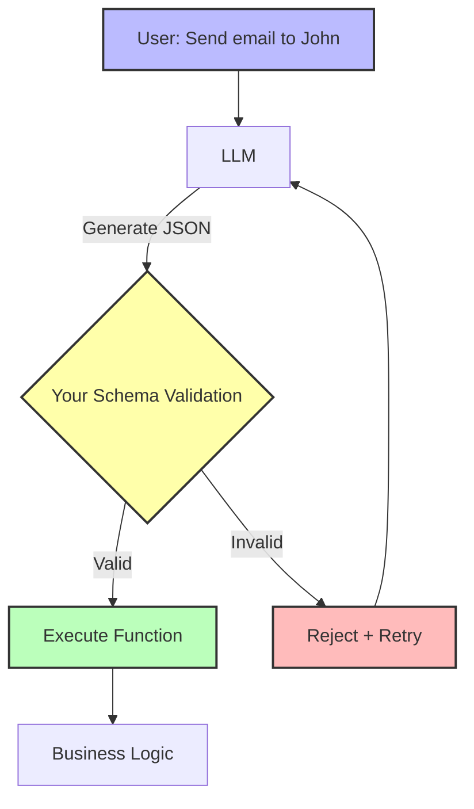

## The Principle

**Treat tool definitions as schemas for constraining LLM output. Function calling is just structured output with runtime validation.**

There's no "magic" in tool calling. It's just the LLM generating JSON that matches a schema you provide. Understanding this removes the mystery and gives you full control over validation, error handling, and behavior.

## Why This Matters

When you understand tools as structured outputs:

1. **Validation becomes obvious** - Use runtime type checking (Zod)
2. **Error handling improves** - Catch invalid outputs before execution
3. **Testing becomes easier** - Mock and verify tool call structures
4. **Control increases** - You define schemas, you control behavior

**The 12 Factor mentality:** Tool calling = deterministic schema validation. The LLM fills in the values, your code validates and enforces correctness.



## Tool Calling Demystified

### What Actually Happens

```typescript
// 1. You provide a schema (tool definition)
const schema = {
  name: 'send_email',
  input_schema: {
    type: 'object',
    properties: {
      to: { type: 'string', format: 'email' },
      subject: { type: 'string' },
      body: { type: 'string' },
    },
    required: ['to', 'subject', 'body'],
  },
};

// 2. LLM generates JSON matching that schema
const llmOutput = {
  type: 'tool_use',
  name: 'send_email',
  input: {
    to: 'john@example.com',
    subject: 'Q4 Report',
    body: 'Please review the attached Q4 report.',
  },
};

// 3. You validate and execute
const validated = validateSchema(llmOutput.input, schema);
await sendEmail(validated);
```

**That's it.** Tool calling is just:
- LLM generating JSON
- You validating it
- You executing it

### JSON Mode vs Tool Calling

They're the same concept with different interfaces:

```typescript
// JSON Mode (explicit)
const response = await anthropic.messages.create({
  model: 'claude-3-5-sonnet-20241022',
  max_tokens: 1024,
  messages: [{
    role: 'user',
    content: 'Extract email, name, and subject from this message as JSON',
  }],
});

// Parse and validate the JSON string
const data = JSON.parse(response.content[0].text);
const validated = EmailDataSchema.parse(data);

// Tool Calling (implicit JSON mode)
const response = await anthropic.messages.create({
  model: 'claude-3-5-sonnet-20241022',
  max_tokens: 1024,
  tools: [emailExtractionTool],
  tool_choice: { type: 'tool', name: 'extract_email_data' },
  messages: [{
    role: 'user',
    content: 'Extract email, name, and subject from this message',
  }],
});

// LLM returns structured tool call
const toolUse = response.content.find(b => b.type === 'tool_use');
const validated = EmailDataSchema.parse(toolUse.input);

// Same result, different interface!
```

## Building Type-Safe Tools with Zod

### Basic Tool with Validation

```typescript
import { z } from 'zod';

// 1. Define schema with Zod
const SendEmailSchema = z.object({
  to: z.string().email('Must be a valid email'),
  subject: z.string().min(1, 'Subject cannot be empty').max(200),
  body: z.string().min(1, 'Body cannot be empty'),
  cc: z.array(z.string().email()).optional(),
  attachments: z.array(z.object({
    filename: z.string(),
    url: z.string().url(),
  })).optional(),
});

type SendEmailParams = z.infer<typeof SendEmailSchema>;

// 2. Create tool
interface Tool<TParams, TResult> {
  name: string;
  description: string;
  schema: z.ZodSchema<TParams>;
  execute: (params: TParams) => Promise<TResult>;
}

const sendEmailTool: Tool<SendEmailParams, EmailResult> = {
  name: 'send_email',
  description: 'Send an email to one or more recipients',
  schema: SendEmailSchema,
  execute: async (params) => {
    // params is fully typed and validated!
    return await emailService.send({
      to: params.to,
      subject: params.subject,
      body: params.body,
      cc: params.cc,
      attachments: params.attachments,
    });
  },
};

// 3. Convert Zod to JSON Schema for Anthropic
function zodToAnthropicTool(tool: Tool<any, any>): AnthropicTool {
  return {
    name: tool.name,
    description: tool.description,
    input_schema: zodToJsonSchema(tool.schema),
  };
}
```

### Advanced Validation Rules

```typescript
// Complex business logic in schemas
const ProcessRefundSchema = z.object({
  orderId: z.string().uuid('Order ID must be valid UUID'),
  amount: z.number()
    .positive('Amount must be positive')
    .max(10000, 'Refunds over $10k require manual approval'),
  reason: z.enum([
    'defective_product',
    'wrong_item',
    'customer_request',
    'pricing_error',
  ]),
  notifyCustomer: z.boolean().default(true),
}).refine(
  // Custom validation: auto-refunds only up to $100
  (data) => data.amount <= 100 || data.reason === 'pricing_error',
  {
    message: 'Refunds over $100 require escalation unless pricing error',
    path: ['amount'],
  }
);

// Schema that depends on other fields
const CreateOrderSchema = z.object({
  customerId: z.string().uuid(),
  items: z.array(z.object({
    productId: z.string(),
    quantity: z.number().int().positive(),
  })).min(1, 'Order must have at least one item'),
  shippingMethod: z.enum(['standard', 'express', 'overnight']),
  shippingAddress: z.object({
    street: z.string(),
    city: z.string(),
    state: z.string().length(2),
    zip: z.string().regex(/^\d{5}$/),
  }),
}).refine(
  async (data) => {
    // Async validation: check customer exists
    const customer = await db.customers.findUnique({
      where: { id: data.customerId },
    });
    return customer !== null;
  },
  {
    message: 'Customer does not exist',
    path: ['customerId'],
  }
);
```

### Conditional Schemas

```typescript
// Different validation based on context
const QueryDatabaseSchema = z.discriminatedUnion('queryType', [
  z.object({
    queryType: z.literal('simple'),
    table: z.string(),
    limit: z.number().max(100).default(10),
  }),
  z.object({
    queryType: z.literal('custom'),
    sql: z.string()
      .regex(/^SELECT/i, 'Only SELECT queries allowed')
      .refine(
        (sql) => !/(DROP|DELETE|UPDATE|INSERT)/i.test(sql),
        'Only read operations allowed'
      ),
    maxRows: z.number().max(1000).default(100),
  }),
]);

// TypeScript infers correct type based on discriminator
function executeQuery(params: z.infer<typeof QueryDatabaseSchema>) {
  if (params.queryType === 'simple') {
    // params.table is available (TypeScript knows the shape)
    return db[params.table].findMany({ take: params.limit });
  } else {
    // params.sql is available
    return db.$queryRaw`${params.sql} LIMIT ${params.maxRows}`;
  }
}
```

## Validation Strategies

### Strategy 1: Fail Fast

```typescript
class ValidatingToolExecutor {
  async execute(toolCall: ToolCall): Promise<ToolResult> {
    const tool = this.tools.get(toolCall.name);
    if (!tool) {
      return {
        success: false,
        error: `Unknown tool: ${toolCall.name}`,
      };
    }

    try {
      // Validate synchronously - fail immediately if invalid
      const validated = tool.schema.parse(toolCall.input);

      // Execute with validated params
      const result = await tool.execute(validated);

      return {
        success: true,
        data: result,
      };
    } catch (error) {
      if (error instanceof z.ZodError) {
        // Return structured validation errors
        return {
          success: false,
          error: 'Validation failed',
          details: error.errors.map(e => ({
            path: e.path.join('.'),
            message: e.message,
          })),
        };
      }

      throw error; // Re-throw unexpected errors
    }
  }
}
```

### Strategy 2: Lenient with Coercion

```typescript
// Coerce types when safe
const LenientSchema = z.object({
  amount: z.coerce.number(), // "123" → 123
  enabled: z.coerce.boolean(), // "true" → true
  tags: z.preprocess(
    (val) => {
      // "tag1,tag2" → ["tag1", "tag2"]
      if (typeof val === 'string') {
        return val.split(',').map(s => s.trim());
      }
      return val;
    },
    z.array(z.string())
  ),
});

// Use for user-facing tools where format flexibility helps
const userFacingTool = {
  schema: LenientSchema,
  execute: async (params) => {
    // params.amount is guaranteed to be a number
    // params.enabled is guaranteed to be a boolean
    // params.tags is guaranteed to be string[]
  },
};
```

### Strategy 3: Graceful Defaults

```typescript
// Provide sensible defaults for optional fields
const CreateTaskSchema = z.object({
  title: z.string().min(1),
  description: z.string().default(''),
  priority: z.enum(['low', 'medium', 'high']).default('medium'),
  dueDate: z.date().optional(),
  assignee: z.string().uuid().optional(),
  tags: z.array(z.string()).default([]),
  notifyAssignee: z.boolean().default(true),
});

// LLM can omit optional fields, defaults will be used
// This reduces token usage and makes prompts simpler
```

### Strategy 4: Multi-Stage Validation

```typescript
class MultiStageValidator {
  async validate(toolCall: ToolCall): Promise<ValidationResult> {
    const tool = this.tools.get(toolCall.name);

    // Stage 1: Schema validation (fast, synchronous)
    try {
      var validated = tool.schema.parse(toolCall.input);
    } catch (error) {
      return {
        valid: false,
        stage: 'schema',
        error,
      };
    }

    // Stage 2: Business rules (medium, may hit DB)
    const businessValidation = await this.validateBusinessRules(
      toolCall.name,
      validated
    );

    if (!businessValidation.valid) {
      return {
        valid: false,
        stage: 'business',
        error: businessValidation.error,
      };
    }

    // Stage 3: External validation (slow, hits external APIs)
    if (tool.requiresExternalValidation) {
      const externalValidation = await this.validateExternal(
        toolCall.name,
        validated
      );

      if (!externalValidation.valid) {
        return {
          valid: false,
          stage: 'external',
          error: externalValidation.error,
        };
      }
    }

    return { valid: true, data: validated };
  }

  private async validateBusinessRules(
    toolName: string,
    params: unknown
  ): Promise<{ valid: boolean; error?: string }> {
    switch (toolName) {
      case 'process_refund':
        const refund = params as RefundParams;

        // Check order exists and is refundable
        const order = await db.orders.findUnique({
          where: { id: refund.orderId },
        });

        if (!order) {
          return { valid: false, error: 'Order not found' };
        }

        if (order.status === 'refunded') {
          return { valid: false, error: 'Order already refunded' };
        }

        if (refund.amount > order.total) {
          return { valid: false, error: 'Refund exceeds order total' };
        }

        return { valid: true };

      default:
        return { valid: true };
    }
  }
}
```

## Testing Structured Outputs

### Unit Testing Schemas

```typescript
import { describe, it, expect } from 'vitest';

describe('SendEmailSchema', () => {
  it('validates correct email params', () => {
    const valid = {
      to: 'user@example.com',
      subject: 'Test',
      body: 'Hello world',
    };

    expect(() => SendEmailSchema.parse(valid)).not.toThrow();
  });

  it('rejects invalid email', () => {
    const invalid = {
      to: 'not-an-email',
      subject: 'Test',
      body: 'Hello',
    };

    expect(() => SendEmailSchema.parse(invalid)).toThrow('Must be a valid email');
  });

  it('rejects empty subject', () => {
    const invalid = {
      to: 'user@example.com',
      subject: '',
      body: 'Hello',
    };

    expect(() => SendEmailSchema.parse(invalid)).toThrow('Subject cannot be empty');
  });

  it('applies defaults', () => {
    const minimal = {
      to: 'user@example.com',
      subject: 'Test',
      body: 'Hello',
    };

    const result = SendEmailSchema.parse(minimal);

    expect(result.cc).toBeUndefined();
    expect(result.attachments).toBeUndefined();
  });
});
```

### Testing Tool Execution

```typescript
describe('SendEmailTool', () => {
  it('executes with valid params', async () => {
    const params = {
      to: 'user@example.com',
      subject: 'Test',
      body: 'Hello',
    };

    const result = await sendEmailTool.execute(params);

    expect(result.success).toBe(true);
    expect(result.messageId).toBeDefined();
  });

  it('rejects invalid params before execution', async () => {
    const executor = new ValidatingToolExecutor(
      new Map([['send_email', sendEmailTool]])
    );

    const toolCall = {
      id: 'test',
      name: 'send_email',
      input: {
        to: 'invalid-email',
        subject: 'Test',
        body: 'Hello',
      },
    };

    const result = await executor.execute(toolCall);

    expect(result.success).toBe(false);
    expect(result.error).toContain('valid email');
  });
});
```

### Property-Based Testing

```typescript
import fc from 'fast-check';

describe('SendEmailSchema property tests', () => {
  it('accepts any valid email format', () => {
    fc.assert(
      fc.property(
        fc.emailAddress(), // Generate random valid emails
        fc.string({ minLength: 1, maxLength: 200 }),
        fc.string({ minLength: 1 }),
        (email, subject, body) => {
          const result = SendEmailSchema.safeParse({
            to: email,
            subject,
            body,
          });

          expect(result.success).toBe(true);
        }
      )
    );
  });

  it('rejects any non-email string', () => {
    fc.assert(
      fc.property(
        fc.string().filter(s => !/@/.test(s)), // Non-email strings
        (nonEmail) => {
          const result = SendEmailSchema.safeParse({
            to: nonEmail,
            subject: 'Test',
            body: 'Hello',
          });

          expect(result.success).toBe(false);
        }
      )
    );
  });
});
```

## Error Handling

### Validation Error Reporting

```typescript
function formatZodError(error: z.ZodError): string {
  return error.errors
    .map(e => `${e.path.join('.')}: ${e.message}`)
    .join('; ');
}

async function executeWithDetailedErrors(toolCall: ToolCall): Promise<ToolResult> {
  const tool = this.tools.get(toolCall.name);

  try {
    const validated = tool.schema.parse(toolCall.input);
    const result = await tool.execute(validated);

    return {
      success: true,
      data: result,
    };
  } catch (error) {
    if (error instanceof z.ZodError) {
      // Log full details for debugging
      logger.error('Tool validation failed', {
        tool: toolCall.name,
        input: toolCall.input,
        errors: error.errors,
      });

      // Return concise error for LLM
      return {
        success: false,
        error: `Validation failed: ${formatZodError(error)}`,
      };
    }

    // Unexpected error
    logger.error('Tool execution failed', {
      tool: toolCall.name,
      error,
    });

    return {
      success: false,
      error: 'Internal error occurred',
    };
  }
}
```

### Automatic Retry with Correction

```typescript
class SelfCorrectingAgent {
  async executeWithRetry(
    userMessage: string,
    maxAttempts: number = 2
  ): Promise<string> {
    let messages = [{ role: 'user', content: userMessage }];

    for (let attempt = 1; attempt <= maxAttempts; attempt++) {
      const response = await this.llm.call({
        tools: this.tools.map(t => zodToAnthropicTool(t)),
        messages,
      });

      const toolUse = response.content.find(b => b.type === 'tool_use');

      if (!toolUse) {
        // No tool call, return text response
        return response.content[0].text;
      }

      // Validate tool call
      const tool = this.tools.find(t => t.name === toolUse.name);
      const validation = tool.schema.safeParse(toolUse.input);

      if (validation.success) {
        // Valid! Execute and return
        const result = await tool.execute(validation.data);
        return this.formatResult(result);
      }

      // Invalid - give LLM feedback and retry
      if (attempt < maxAttempts) {
        messages.push(
          {
            role: 'assistant',
            content: response.content,
          },
          {
            role: 'user',
            content: [{
              type: 'tool_result',
              tool_use_id: toolUse.id,
              content: JSON.stringify({
                success: false,
                error: formatZodError(validation.error),
                hint: 'Check the tool parameter requirements and try again.',
              }),
            }],
          }
        );

        continue; // Retry
      }

      // Max attempts reached
      throw new Error('Could not generate valid tool call');
    }
  }
}
```

## Evaluating Structured Output Quality

### Test with Braintrust

```typescript
import { Braintrust } from 'braintrust';

async function evaluateToolCalling() {
  const bt = new Braintrust({ apiKey: process.env.BRAINTRUST_API_KEY });

  const testCases = [
    {
      input: 'Send an email to john@example.com with subject "Q4 Report"',
      expectedTool: 'send_email',
      expectedParams: {
        to: 'john@example.com',
        subject: 'Q4 Report',
      },
    },
    {
      input: 'Create a task titled "Review PR" with high priority',
      expectedTool: 'create_task',
      expectedParams: {
        title: 'Review PR',
        priority: 'high',
      },
    },
  ];

  return await bt.evaluate({
    projectName: 'tool-calling-agent',
    data: testCases,
    task: async (testCase) => {
      const response = await agent.execute(testCase.input);
      return response;
    },
    scores: [
      {
        name: 'correct_tool',
        scorer: (output, expected) => {
          return output.toolName === expected.expectedTool ? 1 : 0;
        },
      },
      {
        name: 'valid_params',
        scorer: (output, expected) => {
          try {
            // Verify params match schema
            const tool = tools.find(t => t.name === output.toolName);
            tool.schema.parse(output.params);

            // Check expected values present
            for (const [key, value] of Object.entries(expected.expectedParams)) {
              if (output.params[key] !== value) {
                return 0;
              }
            }

            return 1;
          } catch {
            return 0;
          }
        },
      },
    ],
  });
}
```

## The Deterministic Principle

**Key insight:** Structured outputs are your deterministic contract with the LLM. The LLM fills in values, but your schema defines the structure and validates correctness.

```typescript
// Wrong: Hope the LLM gets it right
const badApproach = {
  prompt: 'Send an email. Output format: to, subject, body',
  // No validation! LLM might output anything ❌
};

// Right: Enforce correctness with schema
const goodApproach = {
  schema: z.object({
    to: z.string().email(), // Must be valid email
    subject: z.string().min(1).max(200), // Must have length
    body: z.string().min(1), // Cannot be empty
  }),
  // LLM must match this or call is rejected ✅
};
```

## Next Steps

Now that you understand structured outputs, continue to:

- [Factor 5: Unify State](/universities/agentic-workflows/factor-05-unify-state) - Single source of truth
- [Factor 6: Pause/Resume](/universities/agentic-workflows/factor-06-pause-resume) - Checkpoint agent execution
- [Testing & Validation](/universities/agentic-workflows/testing-validation) - Comprehensive testing guide

Or explore tools:

- [Zod](https://zod.dev/) - TypeScript-first schema validation
- [Braintrust](https://www.braintrust.dev/) - Tool calling evaluation
- [fast-check](https://fast-check.dev/) - Property-based testing
