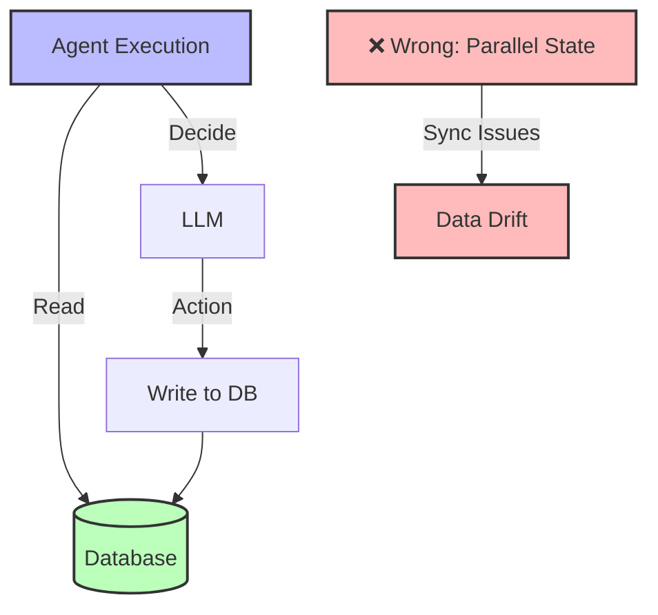

## The Principle

**Keep agent state synchronized with your application's persistent state. Don't duplicate data between agent memory and your database.**

The database is your single source of truth. Agent state is ephemeral execution data—not a parallel copy of business data. Mixing these leads to bugs, data drift, and consistency nightmares.

## Why This Matters

Duplicated state causes:

1. **Data drift** - Agent memory diverges from database
2. **Stale data** - Agent works with outdated information
3. **Consistency bugs** - Updates in one place miss the other
4. **Complex debugging** - Which state is correct?
5. **Wasted memory** - Storing same data twice

**The 12 Factor mentality:** Database = source of truth (deterministic). Agent = stateless processor that reads from DB, makes decisions, writes back to DB.



## The Anti-Pattern: Duplicated State

### Wrong: Agent Memory as State Store

```typescript
// BAD: Agent stores business data
class BadAgent {
  private memory = {
    userId: 'user-123',
    userName: 'Alice', // ❌ Also in database
    userEmail: 'alice@example.com', // ❌ Also in database
    userTier: 'pro', // ❌ Also in database
    currentOrders: [], // ❌ Also in database
    openTickets: [], // ❌ Also in database
  };

  async execute(input: string) {
    // Uses stale memory data
    const response = await llm.call({
      context: `User: ${this.memory.userName} (${this.memory.userTier})`,
      input,
    });

    // Updates memory but not database
    if (response.action === 'upgrade_tier') {
      this.memory.userTier = 'enterprise'; // ❌ Out of sync!
    }

    return response;
  }
}

// Problems:
// 1. If user upgrades via website, agent memory is stale
// 2. If agent upgrades user, website doesn't know
// 3. If agent restarts, memory is lost
// 4. Multiple agent instances have different memories
```

### Why This Fails

```typescript
// Scenario: User upgrades on website
await db.users.update({
  where: { id: 'user-123' },
  data: { tier: 'enterprise' },
});

// Meanwhile, agent still thinks user is 'pro'
const agent = new BadAgent(); // memory.userTier = 'pro'

await agent.execute('Process my $500 refund');
// Agent checks memory: userTier === 'pro'
// Rejects refund (pro limit is $100)
// But user is actually enterprise (can get $500 refund)!

// Data drift causes wrong behavior
```

## The Pattern: Database as Source of Truth

### Right: Fetch Fresh Data

```typescript
class GoodAgent {
  constructor(
    private db: Database,
    private llm: LLM
  ) {}

  async execute(userId: string, input: string): Promise<AgentResult> {
    // Fetch fresh data from database every time
    const user = await this.db.users.findUnique({
      where: { id: userId },
      include: {
        orders: {
          where: { status: 'pending' },
          take: 5,
        },
        tickets: {
          where: { status: 'open' },
        },
      },
    });

    // Use fresh data for decision-making
    const response = await this.llm.call({
      system: this.buildSystemPrompt(),
      context: this.formatUserContext(user),
      input,
    });

    // Execute action based on current state
    if (response.action === 'process_refund') {
      const order = await this.db.orders.findUnique({
        where: { id: response.params.orderId },
      });

      // Validate against current state
      if (order.status === 'refunded') {
        return { error: 'Order already refunded' };
      }

      // Update database (single source of truth)
      await this.db.orders.update({
        where: { id: order.id },
        data: { status: 'refunded' },
      });

      await this.db.refunds.create({
        data: {
          orderId: order.id,
          amount: response.params.amount,
          processedBy: 'agent',
        },
      });

      return { success: true };
    }
  }

  private formatUserContext(user: User): string {
    // Always accurate because fetched fresh
    return `User: ${user.name} (${user.tier} tier since ${user.joinedDate})
${user.orders.length} pending orders
${user.tickets.length} open tickets`;
  }
}
```

## What to Store (and What Not To)

### Store in Database (Source of Truth)

```typescript
// Business data - always in database
interface UserRecord {
  id: string;
  name: string;
  email: string;
  tier: 'free' | 'pro' | 'enterprise';
  createdAt: Date;
  updatedAt: Date;
}

interface OrderRecord {
  id: string;
  userId: string;
  total: number;
  status: 'pending' | 'completed' | 'refunded' | 'cancelled';
  items: OrderItem[];
  createdAt: Date;
}

// Agent execution history - also in database
interface AgentExecutionRecord {
  id: string;
  userId: string;
  input: string;
  output: string;
  toolsUsed: string[];
  tokensUsed: number;
  duration: number;
  success: boolean;
  createdAt: Date;
}
```

### Store in Memory (Ephemeral)

```typescript
// Only ephemeral execution state
interface AgentMemory {
  currentExecutionId: string;      // Current run ID
  conversationTurns: number;        // Count of LLM calls this session
  pendingToolCalls: ToolCall[];     // In-flight operations
  lastCheckpointTime: Date;         // For resumability
}

// NOT business data!
// If you need it again later, fetch from database
```

## Unified State Patterns

### Pattern 1: Read Fresh, Act, Write

```typescript
class ReadActWriteAgent {
  async execute(userId: string, action: string): Promise<Result> {
    // 1. READ: Fetch current state
    const currentState = await this.db.transaction(async (tx) => {
      return {
        user: await tx.users.findUnique({ where: { id: userId } }),
        orders: await tx.orders.findMany({
          where: { userId, status: 'pending' },
        }),
      };
    });

    // 2. ACT: LLM makes decision based on current state
    const decision = await this.llm.call({
      context: currentState,
      action,
    });

    // 3. WRITE: Update database atomically
    const result = await this.db.transaction(async (tx) => {
      if (decision.action === 'upgrade_user') {
        await tx.users.update({
          where: { id: userId },
          data: { tier: decision.params.newTier },
        });
      }

      if (decision.action === 'cancel_orders') {
        await tx.orders.updateMany({
          where: {
            id: { in: decision.params.orderIds },
          },
          data: { status: 'cancelled' },
        });
      }

      return { success: true };
    });

    return result;
  }
}
```

### Pattern 2: Optimistic Locking

```typescript
// Prevent race conditions
interface VersionedOrder {
  id: string;
  version: number; // Increment on every update
  status: string;
  // ... other fields
}

class OptimisticLockingAgent {
  async processRefund(orderId: string, amount: number): Promise<Result> {
    // Read order with version
    const order = await this.db.orders.findUnique({
      where: { id: orderId },
    });

    if (!order) {
      return { error: 'Order not found' };
    }

    if (order.status === 'refunded') {
      return { error: 'Already refunded' };
    }

    // LLM decides if refund should be approved
    const decision = await this.llm.call({
      context: { order, requestedAmount: amount },
      action: 'evaluate_refund',
    });

    if (!decision.approved) {
      return { error: decision.reason };
    }

    // Update with version check
    try {
      await this.db.orders.update({
        where: {
          id: orderId,
          version: order.version, // Only update if version matches
        },
        data: {
          status: 'refunded',
          version: order.version + 1, // Increment version
        },
      });

      return { success: true };
    } catch (error) {
      // Version mismatch - someone else updated the order
      return {
        error: 'Order was modified by another process, please retry',
      };
    }
  }
}
```

### Pattern 3: Event Sourcing

```typescript
// Store events, derive state
interface OrderEvent {
  id: string;
  orderId: string;
  type: 'created' | 'updated' | 'cancelled' | 'refunded';
  data: Record<string, unknown>;
  agentId?: string;
  timestamp: Date;
}

class EventSourcedAgent {
  async execute(orderId: string, action: string): Promise<Result> {
    // Read current state from events
    const events = await this.db.orderEvents.findMany({
      where: { orderId },
      orderBy: { timestamp: 'asc' },
    });

    const currentState = this.reconstructState(events);

    // LLM makes decision
    const decision = await this.llm.call({
      context: currentState,
      action,
    });

    // Write new event (append-only)
    await this.db.orderEvents.create({
      data: {
        orderId,
        type: decision.action,
        data: decision.params,
        agentId: this.id,
        timestamp: new Date(),
      },
    });

    return { success: true };
  }

  private reconstructState(events: OrderEvent[]): OrderState {
    let state: OrderState = { status: 'pending', items: [], total: 0 };

    for (const event of events) {
      switch (event.type) {
        case 'created':
          state = { ...state, ...event.data };
          break;
        case 'refunded':
          state.status = 'refunded';
          break;
        case 'cancelled':
          state.status = 'cancelled';
          break;
      }
    }

    return state;
  }
}
```

## Managing Execution History

### Store Minimal History

```typescript
// Don't store full conversation in database
// Store only what's needed for auditing and debugging

interface AgentRun {
  id: string;
  userId: string;
  input: string;              // User's query
  output: string;             // Agent's response
  toolsUsed: string[];        // Which tools were called
  tokensUsed: number;         // Cost tracking
  duration: number;           // Performance monitoring
  success: boolean;
  errorMessage?: string;
  metadata: {
    model: string;
    promptVersion: string;
    timestamp: Date;
  };
}

// For conversation continuity, use in-memory cache or short-lived session storage
// Not permanent database storage
```

### Conversation State with Zustand

```typescript
import { create } from 'zustand';
import { persist } from 'zustand/middleware';

interface ConversationStore {
  conversations: Map<string, Message[]>;
  addMessage: (conversationId: string, message: Message) => void;
  getHistory: (conversationId: string, limit?: number) => Message[];
  clearConversation: (conversationId: string) => void;
}

export const useConversationStore = create<ConversationStore>()(
  persist(
    (set, get) => ({
      conversations: new Map(),

      addMessage: (conversationId, message) => {
        set((state) => {
          const updated = new Map(state.conversations);
          const history = updated.get(conversationId) || [];

          history.push(message);

          // Keep only last 20 messages per conversation
          if (history.length > 20) {
            history.shift();
          }

          updated.set(conversationId, history);
          return { conversations: updated };
        });
      },

      getHistory: (conversationId, limit = 10) => {
        const history = get().conversations.get(conversationId) || [];
        return history.slice(-limit);
      },

      clearConversation: (conversationId) => {
        set((state) => {
          const updated = new Map(state.conversations);
          updated.delete(conversationId);
          return { conversations: updated };
        });
      },
    }),
    {
      name: 'conversation-storage', // localStorage key
      // Expire after 24 hours
      version: 1,
    }
  )
);

// Use in agent
class SessionAwareAgent {
  async execute(userId: string, input: string): Promise<string> {
    const conversationId = `user-${userId}`;

    // Get ephemeral conversation history from cache
    const history = useConversationStore
      .getState()
      .getHistory(conversationId, 10);

    // Get current business state from database
    const user = await this.db.users.findUnique({
      where: { id: userId },
    });

    const response = await this.llm.call({
      history, // Ephemeral (cache)
      context: user, // Persistent (database)
      input,
    });

    // Store message in ephemeral cache
    useConversationStore.getState().addMessage(conversationId, {
      role: 'user',
      content: input,
    });

    useConversationStore.getState().addMessage(conversationId, {
      role: 'assistant',
      content: response,
    });

    // Store execution record in database (for auditing)
    await this.db.agentRuns.create({
      data: {
        userId,
        input,
        output: response,
        success: true,
      },
    });

    return response;
  }
}
```

## Database Transaction Patterns

### Atomic Operations

```typescript
class TransactionalAgent {
  async processComplexWorkflow(userId: string): Promise<Result> {
    // All-or-nothing: either entire workflow succeeds or none of it does
    return await this.db.$transaction(async (tx) => {
      // 1. Fetch current state
      const user = await tx.users.findUnique({ where: { id: userId } });
      const orders = await tx.orders.findMany({
        where: { userId, status: 'pending' },
      });

      // 2. LLM makes decision based on fetched state
      const decision = await this.llm.call({
        context: { user, orders },
        action: 'optimize_subscriptions',
      });

      // 3. Execute multiple updates atomically
      for (const action of decision.actions) {
        if (action.type === 'upgrade_tier') {
          await tx.users.update({
            where: { id: userId },
            data: { tier: action.newTier },
          });
        }

        if (action.type === 'cancel_order') {
          await tx.orders.update({
            where: { id: action.orderId },
            data: { status: 'cancelled' },
          });
        }

        if (action.type === 'create_discount') {
          await tx.discounts.create({
            data: {
              userId,
              code: action.code,
              amount: action.amount,
            },
          });
        }
      }

      // All updates committed together
      return { success: true, actionsPerformed: decision.actions.length };
    });
  }
}
```

### Idempotent Operations

```typescript
// Ensure same operation can be safely retried
class IdempotentAgent {
  async processRefund(
    orderId: string,
    amount: number,
    idempotencyKey: string
  ): Promise<Result> {
    // Check if this operation was already processed
    const existing = await this.db.refunds.findUnique({
      where: { idempotencyKey },
    });

    if (existing) {
      return {
        success: true,
        alreadyProcessed: true,
        refundId: existing.id,
      };
    }

    // Proceed with refund
    const order = await this.db.orders.findUnique({
      where: { id: orderId },
    });

    if (order.status === 'refunded') {
      return { error: 'Order already refunded' };
    }

    // Process atomically with idempotency key
    return await this.db.$transaction(async (tx) => {
      await tx.orders.update({
        where: { id: orderId },
        data: { status: 'refunded' },
      });

      const refund = await tx.refunds.create({
        data: {
          orderId,
          amount,
          idempotencyKey, // Store key to prevent duplicates
          processedAt: new Date(),
        },
      });

      return {
        success: true,
        refundId: refund.id,
      };
    });
  }
}
```

## Monitoring State Consistency

```typescript
class StateMonitor {
  async checkConsistency(userId: string): Promise<ConsistencyReport> {
    // Verify database state is internally consistent
    const user = await this.db.users.findUnique({
      where: { id: userId },
      include: {
        orders: true,
        refunds: true,
      },
    });

    const issues: string[] = [];

    // Check 1: Refund amounts don't exceed order totals
    for (const refund of user.refunds) {
      const order = user.orders.find(o => o.id === refund.orderId);

      if (refund.amount > order.total) {
        issues.push(`Refund ${refund.id} exceeds order ${order.id} total`);
      }
    }

    // Check 2: Cancelled orders have no pending refunds
    const cancelledOrders = user.orders.filter(o => o.status === 'cancelled');
    for (const order of cancelledOrders) {
      const pendingRefunds = user.refunds.filter(
        r => r.orderId === order.id && r.status === 'pending'
      );

      if (pendingRefunds.length > 0) {
        issues.push(`Cancelled order ${order.id} has pending refunds`);
      }
    }

    // Check 3: User tier matches subscription
    if (user.tier === 'enterprise' && !user.enterpriseSubscription) {
      issues.push('User tier is enterprise but no subscription found');
    }

    return {
      consistent: issues.length === 0,
      issues,
    };
  }

  // Run after agent executions to detect issues early
  async validateAfterExecution(executionId: string) {
    const execution = await this.db.agentRuns.findUnique({
      where: { id: executionId },
    });

    const report = await this.checkConsistency(execution.userId);

    if (!report.consistent) {
      await this.db.consistencyIssues.create({
        data: {
          userId: execution.userId,
          agentRunId: executionId,
          issues: report.issues,
          severity: 'high',
        },
      });

      // Alert team
      await this.alerting.send({
        title: 'State Consistency Issue Detected',
        message: `Agent execution ${executionId} resulted in inconsistent state`,
        issues: report.issues,
      });
    }
  }
}
```

## The Deterministic Principle

**Key insight:** Your database is deterministic truth. Agent memory is ephemeral scratch space for the current execution only.

```typescript
// Wrong: Parallel state management
const badApproach = {
  database: { userTier: 'enterprise' },
  agentMemory: { userTier: 'pro' }, // ❌ Out of sync!
  // Which is correct? Who knows!
};

// Right: Single source of truth
const goodApproach = async (userId: string) => {
  // Always fetch from database
  const user = await db.users.findUnique({ where: { id: userId } });

  // user.tier is guaranteed accurate ✅
  return user;
};
```

## Next Steps

Now that you understand unified state, continue to:

- [Factor 6: Pause/Resume APIs](/universities/agentic-workflows/factor-06-pause-resume) - Checkpoint execution
- [Factor 7: Human-in-Loop](/universities/agentic-workflows/factor-07-human-in-loop) - Request human approval
- [Production Deployment](/universities/agentic-workflows/production-deployment) - State management at scale

Or review related concepts:

- [Factor 3: Own Your Context](/universities/agentic-workflows/factor-03-own-your-context) - Fresh data fetching strategies
- [Core Concepts Glossary](/universities/agentic-workflows/glossary-core-concepts) - State management patterns
