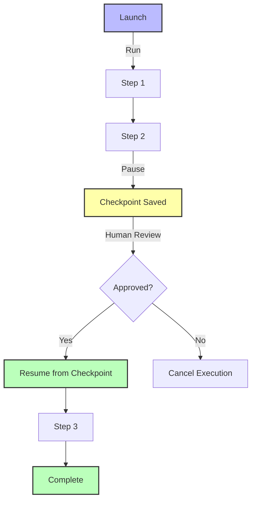

## The Principle

**Design agents to be pausable and resumable without losing context. Provide simple APIs for launching, pausing, and continuing execution.**

Production agents can't run unchecked. They need to pause for human approval, wait for external data, or handle long-running tasks. Your architecture must support interruption and continuation as first-class concepts.

## Why This Matters

Pausability enables:

1. **Human-in-the-Loop** - Get approval before critical actions
2. **Async Workflows** - Handle operations that take hours/days
3. **Error Recovery** - Pause on failure, fix issue, resume
4. **Cost Control** - Pause expensive operations for review
5. **Compliance** - Audit trail of checkpoints and approvals

**The 12 Factor mentality:** Agents are deterministic state machines. You control when they run, pause, and resume. The LLM just processes the current step.



## Basic Pausable Agent

### Simple Implementation

```typescript
import { create } from 'zustand';

interface AgentState {
  id: string;
  status: 'idle' | 'running' | 'paused' | 'completed' | 'failed';
  currentStep: number;
  totalSteps: number;
  checkpoint: AgentCheckpoint;
  result?: unknown;
  error?: string;
}

interface AgentCheckpoint {
  step: number;
  context: Record<string, unknown>;
  messages: Message[];
  pendingApprovals: ApprovalRequest[];
}

class PausableAgent {
  private state: AgentState;

  constructor(private db: Database, private llm: LLM) {}

  async launch(input: string): Promise<string> {
    // Create new execution
    const execution = await this.db.agentExecutions.create({
      data: {
        status: 'running',
        input,
        checkpoint: {},
      },
    });

    this.state = {
      id: execution.id,
      status: 'running',
      currentStep: 0,
      totalSteps: 0,
      checkpoint: {
        step: 0,
        context: {},
        messages: [],
        pendingApprovals: [],
      },
    };

    // Start execution (async)
    this.execute(input).catch(async (error) => {
      await this.fail(error.message);
    });

    return execution.id; // Return execution ID immediately
  }

  async pause(): Promise<void> {
    if (this.state.status !== 'running') {
      throw new Error('Agent is not running');
    }

    // Save checkpoint
    await this.saveCheckpoint();

    this.state.status = 'paused';

    await this.db.agentExecutions.update({
      where: { id: this.state.id },
      data: { status: 'paused' },
    });
  }

  async resume(): Promise<void> {
    if (this.state.status !== 'paused') {
      throw new Error('Agent is not paused');
    }

    // Restore from checkpoint
    await this.loadCheckpoint();

    this.state.status = 'running';

    await this.db.agentExecutions.update({
      where: { id: this.state.id },
      data: { status: 'running' },
    });

    // Continue execution
    await this.executeFromCheckpoint();
  }

  async getStatus(): Promise<AgentState> {
    return this.state;
  }

  private async execute(input: string): Promise<void> {
    // Agent execution logic
    // Will call this.pause() when approval needed
  }

  private async saveCheckpoint(): Promise<void> {
    await this.db.agentExecutions.update({
      where: { id: this.state.id },
      data: {
        checkpoint: JSON.stringify(this.state.checkpoint),
      },
    });
  }

  private async loadCheckpoint(): Promise<void> {
    const execution = await this.db.agentExecutions.findUnique({
      where: { id: this.state.id },
    });

    this.state.checkpoint = JSON.parse(execution.checkpoint);
  }
}
```

## Checkpoint Strategies

### Strategy 1: Step-Based Checkpoints

```typescript
class StepBasedAgent {
  private steps = [
    this.analyzeRequest,
    this.fetchData,
    this.processData,
    this.generateResponse,
    this.executeActions,
  ];

  async execute(input: string): Promise<Result> {
    let currentStep = this.state.checkpoint.step || 0;

    while (currentStep < this.steps.length) {
      // Save checkpoint before each step
      await this.checkpoint({
        step: currentStep,
        context: this.context,
      });

      // Execute step
      try {
        await this.steps[currentStep].call(this);
        currentStep++;
      } catch (error) {
        // Pause on error
        await this.pause();
        throw error;
      }

      // Check if pause requested
      if (this.state.status === 'paused') {
        return { paused: true, step: currentStep };
      }
    }

    return { completed: true };
  }

  async resumeFromCheckpoint(): Promise<Result> {
    // Start from checkpointed step
    const startStep = this.state.checkpoint.step;

    // Restore context
    this.context = this.state.checkpoint.context;

    // Continue execution
    return await this.execute(this.state.checkpoint.input);
  }
}
```

### Strategy 2: Event-Based Checkpoints

```typescript
interface AgentEvent {
  type: 'step_started' | 'step_completed' | 'approval_requested' | 'error' | 'completed';
  data: Record<string, unknown>;
  timestamp: Date;
}

class EventDrivenAgent {
  private events: AgentEvent[] = [];

  async execute(input: string): Promise<Result> {
    await this.emit({ type: 'step_started', data: { input } });

    try {
      // Step 1: Analyze
      const analysis = await this.analyze(input);
      await this.emit({ type: 'step_completed', data: { analysis } });

      // Step 2: Need approval?
      if (analysis.needsApproval) {
        await this.emit({
          type: 'approval_requested',
          data: { reason: analysis.approvalReason },
        });

        // Pause and wait
        await this.pause();
        return { awaitingApproval: true };
      }

      // Step 3: Execute
      const result = await this.executeAction(analysis);
      await this.emit({ type: 'step_completed', data: { result } });

      await this.emit({ type: 'completed', data: { result } });
      return { completed: true, result };
    } catch (error) {
      await this.emit({ type: 'error', data: { error: error.message } });
      throw error;
    }
  }

  async resume(): Promise<Result> {
    // Replay events to restore state
    for (const event of this.events) {
      await this.handleEvent(event);
    }

    // Continue from last checkpoint
    const lastEvent = this.events[this.events.length - 1];

    if (lastEvent.type === 'approval_requested') {
      // Resume after approval
      const analysis = this.findEventData('step_completed', 'analysis');
      return await this.executeAction(analysis);
    }

    throw new Error('Cannot resume from current state');
  }

  private async emit(event: Omit<AgentEvent, 'timestamp'>): Promise<void> {
    const fullEvent = { ...event, timestamp: new Date() };
    this.events.push(fullEvent);

    await this.db.agentEvents.create({
      data: {
        executionId: this.state.id,
        type: fullEvent.type,
        data: JSON.stringify(fullEvent.data),
        timestamp: fullEvent.timestamp,
      },
    });
  }
}
```

### Strategy 3: Continuous Checkpointing

```typescript
class ContinuousCheckpointAgent {
  private checkpointInterval = 30000; // 30 seconds
  private lastCheckpoint = Date.now();

  async execute(input: string): Promise<Result> {
    // Start automatic checkpointing
    const checkpointTimer = setInterval(async () => {
      if (this.state.status === 'running') {
        await this.saveCheckpoint();
      }
    }, this.checkpointInterval);

    try {
      const result = await this.runWorkflow(input);
      clearInterval(checkpointTimer);
      return result;
    } catch (error) {
      clearInterval(checkpointTimer);
      // Last checkpoint saved automatically
      throw error;
    }
  }

  private async runWorkflow(input: string): Promise<Result> {
    // Long-running workflow
    for (let i = 0; i < 100; i++) {
      await this.processChunk(i);

      // Automatic checkpoint every 30s
      // No manual checkpointing needed!
    }

    return { completed: true };
  }
}
```

## Human-in-the-Loop Integration

### Approval Workflow

```typescript
interface ApprovalRequest {
  id: string;
  executionId: string;
  action: string;
  context: Record<string, unknown>;
  requestedAt: Date;
  status: 'pending' | 'approved' | 'rejected' | 'expired';
}

class ApprovalAgent {
  async execute(input: string): Promise<Result> {
    // Step 1: Analyze request
    const analysis = await this.llm.call({
      messages: [{ role: 'user', content: input }],
    });

    // Step 2: Check if sensitive action
    if (this.isSensitiveAction(analysis.action)) {
      // Request human approval
      const approvalId = await this.requestApproval({
        action: analysis.action,
        context: analysis.params,
      });

      // Pause execution
      await this.pause();

      // Store approval ID in checkpoint
      this.state.checkpoint.pendingApprovals.push(approvalId);

      return { awaitingApproval: true, approvalId };
    }

    // Step 3: Execute action
    return await this.executeAction(analysis);
  }

  async requestApproval(request: {
    action: string;
    context: Record<string, unknown>;
  }): Promise<string> {
    const approval = await this.db.approvals.create({
      data: {
        executionId: this.state.id,
        action: request.action,
        context: JSON.stringify(request.context),
        status: 'pending',
        expiresAt: new Date(Date.now() + 3600000), // 1 hour
      },
    });

    // Notify human (Slack, email, etc.)
    await this.notifyHuman({
      approvalId: approval.id,
      action: request.action,
      context: request.context,
    });

    return approval.id;
  }

  async handleApproval(approvalId: string, decision: 'approved' | 'rejected'): Promise<void> {
    // Update approval record
    await this.db.approvals.update({
      where: { id: approvalId },
      data: {
        status: decision,
        respondedAt: new Date(),
      },
    });

    // Get execution ID
    const approval = await this.db.approvals.findUnique({
      where: { id: approvalId },
      include: { execution: true },
    });

    if (decision === 'approved') {
      // Resume agent execution
      const agent = await this.loadAgent(approval.execution.id);
      await agent.resume();
    } else {
      // Cancel execution
      await this.db.agentExecutions.update({
        where: { id: approval.execution.id },
        data: { status: 'cancelled' },
      });
    }
  }

  private isSensitiveAction(action: string): boolean {
    const sensitiveActions = [
      'delete_data',
      'process_large_refund',
      'change_user_permissions',
      'send_bulk_email',
    ];

    return sensitiveActions.includes(action);
  }
}
```

### Timeout Handling

```typescript
class TimeoutAwareAgent {
  async requestApprovalWithTimeout(
    request: ApprovalRequest,
    timeoutMs: number = 3600000 // 1 hour default
  ): Promise<ApprovalResult> {
    const approvalId = await this.requestApproval(request);

    return new Promise((resolve) => {
      // Set timeout
      const timeout = setTimeout(async () => {
        // Check if still pending
        const approval = await this.db.approvals.findUnique({
          where: { id: approvalId },
        });

        if (approval.status === 'pending') {
          // Expire the approval
          await this.db.approvals.update({
            where: { id: approvalId },
            data: { status: 'expired' },
          });

          // Fail the execution
          await this.fail('Approval timeout - no response within time limit');

          resolve({ expired: true });
        }
      }, timeoutMs);

      // Poll for approval
      const pollInterval = setInterval(async () => {
        const approval = await this.db.approvals.findUnique({
          where: { id: approvalId },
        });

        if (approval.status !== 'pending') {
          clearInterval(pollInterval);
          clearTimeout(timeout);

          resolve({
            approved: approval.status === 'approved',
            rejected: approval.status === 'rejected',
          });
        }
      }, 5000); // Check every 5 seconds
    });
  }
}
```

## State Machine Integration

### XState for Control Flow

```typescript
import { createMachine, interpret, assign } from 'xstate';

interface AgentContext {
  input: string;
  result?: unknown;
  error?: string;
  approvalId?: string;
}

const pausableAgentMachine = createMachine<AgentContext>({
  id: 'pausableAgent',
  initial: 'idle',
  context: {
    input: '',
  },
  states: {
    idle: {
      on: {
        START: {
          target: 'analyzing',
          actions: assign({
            input: (_, event) => event.input,
          }),
        },
      },
    },
    analyzing: {
      invoke: {
        src: 'analyzeInput',
        onDone: {
          target: 'checkingSensitivity',
          actions: assign({
            result: (_, event) => event.data,
          }),
        },
        onError: {
          target: 'failed',
          actions: assign({
            error: (_, event) => event.data.message,
          }),
        },
      },
    },
    checkingSensitivity: {
      always: [
        {
          target: 'requestingApproval',
          cond: 'needsApproval',
        },
        {
          target: 'executing',
        },
      ],
    },
    requestingApproval: {
      entry: 'requestApproval',
      on: {
        APPROVED: 'executing',
        REJECTED: 'cancelled',
        TIMEOUT: 'failed',
      },
    },
    executing: {
      invoke: {
        src: 'executeAction',
        onDone: 'completed',
        onError: {
          target: 'failed',
          actions: assign({
            error: (_, event) => event.data.message,
          }),
        },
      },
    },
    completed: {
      type: 'final',
    },
    cancelled: {
      type: 'final',
    },
    failed: {
      type: 'final',
    },
  },
});

class StateMachineAgent {
  private service: any;

  constructor(private db: Database, private llm: LLM) {
    this.service = interpret(pausableAgentMachine, {
      services: {
        analyzeInput: async (context) => {
          return await this.analyze(context.input);
        },
        executeAction: async (context) => {
          return await this.execute(context.result);
        },
      },
      guards: {
        needsApproval: (context) => {
          return this.isSensitiveAction(context.result.action);
        },
      },
      actions: {
        requestApproval: async (context) => {
          const approvalId = await this.requestApproval(context.result);
          context.approvalId = approvalId;
        },
      },
    });

    this.service.start();
  }

  async launch(input: string): Promise<void> {
    this.service.send({ type: 'START', input });
  }

  async handleApproval(decision: 'approved' | 'rejected'): Promise<void> {
    this.service.send({
      type: decision === 'approved' ? 'APPROVED' : 'REJECTED',
    });
  }

  getState(): string {
    return this.service.state.value;
  }

  // State is managed by XState - pausability is built-in!
  // Can serialize/deserialize state for persistence
  async saveState(): Promise<void> {
    const state = this.service.state;

    await this.db.agentStates.create({
      data: {
        state: JSON.stringify(state),
      },
    });
  }

  async restoreState(stateId: string): Promise<void> {
    const saved = await this.db.agentStates.findUnique({
      where: { id: stateId },
    });

    const state = JSON.parse(saved.state);
    this.service = interpret(pausableAgentMachine).start(state);
  }
}
```

## Long-Running Workflows

### Background Job Pattern

```typescript
import { Queue, Worker } from 'bullmq';

interface AgentJob {
  id: string;
  input: string;
  checkpoint?: AgentCheckpoint;
}

class BackgroundAgent {
  private queue: Queue;
  private worker: Worker;

  constructor(private db: Database, private llm: LLM) {
    // Create job queue
    this.queue = new Queue('agent-jobs', {
      connection: {
        host: 'localhost',
        port: 6379,
      },
    });

    // Create worker
    this.worker = new Worker(
      'agent-jobs',
      async (job) => {
        return await this.processJob(job.data);
      },
      {
        connection: {
          host: 'localhost',
          port: 6379,
        },
      }
    );
  }

  async launch(input: string): Promise<string> {
    const job = await this.queue.add('execute', {
      input,
    });

    return job.id;
  }

  async pause(jobId: string): Promise<void> {
    const job = await this.queue.getJob(jobId);
    await job.updateProgress({ paused: true });
  }

  async resume(jobId: string): Promise<void> {
    // Retry the job from checkpoint
    const job = await this.queue.getJob(jobId);
    await this.queue.add('execute', {
      input: job.data.input,
      checkpoint: job.data.checkpoint,
    });
  }

  private async processJob(data: AgentJob): Promise<Result> {
    // Restore from checkpoint if exists
    if (data.checkpoint) {
      return await this.resumeFromCheckpoint(data.checkpoint);
    }

    // Start fresh execution
    return await this.execute(data.input);
  }
}
```

### Webhook-Based Resumption

```typescript
class WebhookAgent {
  async launch(input: string): Promise<LaunchResult> {
    const execution = await this.db.agentExecutions.create({
      data: {
        input,
        status: 'running',
        webhookToken: generateSecureToken(),
      },
    });

    // Start async execution
    this.executeAsync(execution.id).catch(console.error);

    return {
      executionId: execution.id,
      statusUrl: `/agent/${execution.id}/status`,
      resumeUrl: `/agent/${execution.id}/resume`,
      webhookUrl: `/agent/${execution.id}/webhook/${execution.webhookToken}`,
    };
  }

  async handleWebhook(executionId: string, token: string, data: unknown): Promise<void> {
    // Verify token
    const execution = await this.db.agentExecutions.findUnique({
      where: { id: executionId },
    });

    if (execution.webhookToken !== token) {
      throw new Error('Invalid webhook token');
    }

    // Resume with webhook data
    await this.resumeWithData(executionId, data);
  }

  private async resumeWithData(executionId: string, data: unknown): Promise<void> {
    const agent = await this.loadAgent(executionId);

    // Continue execution with external data
    agent.context.externalData = data;

    await agent.resume();
  }
}

// Usage
const result = await agent.launch('Process large dataset');

// External system calls webhook when data is ready
// POST /agent/exec-123/webhook/token-xyz
// { "data": [...processed results...] }

// Agent automatically resumes with data
```

## Monitoring and Observability

### Execution Timeline

```typescript
interface ExecutionTimeline {
  executionId: string;
  events: TimelineEvent[];
  totalDuration: number;
  pauseDuration: number;
  activeDuration: number;
}

interface TimelineEvent {
  timestamp: Date;
  type: 'started' | 'paused' | 'resumed' | 'completed' | 'failed';
  data?: Record<string, unknown>;
}

class TimelineTracker {
  async getTimeline(executionId: string): Promise<ExecutionTimeline> {
    const events = await this.db.agentEvents.findMany({
      where: { executionId },
      orderBy: { timestamp: 'asc' },
    });

    const timeline: TimelineEvent[] = events.map(e => ({
      timestamp: e.timestamp,
      type: e.type as any,
      data: JSON.parse(e.data),
    }));

    const started = timeline.find(e => e.type === 'started')?.timestamp;
    const completed = timeline.find(e => e.type === 'completed')?.timestamp;

    const pauseEvents = timeline.filter(e => e.type === 'paused');
    const resumeEvents = timeline.filter(e => e.type === 'resumed');

    let pauseDuration = 0;
    for (let i = 0; i < pauseEvents.length; i++) {
      const pauseTime = pauseEvents[i].timestamp;
      const resumeTime = resumeEvents[i]?.timestamp || new Date();
      pauseDuration += resumeTime.getTime() - pauseTime.getTime();
    }

    const totalDuration = completed
      ? completed.getTime() - started.getTime()
      : Date.now() - started.getTime();

    return {
      executionId,
      events: timeline,
      totalDuration,
      pauseDuration,
      activeDuration: totalDuration - pauseDuration,
    };
  }
}
```

## The Deterministic Principle

**Key insight:** Pause/resume is deterministic state management. The agent doesn't "remember" - it restores from explicit checkpoints you control.

```typescript
// Wrong: Hope agent remembers where it was
const badApproach = {
  // No checkpoints, no state persistence
  // If process crashes, everything lost ❌
};

// Right: Explicit checkpointing
const goodApproach = {
  checkpoint: {
    step: 3,
    context: { userId: '123', orderId: '456' },
    messages: [...history],
  },
  // Can restore from any checkpoint ✅
  // Crashes don't lose progress ✅
  // Can audit execution history ✅
};
```

## Next Steps

Now that you understand pause/resume, continue to:

- [Factor 7: Human-in-Loop](/universities/agentic-workflows/factor-07-human-in-loop) - Approval patterns
- [Factor 8: Control Flow](/universities/agentic-workflows/factor-08-control-flow) - State machines
- [Production Deployment](/universities/agentic-workflows/production-deployment) - Scaling checkpoints

Or explore tools:

- [XState](https://xstate.js.org/) - State machine library
- [BullMQ](https://bullmq.io/) - Background job processing
- [LangGraph](https://langchain-ai.github.io/langgraph/) - State management for agents (if using LangChain)
