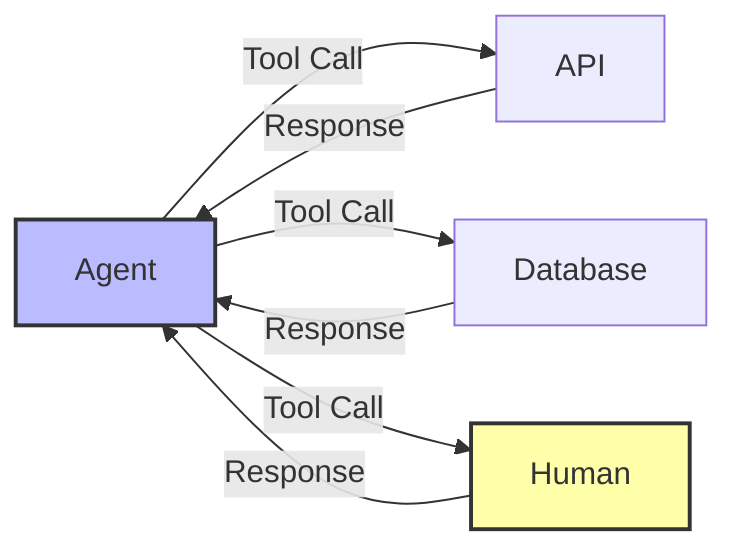

## The Principle

**Treat human interaction as tool calls, not special cases. Request approval, input, or escalation through the same function-calling mechanism as any other tool.**

Human-in-the-loop shouldn't be a separate architecture. It's just another tool the agent can invoke—one that happens to have a human as the execution layer instead of an API.

## Why This Matters

Modeling humans as tools:

1. **Consistency** - Same patterns for all external interactions
2. **Testability** - Mock human responses like API responses
3. **Observability** - Track human interactions like tool calls
4. **Type Safety** - Validate human input/output with Zod
5. **Simplicity** - One mental model for everything

**The 12 Factor mentality:** Humans are deterministic interfaces. The agent calls a function, waits for response, continues. No special-casing needed.



## Human as Tool

### Basic Implementation

```typescript
import { z } from 'zod';

// Human approval tool - just like any other tool
const requestHumanApprovalTool: Tool<ApprovalParams, ApprovalResult> = {
  name: 'request_human_approval',
  description: 'Request approval from a human for sensitive actions',
  parameters: z.object({
    action: z.string().describe('Action requiring approval'),
    reason: z.string().describe('Why approval is needed'),
    context: z.record(z.unknown()).describe('Additional context'),
    urgency: z.enum(['low', 'medium', 'high', 'critical']).default('medium'),
    timeout: z.number().default(3600000), // 1 hour default
  }),
  execute: async (params) => {
    // Create approval request
    const approval = await db.approvals.create({
      data: {
        action: params.action,
        reason: params.reason,
        context: params.context,
        urgency: params.urgency,
        status: 'pending',
        expiresAt: new Date(Date.now() + params.timeout),
      },
    });

    // Notify human (same as calling an external API)
    await notificationService.send({
      channel: params.urgency === 'critical' ? 'sms' : 'slack',
      message: formatApprovalRequest(approval),
      actionUrl: `/approvals/${approval.id}`,
    });

    // Wait for response (same as waiting for webhook)
    return await waitForApproval(approval.id, params.timeout);
  },
};

// From agent's perspective, it's just a tool call!
const response = await llm.messages.create({
  tools: [
    sendEmailTool,
    queryDatabaseTool,
    requestHumanApprovalTool, // ← Just another tool
  ],
  messages: [{ role: 'user', content: 'Process this $5000 refund' }],
});
```

### All Human Interactions as Tools

```typescript
// Request input
const askHumanTool: Tool<AskParams, string> = {
  name: 'ask_human',
  description: 'Ask human a question when information is missing',
  parameters: z.object({
    question: z.string(),
    context: z.string().optional(),
  }),
  execute: async (params) => {
    const question = await db.questions.create({
      data: {
        question: params.question,
        context: params.context,
        status: 'pending',
      },
    });

    await notificationService.send({
      message: params.question,
      replyUrl: `/questions/${question.id}/reply`,
    });

    return await waitForAnswer(question.id);
  },
};

// Escalate to human
const escalateToHumanTool: Tool<EscalateParams, EscalationResult> = {
  name: 'escalate_to_human',
  description: 'Escalate issue to human when agent cannot handle it',
  parameters: z.object({
    reason: z.string(),
    priority: z.enum(['low', 'medium', 'high']),
    summary: z.string(),
  }),
  execute: async (params) => {
    const ticket = await db.escalations.create({
      data: {
        reason: params.reason,
        priority: params.priority,
        summary: params.summary,
        status: 'open',
      },
    });

    await notificationService.send({
      channel: params.priority === 'high' ? 'pagerduty' : 'slack',
      message: `Escalation: ${params.summary}`,
      ticketUrl: `/escalations/${ticket.id}`,
    });

    return {
      escalated: true,
      ticketId: ticket.id,
      message: 'Issue escalated to human team',
    };
  },
};

// Request verification
const requestVerificationTool: Tool<VerifyParams, boolean> = {
  name: 'request_verification',
  description: 'Ask human to verify information or decision',
  parameters: z.object({
    claim: z.string(),
    evidence: z.array(z.string()),
  }),
  execute: async (params) => {
    const verification = await db.verifications.create({
      data: {
        claim: params.claim,
        evidence: params.evidence,
        status: 'pending',
      },
    });

    await notificationService.send({
      message: `Please verify: ${params.claim}`,
      verifyUrl: `/verify/${verification.id}`,
    });

    const result = await waitForVerification(verification.id);
    return result.verified;
  },
};
```

## Notification Channels

### Multi-Channel Notifications

```typescript
interface NotificationChannel {
  name: string;
  send: (message: NotificationMessage) => Promise<void>;
  supportsActions: boolean;
}

const slackChannel: NotificationChannel = {
  name: 'slack',
  send: async (message) => {
    await slackClient.chat.postMessage({
      channel: message.channel || '#agent-approvals',
      text: message.text,
      blocks: message.supportsActions ? [
        {
          type: 'section',
          text: { type: 'mrkdwn', text: message.text },
        },
        {
          type: 'actions',
          elements: [
            {
              type: 'button',
              text: { type: 'plain_text', text: 'Approve' },
              value: 'approve',
              action_id: 'approve_action',
              style: 'primary',
            },
            {
              type: 'button',
              text: { type: 'plain_text', text: 'Reject' },
              value: 'reject',
              action_id: 'reject_action',
              style: 'danger',
            },
          ],
        },
      ] : undefined,
    });
  },
  supportsActions: true,
};

const emailChannel: NotificationChannel = {
  name: 'email',
  send: async (message) => {
    await emailService.send({
      to: message.recipient,
      subject: message.subject,
      html: `
        <p>${message.text}</p>
        ${message.actionUrl ? `
          <p>
            <a href="${message.actionUrl}">Take Action</a>
          </p>
        ` : ''}
      `,
    });
  },
  supportsActions: false, // Requires clicking through to web UI
};

const smsChannel: NotificationChannel = {
  name: 'sms',
  send: async (message) => {
    await twilioClient.messages.create({
      to: message.phoneNumber,
      body: `${message.text}\n\nReply with link: ${message.actionUrl}`,
    });
  },
  supportsActions: false,
};

// Route based on urgency
class NotificationRouter {
  async send(approval: Approval): Promise<void> {
    const channels = this.selectChannels(approval.urgency);

    await Promise.all(
      channels.map(channel => channel.send(this.formatMessage(approval)))
    );
  }

  private selectChannels(urgency: string): NotificationChannel[] {
    switch (urgency) {
      case 'critical':
        return [smsChannel, slackChannel, emailChannel]; // All channels
      case 'high':
        return [slackChannel, emailChannel];
      case 'medium':
        return [slackChannel];
      case 'low':
        return [emailChannel];
      default:
        return [slackChannel];
    }
  }
}
```

### Interactive Slack Approvals

```typescript
// Slack app setup
import { App } from '@slack/bolt';

const app = new App({
  token: process.env.SLACK_BOT_TOKEN,
  signingSecret: process.env.SLACK_SIGNING_SECRET,
});

// Handle approval actions
app.action('approve_action', async ({ ack, body, client }) => {
  await ack();

  const approvalId = body.message.metadata?.approval_id;

  // Record approval
  await db.approvals.update({
    where: { id: approvalId },
    data: {
      status: 'approved',
      approvedBy: body.user.id,
      approvedAt: new Date(),
    },
  });

  // Update message
  await client.chat.update({
    channel: body.channel.id,
    ts: body.message.ts,
    text: '✅ Approved',
    blocks: [
      {
        type: 'section',
        text: {
          type: 'mrkdwn',
          text: `✅ *Approved* by <@${body.user.id}>`,
        },
      },
    ],
  });

  // Resume agent execution
  await resumeAgent(approvalId);
});

app.action('reject_action', async ({ ack, body, client }) => {
  await ack();

  const approvalId = body.message.metadata?.approval_id;

  await db.approvals.update({
    where: { id: approvalId },
    data: {
      status: 'rejected',
      rejectedBy: body.user.id,
      rejectedAt: new Date(),
    },
  });

  await client.chat.update({
    channel: body.channel.id,
    ts: body.message.ts,
    text: '❌ Rejected',
    blocks: [
      {
        type: 'section',
        text: {
          type: 'mrkdwn',
          text: `❌ *Rejected* by <@${body.user.id}>`,
        },
      },
    ],
  });

  // Cancel agent execution
  await cancelAgent(approvalId);
});
```

## Testing Human Tools

### Mocking Human Responses

```typescript
// Mock human approval for testing
class MockHumanTool implements Tool<ApprovalParams, ApprovalResult> {
  constructor(private autoApprove: boolean = true) {}

  name = 'request_human_approval';
  description = 'Mock human approval for testing';
  parameters = requestHumanApprovalTool.parameters;

  async execute(params: ApprovalParams): Promise<ApprovalResult> {
    // Simulate human delay
    await new Promise(resolve => setTimeout(resolve, 100));

    // Auto-approve or reject based on config
    return {
      approved: this.autoApprove,
      respondedBy: 'test-user',
      respondedAt: new Date(),
      comments: this.autoApprove ? 'Auto-approved for testing' : 'Auto-rejected for testing',
    };
  }
}

// Use in tests
describe('RefundAgent', () => {
  it('requests approval for large refunds', async () => {
    const mockHuman = new MockHumanTool(true);

    const agent = new RefundAgent({
      tools: [
        processRefundTool,
        mockHuman, // ← Mock human tool
      ],
    });

    const result = await agent.execute({
      orderId: 'order-123',
      amount: 5000,
    });

    expect(result.approved).toBe(true);
    expect(result.refundProcessed).toBe(true);
  });

  it('handles rejection gracefully', async () => {
    const mockHuman = new MockHumanTool(false); // Reject

    const agent = new RefundAgent({
      tools: [processRefundTool, mockHuman],
    });

    const result = await agent.execute({
      orderId: 'order-123',
      amount: 5000,
    });

    expect(result.approved).toBe(false);
    expect(result.refundProcessed).toBe(false);
  });
});
```

### Simulating Human Delays

```typescript
class RealisticMockHuman implements Tool {
  constructor(
    private approvalRate: number = 0.8,
    private avgResponseTime: number = 300000 // 5 minutes
  ) {}

  async execute(params: ApprovalParams): Promise<ApprovalResult> {
    // Simulate realistic human response time
    const delay = this.randomDelay(this.avgResponseTime);
    await new Promise(resolve => setTimeout(resolve, delay));

    // Probabilistic approval
    const approved = Math.random() < this.approvalRate;

    return {
      approved,
      respondedBy: 'simulated-human',
      respondedAt: new Date(),
      responseTime: delay,
    };
  }

  private randomDelay(avg: number): number {
    // Log-normal distribution for realistic delays
    const sigma = 0.5;
    const mu = Math.log(avg);
    const random = Math.random();
    return Math.exp(mu + sigma * this.normalRandom()) * random;
  }

  private normalRandom(): number {
    // Box-Muller transform
    const u1 = Math.random();
    const u2 = Math.random();
    return Math.sqrt(-2 * Math.log(u1)) * Math.cos(2 * Math.PI * u2);
  }
}
```

## Smart Routing

### Context-Aware Escalation

```typescript
class SmartEscalationRouter {
  async route(escalation: Escalation): Promise<RoutingResult> {
    // Determine best human/team for this issue
    const routing = await this.analyzeEscalation(escalation);

    switch (routing.category) {
      case 'billing':
        return {
          team: 'billing',
          channel: 'slack',
          slackChannel: '#billing-escalations',
          priority: escalation.priority,
        };

      case 'technical':
        return {
          team: 'engineering',
          channel: 'pagerduty',
          oncallSchedule: 'engineering-oncall',
          priority: escalation.priority,
        };

      case 'security':
        return {
          team: 'security',
          channel: 'pagerduty',
          oncallSchedule: 'security-oncall',
          priority: 'critical', // Always critical
        };

      case 'customer_success':
        return {
          team: 'customer-success',
          channel: 'slack',
          slackChannel: '#cs-escalations',
          assignTo: await this.findAccountOwner(escalation.customerId),
        };

      default:
        return {
          team: 'general',
          channel: 'slack',
          slackChannel: '#agent-escalations',
        };
    }
  }

  private async analyzeEscalation(escalation: Escalation): Promise<{ category: string }> {
    // Use LLM to categorize
    const response = await llm.messages.create({
      model: 'claude-3-haiku-20240307', // Fast, cheap model
      max_tokens: 50,
      messages: [{
        role: 'user',
        content: `Categorize this escalation: ${escalation.summary}

        Categories: billing, technical, security, customer_success, other

        Respond with just the category name.`
      }],
    });

    const category = response.content[0].text.trim().toLowerCase();
    return { category };
  }

  private async findAccountOwner(customerId: string): Promise<string> {
    const customer = await db.customers.findUnique({
      where: { id: customerId },
      include: { accountOwner: true },
    });

    return customer.accountOwner?.slackUserId || 'default-cs-team';
  }
}
```

### Load Balancing

```typescript
class ApprovalLoadBalancer {
  async assignApprover(approval: Approval): Promise<string> {
    // Get available approvers
    const approvers = await db.approvers.findMany({
      where: {
        permissions: { has: approval.requiredPermission },
        status: 'available',
      },
      include: {
        pendingApprovals: {
          where: { status: 'pending' },
        },
      },
    });

    if (approvers.length === 0) {
      throw new Error('No available approvers');
    }

    // Find least loaded approver
    const leastLoaded = approvers.reduce((min, approver) =>
      approver.pendingApprovals.length < min.pendingApprovals.length
        ? approver
        : min
    );

    // Assign
    await db.approvals.update({
      where: { id: approval.id },
      data: { assignedTo: leastLoaded.id },
    });

    return leastLoaded.id;
  }
}
```

## Observability

### Tracking Human Response Times

```typescript
interface HumanMetrics {
  avgResponseTime: number;
  approvalRate: number;
  timeoutRate: number;
  byUrgency: Record<string, {
    avgResponseTime: number;
    approvalRate: number;
  }>;
}

class HumanToolMonitor {
  async getMetrics(timeRange: TimeRange): Promise<HumanMetrics> {
    const approvals = await db.approvals.findMany({
      where: {
        createdAt: {
          gte: timeRange.start,
          lte: timeRange.end,
        },
      },
    });

    const responseTimes = approvals
      .filter(a => a.respondedAt)
      .map(a => a.respondedAt.getTime() - a.createdAt.getTime());

    const avgResponseTime = responseTimes.reduce((sum, t) => sum + t, 0) / responseTimes.length;

    const approvalRate = approvals.filter(a => a.status === 'approved').length / approvals.length;

    const timeoutRate = approvals.filter(a => a.status === 'expired').length / approvals.length;

    // By urgency
    const byUrgency: Record<string, any> = {};

    for (const urgency of ['low', 'medium', 'high', 'critical']) {
      const urgentApprovals = approvals.filter(a => a.urgency === urgency);

      if (urgentApprovals.length > 0) {
        const urgentResponseTimes = urgentApprovals
          .filter(a => a.respondedAt)
          .map(a => a.respondedAt.getTime() - a.createdAt.getTime());

        byUrgency[urgency] = {
          avgResponseTime: urgentResponseTimes.reduce((sum, t) => sum + t, 0) / urgentResponseTimes.length,
          approvalRate: urgentApprovals.filter(a => a.status === 'approved').length / urgentApprovals.length,
        };
      }
    }

    return {
      avgResponseTime,
      approvalRate,
      timeoutRate,
      byUrgency,
    };
  }

  async alertSlowResponses(): Promise<void> {
    // Find approvals pending > 30 minutes
    const slowApprovals = await db.approvals.findMany({
      where: {
        status: 'pending',
        createdAt: {
          lte: new Date(Date.now() - 1800000), // 30 min ago
        },
      },
    });

    for (const approval of slowApprovals) {
      await notificationService.send({
        channel: 'slack',
        message: `⚠️ Approval pending for ${Math.floor((Date.now() - approval.createdAt.getTime()) / 60000)} minutes: ${approval.action}`,
        actionUrl: `/approvals/${approval.id}`,
      });
    }
  }
}
```

## The Deterministic Principle

**Key insight:** Humans are just async APIs. The agent calls a function, waits for response, continues. No special architecture needed.

```typescript
// Wrong: Special human interaction flow
const badApproach = {
  if (needsApproval) {
    // Special human approval logic ❌
    pauseAgent();
    showApprovalUI();
    waitForHumanInSpecialWay();
    resumeAgent();
  }
};

// Right: Human as tool
const goodApproach = {
  tools: [
    apiTool,
    databaseTool,
    humanApprovalTool, // ← Same pattern ✅
  ],
  // Agent calls whichever tool it needs
  // All follow same interface
};
```

## Next Steps

Now that you understand human-in-loop as tools, continue to:

- [Factor 8: Control Flow](/universities/agentic-workflows/factor-08-control-flow) - Explicit state machines
- [Factor 9: Error Handling](/universities/agentic-workflows/factor-09-error-handling) - Graceful failures
- [Human-in-Loop Patterns](/universities/agentic-workflows/human-in-loop-patterns) - Advanced patterns

Or review related concepts:

- [Factor 6: Pause/Resume](/universities/agentic-workflows/factor-06-pause-resume) - Checkpointing during human wait
- [Tools Glossary](/universities/agentic-workflows/glossary-tools-integrations) - Tool implementation patterns
