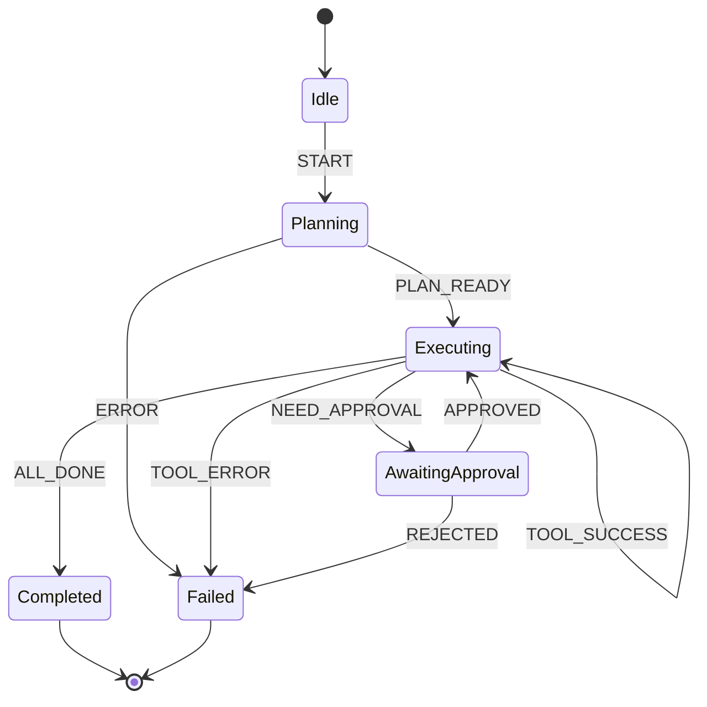

## The Principle

**Implement explicit control flow logic with state machines rather than letting the LLM orchestrate. While LLMs decide individual steps, your code defines allowed transitions, error handling, and termination conditions.**

Don't let the LLM control when to retry, when to escalate, or when to stop. That's your job. The LLM should make decisions within boundaries you set.

## Why This Matters

Explicit control flow prevents:

1. **Infinite loops** - LLM keeps calling same tool forever
2. **Invalid states** - Agent enters impossible situations
3. **Unpredictable behavior** - Different results on retry
4. **Missing error handling** - No fallback when LLM fails
5. **Debugging nightmares** - Can't trace execution path

**The 12 Factor mentality:** LLM picks the action. State machine controls the workflow. Deterministic flow + intelligent decisions = production-ready.



## The Anti-Pattern: LLM-Controlled Flow

### Wrong: ReAct Loop Without Guardrails

```typescript
// BAD: Let LLM decide everything
async function reactLoop(input: string) {
  let thought = await llm.generate(`Think about: ${input}`);

  // ❌ No iteration limit
  // ❌ No state validation
  // ❌ No error handling
  // ❌ No exit conditions
  while (true) {
    thought = await llm.generate(`Current: ${thought}\nWhat next?`);

    if (thought.includes('FINAL ANSWER')) {
      return extractAnswer(thought);
    }

    const action = extractAction(thought);
    const result = await executeTool(action); // Could fail, loop forever, anything

    thought = await llm.generate(`Result: ${result}\nContinue?`);
  }
}

// Problems:
// 1. Infinite loops (LLM never says "FINAL ANSWER")
// 2. No retry limits
// 3. Errors crash entire system
// 4. Can't pause/resume
// 5. Impossible to debug
```

## The Pattern: Explicit State Machines

### With XState

```typescript
import { createMachine, interpret, assign } from 'xstate';

interface AgentContext {
  input: string;
  plan?: Plan;
  executedSteps: Step[];
  result?: unknown;
  error?: Error;
  retryCount: number;
}

type AgentEvent =
  | { type: 'START'; input: string }
  | { type: 'PLAN_READY'; plan: Plan }
  | { type: 'STEP_SUCCESS'; result: unknown }
  | { type: 'STEP_ERROR'; error: Error }
  | { type: 'NEED_APPROVAL' }
  | { type: 'APPROVED' }
  | { type: 'REJECTED' }
  | { type: 'ALL_COMPLETE'; result: unknown }
  | { type: 'RETRY' };

const agentMachine = createMachine<AgentContext, AgentEvent>({
  id: 'productionAgent',
  initial: 'idle',
  context: {
    input: '',
    executedSteps: [],
    retryCount: 0,
  },
  states: {
    idle: {
      on: {
        START: {
          target: 'planning',
          actions: assign({
            input: (_, event) => event.input,
            retryCount: 0,
          }),
        },
      },
    },

    planning: {
      invoke: {
        src: 'createPlan',
        onDone: {
          target: 'executing',
          actions: assign({
            plan: (_, event) => event.data,
          }),
        },
        onError: {
          target: 'failed',
          actions: assign({
            error: (_, event) => event.data,
          }),
        },
      },
    },

    executing: {
      invoke: {
        src: 'executeNextStep',
        onDone: [
          {
            target: 'checkingApproval',
            cond: 'needsApproval',
          },
          {
            target: 'executing',
            cond: 'hasMoreSteps',
            actions: assign({
              executedSteps: (context, event) => [
                ...context.executedSteps,
                event.data,
              ],
            }),
          },
          {
            target: 'completed',
            actions: assign({
              result: (_, event) => event.data,
            }),
          },
        ],
        onError: [
          {
            target: 'retrying',
            cond: 'canRetry',
            actions: assign({
              retryCount: (context) => context.retryCount + 1,
              error: (_, event) => event.data,
            }),
          },
          {
            target: 'failed',
            actions: assign({
              error: (_, event) => event.data,
            }),
          },
        ],
      },
    },

    checkingApproval: {
      on: {
        APPROVED: 'executing',
        REJECTED: 'cancelled',
      },
      after: {
        3600000: 'failed', // 1 hour timeout
      },
    },

    retrying: {
      after: {
        2000: 'executing', // Wait 2s before retry
      },
    },

    completed: {
      type: 'final',
    },

    cancelled: {
      type: 'final',
    },

    failed: {
      type: 'final',
    },
  },
}, {
  guards: {
    needsApproval: (context) => {
      const nextStep = context.plan?.steps[context.executedSteps.length];
      return nextStep?.requiresApproval === true;
    },
    hasMoreSteps: (context) => {
      return context.executedSteps.length < (context.plan?.steps.length || 0);
    },
    canRetry: (context) => {
      return context.retryCount < 3;
    },
  },
  services: {
    createPlan: async (context) => {
      return await llm.createPlan(context.input);
    },
    executeNextStep: async (context) => {
      const nextStep = context.plan?.steps[context.executedSteps.length];
      return await executeTool(nextStep.tool, nextStep.params);
    },
  },
});
```

### Using the State Machine

```typescript
class StateMachineAgent {
  private service: any;

  constructor() {
    this.service = interpret(agentMachine)
      .onTransition((state) => {
        console.log('State:', state.value);
        console.log('Context:', state.context);

        // Save checkpoint on each transition
        this.saveCheckpoint(state);
      })
      .start();
  }

  async execute(input: string): Promise<AgentResult> {
    return new Promise((resolve, reject) => {
      this.service.send({ type: 'START', input });

      this.service.onDone(() => {
        const finalState = this.service.state;

        if (finalState.matches('completed')) {
          resolve({
            success: true,
            result: finalState.context.result,
          });
        } else if (finalState.matches('failed')) {
          reject(finalState.context.error);
        } else if (finalState.matches('cancelled')) {
          resolve({
            success: false,
            reason: 'cancelled',
          });
        }
      });
    });
  }

  handleApproval(approved: boolean) {
    this.service.send({
      type: approved ? 'APPROVED' : 'REJECTED',
    });
  }

  getState() {
    return this.service.state.value;
  }

  private saveCheckpoint(state: any) {
    // Persist state for resumability
    db.agentCheckpoints.create({
      data: {
        state: JSON.stringify(state),
        timestamp: new Date(),
      },
    });
  }
}
```

## Control Flow Patterns

### Pattern 1: Sequential Steps

```typescript
const sequentialMachine = createMachine({
  id: 'sequential',
  initial: 'step1',
  states: {
    step1: {
      invoke: {
        src: 'executeStep1',
        onDone: 'step2',
        onError: 'failed',
      },
    },
    step2: {
      invoke: {
        src: 'executeStep2',
        onDone: 'step3',
        onError: 'failed',
      },
    },
    step3: {
      invoke: {
        src: 'executeStep3',
        onDone: 'completed',
        onError: 'failed',
      },
    },
    completed: { type: 'final' },
    failed: { type: 'final' },
  },
});
```

### Pattern 2: Parallel Execution

```typescript
const parallelMachine = createMachine({
  id: 'parallel',
  initial: 'executing',
  states: {
    executing: {
      type: 'parallel',
      states: {
        task1: {
          initial: 'running',
          states: {
            running: {
              invoke: {
                src: 'task1',
                onDone: 'done',
                onError: 'failed',
              },
            },
            done: { type: 'final' },
            failed: { type: 'final' },
          },
        },
        task2: {
          initial: 'running',
          states: {
            running: {
              invoke: {
                src: 'task2',
                onDone: 'done',
                onError: 'failed',
              },
            },
            done: { type: 'final' },
            failed: { type: 'final' },
          },
        },
      },
      onDone: 'completed',
    },
    completed: { type: 'final' },
  },
});
```

### Pattern 3: Conditional Branching

```typescript
const branchingMachine = createMachine({
  id: 'branching',
  initial: 'analyzing',
  states: {
    analyzing: {
      invoke: {
        src: 'analyze',
        onDone: [
          {
            target: 'criticalPath',
            cond: (_, event) => event.data.priority === 'critical',
          },
          {
            target: 'normalPath',
            cond: (_, event) => event.data.priority === 'normal',
          },
          {
            target: 'lowPriorityPath',
          },
        ],
      },
    },
    criticalPath: {
      // Immediate human escalation
      invoke: {
        src: 'escalateToHuman',
        onDone: 'completed',
      },
    },
    normalPath: {
      // Automated handling with approval
      invoke: {
        src: 'handleNormally',
        onDone: 'awaitingApproval',
      },
    },
    lowPriorityPath: {
      // Fully automated
      invoke: {
        src: 'handleAutomatically',
        onDone: 'completed',
      },
    },
    awaitingApproval: {
      on: {
        APPROVED: 'completed',
        REJECTED: 'failed',
      },
    },
    completed: { type: 'final' },
    failed: { type: 'final' },
  },
});
```

### Pattern 4: Retry with Backoff

```typescript
const retryMachine = createMachine({
  id: 'retryWithBackoff',
  initial: 'attempting',
  context: {
    retries: 0,
    maxRetries: 3,
  },
  states: {
    attempting: {
      invoke: {
        src: 'riskyOperation',
        onDone: 'success',
        onError: [
          {
            target: 'waiting',
            cond: (context) => context.retries < context.maxRetries,
            actions: assign({
              retries: (context) => context.retries + 1,
            }),
          },
          {
            target: 'failed',
          },
        ],
      },
    },
    waiting: {
      after: {
        // Exponential backoff
        1000: {
          target: 'attempting',
          cond: (context) => context.retries === 1,
        },
        2000: {
          target: 'attempting',
          cond: (context) => context.retries === 2,
        },
        4000: {
          target: 'attempting',
          cond: (context) => context.retries === 3,
        },
      },
    },
    success: { type: 'final' },
    failed: { type: 'final' },
  },
});
```

## Iteration Limits

### Maximum Step Enforcement

```typescript
const boundedMachine = createMachine({
  id: 'bounded',
  context: {
    steps: 0,
    maxSteps: 10,
  },
  initial: 'executing',
  states: {
    executing: {
      always: [
        {
          target: 'failed',
          cond: (context) => context.steps >= context.maxSteps,
        },
      ],
      invoke: {
        src: 'executeStep',
        onDone: {
          target: 'executing',
          actions: assign({
            steps: (context) => context.steps + 1,
          }),
        },
      },
    },
    failed: {
      entry: () => {
        console.error('Max steps exceeded - possible infinite loop');
      },
      type: 'final',
    },
  },
});
```

### Time-Based Limits

```typescript
const timedMachine = createMachine({
  id: 'timed',
  initial: 'executing',
  states: {
    executing: {
      invoke: {
        src: 'longRunningTask',
        onDone: 'completed',
      },
      after: {
        300000: 'timeout', // 5 minute timeout
      },
    },
    completed: { type: 'final' },
    timeout: {
      entry: () => {
        console.error('Execution timeout');
      },
      type: 'final',
    },
  },
});
```

## Error Recovery

### Circuit Breaker Pattern

```typescript
const circuitBreakerMachine = createMachine({
  id: 'circuitBreaker',
  initial: 'closed',
  context: {
    failures: 0,
    threshold: 5,
  },
  states: {
    closed: {
      // Normal operation
      invoke: {
        src: 'callService',
        onDone: {
          actions: assign({ failures: 0 }),
        },
        onError: [
          {
            target: 'open',
            cond: (context) => context.failures >= context.threshold - 1,
            actions: assign({
              failures: (context) => context.failures + 1,
            }),
          },
          {
            actions: assign({
              failures: (context) => context.failures + 1,
            }),
          },
        ],
      },
    },
    open: {
      // Stop calling failing service
      after: {
        60000: 'halfOpen', // Wait 1 minute
      },
      invoke: {
        src: 'returnError',
      },
    },
    halfOpen: {
      // Try one request
      invoke: {
        src: 'callService',
        onDone: {
          target: 'closed',
          actions: assign({ failures: 0 }),
        },
        onError: 'open',
      },
    },
  },
});
```

### Fallback States

```typescript
const fallbackMachine = createMachine({
  id: 'fallback',
  initial: 'primary',
  states: {
    primary: {
      invoke: {
        src: 'primaryService',
        onDone: 'success',
        onError: 'secondary',
      },
    },
    secondary: {
      invoke: {
        src: 'secondaryService',
        onDone: 'success',
        onError: 'tertiary',
      },
    },
    tertiary: {
      invoke: {
        src: 'tertiaryService',
        onDone: 'success',
        onError: 'failed',
      },
    },
    success: { type: 'final' },
    failed: { type: 'final' },
  },
});
```

## Visualization

### Generate State Diagrams

```typescript
import { createMachine } from 'xstate';
import { createModel } from '@xstate/graph';

// Your machine
const machine = createMachine({ /* ... */ });

// Generate visualization
const model = createModel(machine);

// Get all possible paths
const paths = model.getShortestPaths();

console.log('Possible paths:', paths);

// Export to mermaid/graphviz for documentation
function toMermaid(machine: any): string {
  // Convert XState machine to Mermaid diagram
  // (simplified - use @xstate/graph for full implementation)
  return `
stateDiagram-v2
  [*] --> ${machine.initial}
  ${Object.entries(machine.states).map(([name, state]) => {
    // Generate state transitions
  }).join('\n')}
  `;
}
```

## Testing State Machines

### Path Testing

```typescript
import { describe, it, expect } from 'vitest';
import { interpret } from 'xstate';

describe('AgentStateMachine', () => {
  it('follows happy path', (done) => {
    const service = interpret(agentMachine)
      .onTransition((state) => {
        // Verify transitions
        if (state.matches('completed')) {
          expect(state.context.result).toBeDefined();
          done();
        }
      })
      .start();

    service.send({ type: 'START', input: 'test' });
  });

  it('handles errors gracefully', (done) => {
    const service = interpret(agentMachine)
      .onTransition((state) => {
        if (state.matches('failed')) {
          expect(state.context.error).toBeDefined();
          done();
        }
      })
      .start();

    // Trigger error path
    service.send({ type: 'START', input: 'error-trigger' });
  });

  it('respects retry limits', (done) => {
    const service = interpret(retryMachine)
      .onTransition((state) => {
        if (state.matches('failed')) {
          expect(state.context.retries).toBe(3);
          done();
        }
      })
      .start();

    service.send({ type: 'START' });
  });
});
```

## The Deterministic Principle

**Key insight:** State machines = deterministic control flow. LLM picks actions within your defined states and transitions. You control the graph, LLM traverses it.

```typescript
// Wrong: LLM controls everything
const badApproach = {
  while (true) {
    const decision = await llm.decide('what next?');
    // LLM can do anything - no guardrails ❌
    await execute(decision);
  }
};

// Right: State machine controls flow
const goodApproach = {
  stateMachine: {
    states: ['idle', 'executing', 'approval', 'done'],
    transitions: {
      idle: ['executing'],
      executing: ['approval', 'done', 'executing'],
      approval: ['executing', 'done'],
      done: [],
    },
  },
  // LLM picks transitions ✅
  // State machine enforces validity ✅
};
```

## Next Steps

Now that you own control flow, continue to:

- [Factor 9: Error Handling](/universities/agentic-workflows/factor-09-error-handling) - Compact errors
- [Factor 10: Focused Agents](/universities/agentic-workflows/factor-10-focused-agents) - Keep scope small
- [Production Deployment](/universities/agentic-workflows/production-deployment) - Deploy state machines

Or explore tools:

- [XState](https://xstate.js.org/) - State machine library
- [XState Inspector](https://stately.ai/registry/editor) - Visual state machine editor
- [@xstate/graph](https://xstate.js.org/docs/packages/xstate-graph/) - Path generation and testing
