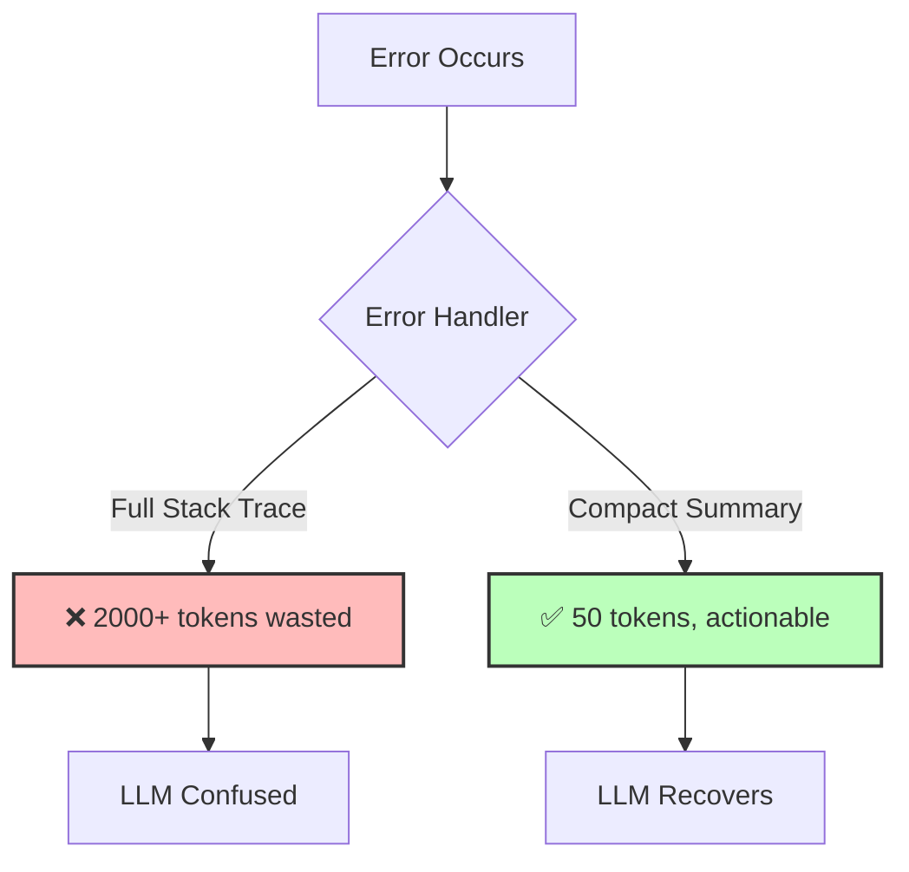

## The Principle

**Represent error information concisely when feeding back to the LLM. Summarize failures and exceptions into brief, actionable context rather than lengthy stack traces.**

LLMs don't need full error details. They need: what failed, why it failed, and what to try instead. Compact errors save tokens and improve recovery.

## Why This Matters

Compact error handling:

1. **Saves tokens** - Stack traces waste thousands of tokens
2. **Improves recovery** - LLM understands problem better
3. **Reduces confusion** - Less noise in context
4. **Enables retries** - Clear guidance on what went wrong
5. **Costs less** - Fewer tokens = lower API bills

**The 12 Factor mentality:** Errors are deterministic signals. Extract actionable information, discard noise. Guide the LLM toward solutions, not debug sessions.



## The Anti-Pattern: Raw Errors

### Wrong: Send Everything

```typescript
// BAD: Full stack trace to LLM
async function badErrorHandling(toolCall: ToolCall) {
  try {
    return await executeTool(toolCall);
  } catch (error) {
    // ❌ Sends massive error dump
    return {
      success: false,
      error: error.stack, // 500+ lines of stack trace!
    };
  }
}

/*
Error sent to LLM:

Error: Database connection failed
    at Connection.connect (/app/node_modules/pg/lib/connection.js:123:15)
    at Pool.query (/app/node_modules/pg/lib/pool.js:456:23)
    at Database.findUnique (/app/src/database.ts:89:18)
    at CustomerService.getCustomer (/app/src/services/customer.ts:34:28)
    at async AgentToolExecutor.execute (/app/src/agent/executor.ts:67:21)
    ... 50 more lines ...

Result: LLM gets confused, generates poor response, wastes 1000+ tokens
*/
```

## The Pattern: Compact Errors

### Error Summarization

```typescript
interface CompactError {
  type: string;           // Category of error
  message: string;        // Brief human-readable description
  code?: string;          // Error code if applicable
  suggestion?: string;    // What to try instead
  retryable: boolean;     // Can this be retried?
}

function compactError(error: Error): CompactError {
  // Classify error
  if (error.message.includes('ECONNREFUSED')) {
    return {
      type: 'connection_error',
      message: 'Database connection refused',
      code: 'DB_UNAVAILABLE',
      suggestion: 'Wait a moment and retry',
      retryable: true,
    };
  }

  if (error.message.includes('timeout')) {
    return {
      type: 'timeout',
      message: 'Operation took too long',
      suggestion: 'Try with smaller dataset or simpler query',
      retryable: true,
    };
  }

  if (error.message.includes('not found')) {
    return {
      type: 'not_found',
      message: error.message,
      suggestion: 'Verify the ID and try again',
      retryable: false,
    };
  }

  if (error.message.includes('permission denied')) {
    return {
      type: 'permission_error',
      message: 'Insufficient permissions',
      suggestion: 'Request human approval for this action',
      retryable: false,
    };
  }

  // Default
  return {
    type: 'unknown_error',
    message: error.message.substring(0, 100), // Truncate
    retryable: false,
  };
}

// Usage
async function goodErrorHandling(toolCall: ToolCall) {
  try {
    return await executeTool(toolCall);
  } catch (error) {
    const compact = compactError(error);

    return {
      success: false,
      error: compact,
    };
  }
}

/*
Error sent to LLM:

{
  "success": false,
  "error": {
    "type": "connection_error",
    "message": "Database connection refused",
    "code": "DB_UNAVAILABLE",
    "suggestion": "Wait a moment and retry",
    "retryable": true
  }
}

Result: LLM understands problem, can retry intelligently, uses ~30 tokens
*/
```

### Error Classification

```typescript
enum ErrorCategory {
  TRANSIENT = 'transient',        // Temporary, retry will help
  INVALID_INPUT = 'invalid_input', // Bad parameters, fix and retry
  PERMISSION = 'permission',       // Needs human approval
  NOT_FOUND = 'not_found',        // Resource doesn't exist
  QUOTA = 'quota',                // Rate limit or quota exceeded
  SYSTEM = 'system',              // Internal error
}

interface ClassifiedError extends CompactError {
  category: ErrorCategory;
  shouldRetry: boolean;
  retryDelay?: number;
  needsHuman: boolean;
}

function classifyError(error: Error): ClassifiedError {
  const patterns: Array<{
    pattern: RegExp;
    category: ErrorCategory;
    shouldRetry: boolean;
    retryDelay?: number;
    needsHuman: boolean;
    suggestion: string;
  }> = [
    {
      pattern: /ECONNREFUSED|ETIMEDOUT|ENOTFOUND/,
      category: ErrorCategory.TRANSIENT,
      shouldRetry: true,
      retryDelay: 2000,
      needsHuman: false,
      suggestion: 'Temporary network issue, retrying automatically',
    },
    {
      pattern: /rate limit|too many requests/i,
      category: ErrorCategory.QUOTA,
      shouldRetry: true,
      retryDelay: 60000, // Wait 1 minute
      needsHuman: false,
      suggestion: 'Rate limited, waiting before retry',
    },
    {
      pattern: /not found|does not exist/i,
      category: ErrorCategory.NOT_FOUND,
      shouldRetry: false,
      needsHuman: false,
      suggestion: 'Resource not found, verify ID is correct',
    },
    {
      pattern: /permission|unauthorized|forbidden/i,
      category: ErrorCategory.PERMISSION,
      shouldRetry: false,
      needsHuman: true,
      suggestion: 'Request human approval to proceed',
    },
    {
      pattern: /invalid|validation|malformed/i,
      category: ErrorCategory.INVALID_INPUT,
      shouldRetry: false,
      needsHuman: false,
      suggestion: 'Fix the parameters and try again',
    },
  ];

  for (const { pattern, category, shouldRetry, retryDelay, needsHuman, suggestion } of patterns) {
    if (pattern.test(error.message)) {
      return {
        type: category,
        category,
        message: error.message.substring(0, 100),
        suggestion,
        retryable: shouldRetry,
        shouldRetry,
        retryDelay,
        needsHuman,
      };
    }
  }

  // Unknown error
  return {
    type: 'unknown_error',
    category: ErrorCategory.SYSTEM,
    message: error.message.substring(0, 100),
    suggestion: 'Unexpected error occurred',
    retryable: false,
    shouldRetry: false,
    needsHuman: true,
  };
}
```

## Smart Retry Logic

### Automatic Retry with Classified Errors

```typescript
class SmartRetryExecutor {
  async execute(
    toolCall: ToolCall,
    maxRetries: number = 3
  ): Promise<ToolResult> {
    let lastError: ClassifiedError | undefined;

    for (let attempt = 0; attempt < maxRetries; attempt++) {
      try {
        return await this.executeTool(toolCall);
      } catch (error) {
        lastError = classifyError(error as Error);

        // Don't retry if not retryable
        if (!lastError.shouldRetry) {
          break;
        }

        // Log retry
        logger.info('Retrying after error', {
          tool: toolCall.name,
          attempt: attempt + 1,
          error: lastError,
        });

        // Wait before retry
        if (lastError.retryDelay) {
          await new Promise(resolve =>
            setTimeout(resolve, lastError.retryDelay)
          );
        }
      }
    }

    // Return compact error
    return {
      success: false,
      error: lastError!,
    };
  }
}
```

### Self-Correcting Agent

```typescript
class SelfCorrectingAgent {
  async execute(input: string): Promise<AgentResult> {
    let messages = [{ role: 'user', content: input }];
    let correctionAttempts = 0;
    const MAX_CORRECTIONS = 2;

    while (correctionAttempts <= MAX_CORRECTIONS) {
      const response = await this.llm.call({
        tools: this.tools,
        messages,
      });

      const toolUse = response.content.find(b => b.type === 'tool_use');

      if (!toolUse) {
        return { success: true, content: response.content[0].text };
      }

      // Execute tool
      const result = await this.executeWithErrorHandling(toolUse);

      if (result.success) {
        return result;
      }

      // Compact error and ask LLM to fix
      const compact = result.error as CompactError;

      messages.push(
        {
          role: 'assistant',
          content: response.content,
        },
        {
          role: 'user',
          content: [{
            type: 'tool_result',
            tool_use_id: toolUse.id,
            content: JSON.stringify({
              success: false,
              error: compact.message,
              suggestion: compact.suggestion,
            }),
          }],
        }
      );

      correctionAttempts++;
    }

    throw new Error('Max correction attempts exceeded');
  }
}
```

## Error Context Formatting

### Structured Error Messages

```typescript
function formatErrorForLLM(error: ClassifiedError, context?: {
  toolName: string;
  params: unknown;
}): string {
  let message = `Tool "${context?.toolName}" failed:\n`;
  message += `Error: ${error.message}\n`;

  if (error.suggestion) {
    message += `Suggestion: ${error.suggestion}\n`;
  }

  if (error.shouldRetry) {
    message += `This error is retryable. Try again with the suggestion.`;
  } else if (error.needsHuman) {
    message += `This requires human intervention. Use request_human_approval tool.`;
  } else {
    message += `This cannot be retried. Try a different approach.`;
  }

  return message;
}

// Example output:
/*
Tool "get_customer" failed:
Error: Customer with ID "invalid-id" not found
Suggestion: Verify the ID and try again
This cannot be retried. Try a different approach.
*/
```

### Error Examples for Few-Shot

```typescript
const errorRecoveryPrompt = `When tools fail, analyze the error and retry intelligently.

Examples:

Error: "Database timeout"
Your response: Retry with smaller limit parameter

Error: "Permission denied"
Your response: Use request_human_approval tool

Error: "Invalid email format"
Your response: Fix the email parameter (add @ symbol)

Error: "Rate limit exceeded"
Your response: Wait 60 seconds then retry

Now handle this error:
${errorMessage}`;
```

## Monitoring Error Patterns

### Error Analytics

```typescript
interface ErrorMetrics {
  category: ErrorCategory;
  count: number;
  exampleMessages: string[];
  avgRecoveryAttempts: number;
  successfulRecoveryRate: number;
}

class ErrorAnalytics {
  async getErrorMetrics(timeRange: TimeRange): Promise<ErrorMetrics[]> {
    const errors = await db.agentErrors.groupBy({
      by: ['category'],
      where: {
        createdAt: {
          gte: timeRange.start,
          lte: timeRange.end,
        },
      },
      _count: true,
      _avg: {
        recoveryAttempts: true,
      },
    });

    return Promise.all(
      errors.map(async (error) => {
        const examples = await db.agentErrors.findMany({
          where: { category: error.category },
          take: 5,
          select: { message: true },
        });

        const recovered = await db.agentErrors.count({
          where: {
            category: error.category,
            recovered: true,
          },
        });

        return {
          category: error.category as ErrorCategory,
          count: error._count,
          exampleMessages: examples.map(e => e.message),
          avgRecoveryAttempts: error._avg.recoveryAttempts || 0,
          successfulRecoveryRate: recovered / error._count,
        };
      })
    );
  }

  async alertHighErrorRate(): Promise<void> {
    const last10Min = {
      start: new Date(Date.now() - 600000),
      end: new Date(),
    };

    const metrics = await this.getErrorMetrics(last10Min);

    for (const metric of metrics) {
      if (metric.count > 100 || metric.successfulRecoveryRate < 0.5) {
        await alerting.send({
          severity: 'high',
          title: `High ${metric.category} error rate`,
          message: `${metric.count} errors in last 10 min, ${Math.round(metric.successfulRecoveryRate * 100)}% recovery rate`,
        });
      }
    }
  }
}
```

## Testing Error Recovery

### Error Injection

```typescript
class ErrorInjectionTool implements Tool {
  constructor(private shouldFail: boolean = false) {}

  async execute(params: unknown): Promise<unknown> {
    if (this.shouldFail) {
      throw new Error('Injected error for testing');
    }

    return { success: true };
  }
}

describe('Error Recovery', () => {
  it('recovers from transient errors', async () => {
    let attempts = 0;

    const flakeyTool = {
      async execute() {
        attempts++;
        if (attempts < 3) {
          throw new Error('ECONNREFUSED');
        }
        return { success: true };
      },
    };

    const executor = new SmartRetryExecutor();
    const result = await executor.execute({ tool: flakeyTool });

    expect(result.success).toBe(true);
    expect(attempts).toBe(3); // Retried twice
  });

  it('does not retry non-retryable errors', async () => {
    let attempts = 0;

    const tool = {
      async execute() {
        attempts++;
        throw new Error('Not found');
      },
    };

    const executor = new SmartRetryExecutor();
    const result = await executor.execute({ tool });

    expect(result.success).toBe(false);
    expect(attempts).toBe(1); // Did not retry
  });
});
```

## The Deterministic Principle

**Key insight:** Error handling is deterministic classification and response. Extract signal from noise. Give LLM actionable guidance, not debug dumps.

```typescript
// Wrong: Raw errors confuse LLM
const badApproach = {
  error: error.stack, // 1000+ tokens of confusion ❌
};

// Right: Compact, actionable errors
const goodApproach = {
  error: {
    type: 'connection_error',
    message: 'DB unavailable',
    suggestion: 'Retry in 2 seconds',
    retryable: true,
  }, // 30 tokens, clear guidance ✅
};
```

## Next Steps

Now that you understand error compaction, continue to:

- [Factor 10: Focused Agents](/universities/agentic-workflows/factor-10-focused-agents) - Keep scope small
- [Factor 11: Flexible Triggers](/universities/agentic-workflows/factor-11-flexible-triggers) - Deploy everywhere
- [Error Handling Strategies](/universities/agentic-workflows/error-handling-strategies) - Advanced patterns

Or review related concepts:

- [Factor 8: Control Flow](/universities/agentic-workflows/factor-08-control-flow) - Retry state machines
- [Testing & Validation](/universities/agentic-workflows/testing-validation) - Error injection testing
