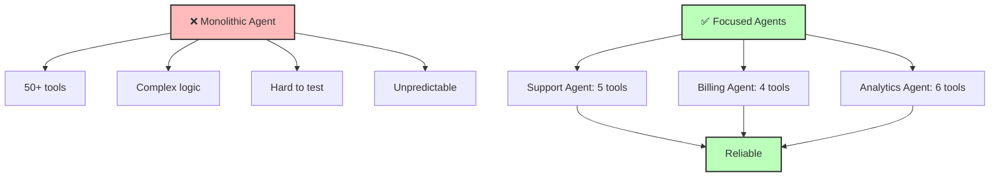

## The Principle

**Build agents with narrow, well-defined scopes rather than monolithic all-purpose systems. Limit tools to <20 and steps to <100 for maximum reliability.**

The smaller the scope, the more reliable the agent. Specialized agents that do one thing well outperform generalists that do everything poorly.

## Why This Matters

Focused agents provide:

1. **Higher reliability** - Fewer edge cases to handle
2. **Easier debugging** - Smaller surface area for bugs
3. **Better performance** - Fewer tools = faster decisions
4. **Simpler testing** - Test all paths exhaustively
5. **Clear ownership** - One team, one responsibility

**The 12 Factor mentality:** Agents are microservices. Each does one job deterministically. Compose small agents into larger workflows.



## The Anti-Pattern: Monolithic Agents

### Wrong: Swiss Army Knife Agent

```typescript
// BAD: One agent tries to do everything
const superAgent = {
  name: 'universal_agent',
  tools: [
    // Customer support (10 tools)
    'lookup_customer',
    'create_ticket',
    'escalate_issue',
    'process_refund',
    'update_subscription',
    'send_email',
    'create_discount',
    'cancel_account',
    'merge_accounts',
    'export_data',

    // Analytics (15 tools)
    'run_sql_query',
    'generate_report',
    'calculate_metrics',
    'create_dashboard',
    'export_csv',
    'schedule_report',
    // ... 9 more

    // Sales (12 tools)
    'create_lead',
    'update_pipeline',
    'send_proposal',
    // ... 9 more

    // Engineering (18 tools)
    'create_jira_ticket',
    'deploy_code',
    'rollback_deployment',
    // ... 15 more
  ], // 55+ tools total!

  systemPrompt: `You can help with anything! Customer support, analytics, sales, engineering...`,
};

// Problems:
// 1. LLM confused by too many tools
// 2. Chooses wrong tool frequently
// 3. Impossible to test all combinations
// 4. Debugging nightmare
// 5. Unreliable in production
```

## The Pattern: Specialized Agents

### Right: Single-Purpose Agents

```typescript
// GOOD: Customer support agent (5 tools)
const customerSupportAgent = {
  name: 'customer_support',
  purpose: 'Handle customer inquiries and basic support tasks',
  tools: [
    lookupCustomerTool,
    searchKnowledgeBaseTool,
    createTicketTool,
    escalateToHumanTool,
    sendEmailTool,
  ],
  systemPrompt: `You are a customer support agent for Acme Corp.

Your ONLY job is to:
1. Look up customer information
2. Answer questions using the knowledge base
3. Create support tickets for unresolved issues
4. Escalate complex issues to humans

You CANNOT:
- Process refunds (escalate to billing team)
- Make technical changes (escalate to engineering)
- Modify subscriptions (escalate to account management)`,
};

// GOOD: Billing agent (4 tools)
const billingAgent = {
  name: 'billing',
  purpose: 'Handle billing, payments, and refunds',
  tools: [
    processRefundTool,
    updateSubscriptionTool,
    generateInvoiceTool,
    requestApprovalTool,
  ],
  systemPrompt: `You are a billing agent.

Your ONLY job is to:
1. Process refunds under $100 (require approval for >$100)
2. Update subscription information
3. Generate invoices

You CANNOT:
- Handle customer support questions (route to support agent)
- Make technical changes (route to engineering)`,
};

// GOOD: Analytics agent (6 tools)
const analyticsAgent = {
  name: 'analytics',
  purpose: 'Generate reports and insights from data',
  tools: [
    executeSQLQueryTool,
    calculateMetricsTool,
    generateChartTool,
    exportDataTool,
    scheduleReportTool,
    saveReportTool,
  ],
  systemPrompt: `You are an analytics agent.

Your ONLY job is to:
1. Execute read-only SQL queries
2. Calculate business metrics
3. Generate visualizations
4. Export data to CSV/Excel

You CANNOT:
- Modify data (read-only access)
- Access customer PII (anonymized data only)
- Make business decisions (present data, don't recommend)`,
};
```

## Sizing Guidelines

### Tool Count Limits

```typescript
// Optimal: 4-8 tools per agent
const idealAgent = {
  tools: 6, // Sweet spot for reliability
};

// Acceptable: Up to 15 tools
const acceptableAgent = {
  tools: 12, // Still manageable
};

// Warning: 15-20 tools
const marginalAgent = {
  tools: 18, // Getting unreliable
};

// Error: > 20 tools
const tooManyTools = {
  tools: 25, // ❌ Split into multiple agents
};
```

### Step Count Limits

```typescript
// Optimal: 3-10 steps
const simpleWorkflow = {
  steps: [
    'fetch_user',
    'analyze_issue',
    'search_knowledge_base',
    'respond_to_user',
  ], // 4 steps - very reliable
};

// Acceptable: 10-50 steps
const moderateWorkflow = {
  steps: 20, // Still testable
};

// Warning: 50-100 steps
const complexWorkflow = {
  steps: 75, // Consider splitting
};

// Error: > 100 steps
const tooComplex = {
  steps: 150, // ❌ Definitely split
};
```

## Agent Composition

### Orchestrator Pattern

```typescript
// Coordinator routes to specialized agents
class AgentOrchestrator {
  private agents: Map<string, Agent> = new Map([
    ['support', customerSupportAgent],
    ['billing', billingAgent],
    ['analytics', analyticsAgent],
  ]);

  async route(request: Request): Promise<AgentResult> {
    // Classify request
    const category = await this.classifyRequest(request);

    // Route to specialized agent
    const agent = this.agents.get(category);

    if (!agent) {
      return { error: 'No agent available for this request' };
    }

    return await agent.execute(request);
  }

  private async classifyRequest(request: Request): Promise<string> {
    const response = await llm.messages.create({
      model: 'claude-3-haiku-20240307', // Fast classification
      max_tokens: 10,
      messages: [{
        role: 'user',
        content: `Classify this request into one category: support, billing, analytics

Request: ${request.input}

Category:`,
      }],
    });

    return response.content[0].text.trim().toLowerCase();
  }
}
```

### Sequential Workflow

```typescript
// Chain specialized agents for complex workflows
class SequentialAgentWorkflow {
  async execute(input: string): Promise<Result> {
    // Step 1: Support agent handles initial inquiry
    const supportResult = await customerSupportAgent.execute(input);

    if (supportResult.escalateTo === 'billing') {
      // Step 2: Hand off to billing agent
      const billingResult = await billingAgent.execute({
        context: supportResult.context,
        action: supportResult.requestedAction,
      });

      return billingResult;
    }

    return supportResult;
  }
}
```

### Parallel Delegation

```typescript
// Run multiple specialized agents in parallel
class ParallelAgentWorkflow {
  async execute(userId: string): Promise<UserReport> {
    // Execute specialized agents in parallel
    const [support, billing, usage] = await Promise.all([
      supportStatusAgent.execute({ userId }),
      billingStatusAgent.execute({ userId }),
      usageAnalyticsAgent.execute({ userId }),
    ]);

    // Combine results
    return {
      userId,
      support: support.status,
      billing: billing.summary,
      usage: usage.metrics,
    };
  }
}
```

## When to Split an Agent

### Signals to Split

```typescript
class AgentComplexityAnalyzer {
  shouldSplit(agent: Agent): { should: boolean; reasons: string[] } {
    const reasons: string[] = [];

    // Too many tools
    if (agent.tools.length > 20) {
      reasons.push(`${agent.tools.length} tools exceeds limit of 20`);
    }

    // Too many steps
    if (agent.avgStepsPerExecution > 100) {
      reasons.push(`${agent.avgStepsPerExecution} avg steps exceeds limit of 100`);
    }

    // Low success rate
    if (agent.successRate < 0.8) {
      reasons.push(`Success rate ${agent.successRate} below threshold of 0.80`);
    }

    // High average response time
    if (agent.avgResponseTime > 30000) {
      reasons.push(`Avg response time ${agent.avgResponseTime}ms exceeds 30s`);
    }

    // Multiple unrelated domains
    const domains = this.identifyDomains(agent.tools);
    if (domains.length > 2) {
      reasons.push(`Agent handles ${domains.length} unrelated domains: ${domains.join(', ')}`);
    }

    return {
      should: reasons.length > 0,
      reasons,
    };
  }

  identifyDomains(tools: Tool[]): string[] {
    const domains = new Set<string>();

    for (const tool of tools) {
      if (/customer|support|ticket/i.test(tool.name)) {
        domains.add('customer_support');
      }
      if (/bill|payment|refund|subscription/i.test(tool.name)) {
        domains.add('billing');
      }
      if (/analytics|report|metric|query/i.test(tool.name)) {
        domains.add('analytics');
      }
      if (/deploy|build|test|code/i.test(tool.name)) {
        domains.add('engineering');
      }
    }

    return Array.from(domains);
  }
}
```

### Refactoring Example

```typescript
// Before: Monolithic agent
const beforeAgent = {
  tools: [
    // Support
    'lookup_customer',
    'create_ticket',

    // Billing
    'process_refund',
    'update_subscription',

    // Analytics
    'run_query',
    'generate_report',
  ],
};

// After: Three focused agents
const supportAgent = {
  tools: ['lookup_customer', 'create_ticket'],
};

const billingAgent = {
  tools: ['process_refund', 'update_subscription'],
};

const analyticsAgent = {
  tools: ['run_query', 'generate_report'],
};

// Orchestrator routes between them
const orchestrator = new AgentOrchestrator();
```

## Testing Focused Agents

### Exhaustive Path Testing

```typescript
// With only 5 tools, can test all combinations
describe('CustomerSupportAgent', () => {
  const allToolCombinations = [
    ['lookup_customer'],
    ['lookup_customer', 'search_kb'],
    ['lookup_customer', 'create_ticket'],
    ['lookup_customer', 'search_kb', 'send_email'],
    // ... test all likely paths (manageable with 5 tools)
  ];

  for (const toolSequence of allToolCombinations) {
    it(`handles ${toolSequence.join(' → ')}`, async () => {
      const result = await agent.execute(createTestCase(toolSequence));
      expect(result.success).toBe(true);
    });
  }
});

// With 50 tools? Impossible to test exhaustively!
```

### Property-Based Testing

```typescript
import fc from 'fast-check';

describe('BillingAgent', () => {
  it('never processes refunds > $100 without approval', () => {
    fc.assert(
      fc.property(
        fc.float({ min: 0, max: 10000 }), // Random refund amount
        async (amount) => {
          const result = await billingAgent.execute({
            action: 'process_refund',
            amount,
          });

          if (amount > 100) {
            expect(result.toolsUsed).toContain('request_approval');
          }
        }
      )
    );
  });
});
```

## Monitoring Agent Performance

### Agent-Specific Metrics

```typescript
interface AgentMetrics {
  agentName: string;
  toolCount: number;
  avgStepsPerExecution: number;
  avgResponseTime: number;
  successRate: number;
  errorRate: number;
  costPerExecution: number;
}

class AgentPerformanceMonitor {
  async getMetrics(agentName: string, timeRange: TimeRange): Promise<AgentMetrics> {
    const executions = await db.agentExecutions.findMany({
      where: {
        agentName,
        createdAt: { gte: timeRange.start, lte: timeRange.end },
      },
    });

    const totalSteps = executions.reduce((sum, e) => sum + e.steps, 0);
    const totalTime = executions.reduce((sum, e) => sum + e.duration, 0);
    const successful = executions.filter(e => e.success).length;

    return {
      agentName,
      toolCount: this.getToolCount(agentName),
      avgStepsPerExecution: totalSteps / executions.length,
      avgResponseTime: totalTime / executions.length,
      successRate: successful / executions.length,
      errorRate: 1 - (successful / executions.length),
      costPerExecution: this.calculateCost(executions),
    };
  }

  async findUnderutilizedTools(agentName: string): Promise<Tool[]> {
    // Find tools that are rarely used
    const toolUsage = await db.toolCalls.groupBy({
      by: ['toolName'],
      where: { agentName },
      _count: true,
    });

    const totalCalls = toolUsage.reduce((sum, t) => sum + t._count, 0);

    return toolUsage
      .filter(t => t._count / totalCalls < 0.05) // Used in < 5% of executions
      .map(t => t.toolName);
  }
}
```

## The Deterministic Principle

**Key insight:** Small scope = deterministic behavior. You can reason about all possible states. Large scope = chaos.

```typescript
// Wrong: One agent for everything
const badApproach = {
  agent: 'universal',
  tools: 50, // ❌ Too many states
  possibilities: 50!, // Astronomical combinations
};

// Right: Focused agents
const goodApproach = {
  agents: {
    support: { tools: 5, possibilities: 120 }, // ✅ Testable
    billing: { tools: 4, possibilities: 24 },  // ✅ Reliable
    analytics: { tools: 6, possibilities: 720 }, // ✅ Manageable
  },
};
```

## Next Steps

Now that you understand focused agents, continue to:

- [Factor 11: Flexible Triggers](/universities/agentic-workflows/factor-11-flexible-triggers) - Deploy anywhere
- [Factor 12: Stateless Reducer](/universities/agentic-workflows/factor-12-stateless-reducer) - Pure functions
- [Use Cases](/universities/agentic-workflows/usecase-customer-support) - See focused agents in action

Or review related concepts:

- [Factor 8: Control Flow](/universities/agentic-workflows/factor-08-control-flow) - Managing agent workflows
- [Testing & Validation](/universities/agentic-workflows/testing-validation) - Testing strategies
