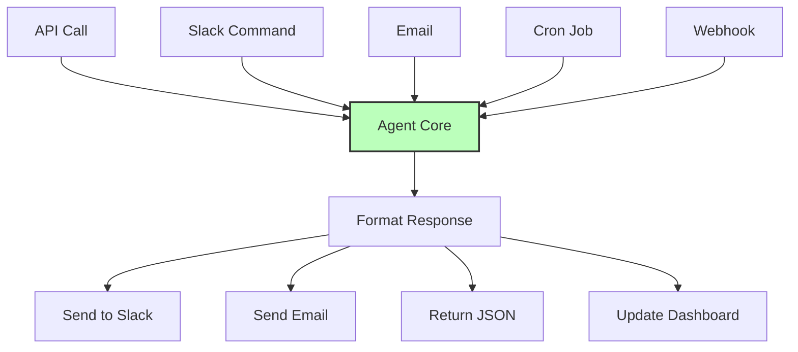

## The Principle

**Decouple agent triggers from platforms. Agents should work via API, webhook, schedule, or UI and deliver results through appropriate channels (email, Slack, etc.).**

Users are everywhere: Slack, email, web apps, mobile apps, webhooks, scheduled tasks. Your agent should run anywhere without changing its core logic.

## Why This Matters

Platform-agnostic agents enable:

1. **Maximum reach** - Users trigger where convenient
2. **Reusability** - Same agent, many interfaces
3. **Future-proofing** - New platforms without rewrites
4. **Testing flexibility** - Test via any trigger
5. **Cost efficiency** - One codebase for all channels

**The 12 Factor mentality:** Agent execution is deterministic. Trigger mechanism is just input. Output delivery is just formatting.



## The Anti-Pattern: Platform-Locked Agents

### Wrong: Slack-Only Agent

```typescript
// BAD: Tightly coupled to Slack
class SlackOnlyAgent {
  async handleSlackCommand(event: SlackCommandEvent) {
    // ❌ Logic mixed with Slack-specific code
    const customer = await db.customers.findUnique({
      where: { slackUserId: event.user },
    });

    const llmResponse = await llm.call({
      context: customer,
      input: event.text,
    });

    // ❌ Can only respond via Slack
    await slackClient.chat.postMessage({
      channel: event.channel,
      text: llmResponse,
    });
  }

  // Can't reuse this for API, email, or other channels!
}
```

## The Pattern: Platform-Agnostic Core

### Right: Decoupled Architecture

```typescript
// GOOD: Platform-agnostic core
interface AgentInput {
  userId: string;
  message: string;
  context?: Record<string, unknown>;
}

interface AgentOutput {
  message: string;
  data?: unknown;
  actions?: Action[];
}

class UniversalAgent {
  async execute(input: AgentInput): Promise<AgentOutput> {
    // Pure business logic - no platform coupling
    const user = await db.users.findUnique({
      where: { id: input.userId },
    });

    const response = await this.llm.call({
      context: user,
      input: input.message,
    });

    return {
      message: response.text,
      data: response.data,
      actions: response.actions,
    };
  }
}

// Adapters for different platforms
class SlackAdapter {
  constructor(private agent: UniversalAgent) {}

  async handleCommand(event: SlackCommandEvent) {
    // Translate Slack input to agent input
    const agentInput: AgentInput = {
      userId: await this.slackUserToUserId(event.user),
      message: event.text,
    };

    // Execute agent
    const output = await this.agent.execute(agentInput);

    // Translate agent output to Slack response
    await slackClient.chat.postMessage({
      channel: event.channel,
      text: output.message,
      blocks: this.formatAsSlackBlocks(output),
    });
  }
}

class APIAdapter {
  constructor(private agent: UniversalAgent) {}

  async handleRequest(req: Request): Promise<Response> {
    const agentInput: AgentInput = {
      userId: req.user.id,
      message: req.body.message,
    };

    const output = await this.agent.execute(agentInput);

    return res.json(output);
  }
}

class EmailAdapter {
  constructor(private agent: UniversalAgent) {}

  async handleIncomingEmail(email: IncomingEmail) {
    const agentInput: AgentInput = {
      userId: await this.emailToUserId(email.from),
      message: email.body,
    };

    const output = await this.agent.execute(agentInput);

    await emailService.send({
      to: email.from,
      subject: `Re: ${email.subject}`,
      body: output.message,
    });
  }
}
```

## Trigger Implementations

### HTTP API

```typescript
import express from 'express';

const app = express();
const agent = new UniversalAgent();

app.post('/agent/execute', async (req, res) => {
  try {
    const output = await agent.execute({
      userId: req.user.id,
      message: req.body.message,
      context: req.body.context,
    });

    res.json({
      success: true,
      ...output,
    });
  } catch (error) {
    res.status(500).json({
      success: false,
      error: error.message,
    });
  }
});

app.listen(3000);
```

### Slack Integration

```typescript
import { App } from '@slack/bolt';

const slackApp = new App({
  token: process.env.SLACK_BOT_TOKEN,
  signingSecret: process.env.SLACK_SIGNING_SECRET,
});

// Slash commands
slackApp.command('/agent', async ({ command, ack, respond }) => {
  await ack();

  const userId = await mapSlackUser(command.user_id);

  const output = await agent.execute({
    userId,
    message: command.text,
  });

  await respond({
    text: output.message,
    blocks: formatSlackBlocks(output),
  });
});

// Mentions
slackApp.event('app_mention', async ({ event, client }) => {
  const userId = await mapSlackUser(event.user);

  const output = await agent.execute({
    userId,
    message: event.text.replace(/<@.*?>/, '').trim(),
  });

  await client.chat.postMessage({
    channel: event.channel,
    thread_ts: event.ts,
    text: output.message,
  });
});

await slackApp.start(3001);
```

### Email Integration

```typescript
import { simpleParser } from 'mailparser';

// Webhook from email service (SendGrid, Mailgun, etc.)
app.post('/webhooks/inbound-email', async (req, res) => {
  const parsed = await simpleParser(req.body.email);

  const userId = await getUserByEmail(parsed.from.value[0].address);

  const output = await agent.execute({
    userId,
    message: parsed.text,
  });

  await emailService.send({
    to: parsed.from.value[0].address,
    subject: `Re: ${parsed.subject}`,
    html: formatEmailHTML(output),
  });

  res.sendStatus(200);
});
```

### Scheduled Triggers

```typescript
import cron from 'node-cron';

// Daily report at 9am
cron.schedule('0 9 * * *', async () => {
  const users = await db.users.findMany({
    where: { receivesDailyReport: true },
  });

  for (const user of users) {
    const output = await agent.execute({
      userId: user.id,
      message: 'Generate my daily summary',
    });

    await emailService.send({
      to: user.email,
      subject: 'Daily Summary',
      html: formatEmailHTML(output),
    });
  }
});

// Check for stale tickets every hour
cron.schedule('0 * * * *', async () => {
  const output = await agent.execute({
    userId: 'system',
    message: 'Find tickets with no response in 24 hours',
  });

  if (output.data?.tickets?.length > 0) {
    await alerting.send({
      title: 'Stale Tickets Alert',
      message: `${output.data.tickets.length} tickets need attention`,
    });
  }
});
```

### Webhook Triggers

```typescript
// GitHub webhook
app.post('/webhooks/github', async (req, res) => {
  if (req.body.action === 'opened' && req.body.issue) {
    const output = await agent.execute({
      userId: 'github-bot',
      message: `New GitHub issue: ${req.body.issue.title}\n${req.body.issue.body}`,
      context: {
        repository: req.body.repository.full_name,
        issueNumber: req.body.issue.number,
      },
    });

    // Post comment on issue
    await githubClient.issues.createComment({
      owner: req.body.repository.owner.login,
      repo: req.body.repository.name,
      issue_number: req.body.issue.number,
      body: output.message,
    });
  }

  res.sendStatus(200);
});

// Stripe webhook
app.post('/webhooks/stripe', async (req, res) => {
  if (req.body.type === 'payment_intent.payment_failed') {
    const output = await agent.execute({
      userId: 'billing-system',
      message: `Payment failed for customer ${req.body.data.object.customer}`,
      context: req.body.data.object,
    });

    // Send to support team
    await slackClient.chat.postMessage({
      channel: '#billing-alerts',
      text: output.message,
    });
  }

  res.sendStatus(200);
});
```

## Multi-Channel Response Delivery

### Smart Response Routing

```typescript
interface DeliveryPreferences {
  userId: string;
  preferredChannel: 'email' | 'slack' | 'sms' | 'push';
  urgencyChannels: {
    low: string[];
    medium: string[];
    high: string[];
    critical: string[];
  };
}

class ResponseDeliveryService {
  async deliver(
    output: AgentOutput,
    userId: string,
    urgency: 'low' | 'medium' | 'high' | 'critical' = 'medium'
  ) {
    const prefs = await this.getPreferences(userId);
    const channels = prefs.urgencyChannels[urgency];

    await Promise.all(
      channels.map(channel => this.sendViaChannel(channel, output, userId))
    );
  }

  private async sendViaChannel(
    channel: string,
    output: AgentOutput,
    userId: string
  ) {
    switch (channel) {
      case 'email':
        const user = await db.users.findUnique({ where: { id: userId } });
        await emailService.send({
          to: user.email,
          subject: this.extractSubject(output),
          html: this.formatEmail(output),
        });
        break;

      case 'slack':
        const slackUser = await this.getUserSlackId(userId);
        await slackClient.chat.postMessage({
          channel: slackUser,
          text: output.message,
          blocks: this.formatSlackBlocks(output),
        });
        break;

      case 'sms':
        const phoneNumber = await this.getUserPhone(userId);
        await twilioClient.messages.create({
          to: phoneNumber,
          body: this.formatSMS(output),
        });
        break;

      case 'push':
        await pushService.send({
          userId,
          title: this.extractTitle(output),
          body: output.message,
        });
        break;
    }
  }
}
```

### Format Adapters

```typescript
class ResponseFormatter {
  formatEmail(output: AgentOutput): string {
    return `
<!DOCTYPE html>
<html>
<body>
  <h2>${output.data?.title || 'Agent Response'}</h2>
  <p>${output.message}</p>

  ${output.data ? `
    <h3>Details</h3>
    <pre>${JSON.stringify(output.data, null, 2)}</pre>
  ` : ''}

  ${output.actions ? `
    <h3>Recommended Actions</h3>
    <ul>
      ${output.actions.map(a => `<li>${a.description}</li>`).join('')}
    </ul>
  ` : ''}
</body>
</html>
    `;
  }

  formatSlackBlocks(output: AgentOutput): any[] {
    const blocks: any[] = [
      {
        type: 'section',
        text: { type: 'mrkdwn', text: output.message },
      },
    ];

    if (output.data) {
      blocks.push({
        type: 'section',
        text: {
          type: 'mrkdwn',
          text: `\`\`\`${JSON.stringify(output.data, null, 2)}\`\`\``,
        },
      });
    }

    if (output.actions) {
      blocks.push({
        type: 'actions',
        elements: output.actions.map(action => ({
          type: 'button',
          text: { type: 'plain_text', text: action.label },
          value: action.id,
          action_id: `action_${action.id}`,
        })),
      });
    }

    return blocks;
  }

  formatSMS(output: AgentOutput): string {
    // SMS has 160 char limit
    let text = output.message.substring(0, 140);

    if (output.actions && output.actions.length > 0) {
      text += `\n\nActions: ${output.actions.length}`;
    }

    return text;
  }
}
```

## Testing Across Platforms

### Platform-Agnostic Tests

```typescript
describe('UniversalAgent', () => {
  const agent = new UniversalAgent();

  it('processes requests consistently regardless of source', async () => {
    const input: AgentInput = {
      userId: 'user-123',
      message: 'What is my account status?',
    };

    // Same input should produce same output
    const output1 = await agent.execute(input);
    const output2 = await agent.execute(input);

    expect(output1.message).toBe(output2.message);
    expect(output1.data).toEqual(output2.data);
  });
});

describe('Platform Adapters', () => {
  it('Slack adapter formats correctly', async () => {
    const slackAdapter = new SlackAdapter(agent);

    const event = createMockSlackEvent({
      user: 'U123',
      text: 'test',
    });

    await slackAdapter.handleCommand(event);

    expect(slackClient.chat.postMessage).toHaveBeenCalledWith(
      expect.objectContaining({
        channel: event.channel,
        text: expect.any(String),
      })
    );
  });

  it('API adapter returns JSON', async () => {
    const apiAdapter = new APIAdapter(agent);

    const req = createMockRequest({
      user: { id: 'user-123' },
      body: { message: 'test' },
    });

    const res = await apiAdapter.handleRequest(req);

    expect(res).toHaveProperty('message');
    expect(res).toHaveProperty('data');
  });
});
```

## The Deterministic Principle

**Key insight:** Execution is deterministic. Trigger and delivery are just I/O. Separate concerns cleanly.

```typescript
// Wrong: Platform-specific logic everywhere
const badApproach = {
  handleSlack: async () => { /* Slack + logic */ },
  handleAPI: async () => { /* API + logic */ },
  handleEmail: async () => { /* Email + logic */ },
  // Logic duplicated 3 times ❌
};

// Right: One core, many adapters
const goodApproach = {
  core: agent.execute, // Logic once ✅
  adapters: {
    slack: translateSlackInput,
    api: translateAPIInput,
    email: translateEmailInput,
  },
};
```

## Next Steps

Now that you understand flexible triggers, complete the methodology with:

- [Factor 12: Stateless Reducer](/universities/agentic-workflows/factor-12-stateless-reducer) - Final factor
- [Production Deployment](/universities/agentic-workflows/production-deployment) - Deploy across platforms
- [Use Cases](/universities/agentic-workflows/usecase-customer-support) - See multi-platform agents

Or review related concepts:

- [Factor 10: Focused Agents](/universities/agentic-workflows/factor-10-focused-agents) - Keep agents simple
- [Testing & Validation](/universities/agentic-workflows/testing-validation) - Platform testing strategies
