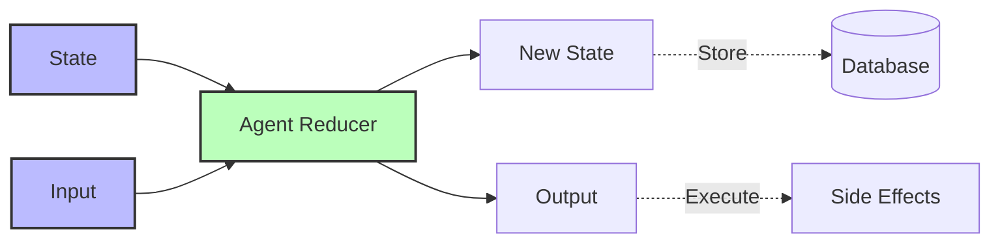

## The Principle

**Design agents as pure functions that transform state plus input into new state plus output. Given the same history and input, they should produce identical results.**

This is the culmination of all 12 factors. An agent that follows this pattern is testable, debuggable, reproducible, and production-ready.

## Why This Matters

Stateless reducers enable:

1. **Deterministic behavior** - Same input = same output
2. **Perfect testing** - Replay any scenario
3. **Time-travel debugging** - Step through execution history
4. **Audit trails** - Reproduce exact agent decisions
5. **Cacheability** - Memoize expensive operations

**The 12 Factor mentality:** Agents are pure functions. State goes in, decision comes out. No side effects in the decision logic. Execute side effects only after decision is made.



## The Anti-Pattern: Stateful Agents

### Wrong: Hidden State and Side Effects

```typescript
// BAD: Mutable state, side effects in decision logic
class StatefulAgent {
  private conversationHistory: Message[] = []; // ❌ Mutable state
  private context: Record<string, unknown> = {}; // ❌ Hidden state

  async execute(input: string): Promise<string> {
    // ❌ Side effect during decision-making
    const user = await db.users.findUnique({ where: { id: this.userId } });
    this.context.user = user;

    // ❌ Mutating internal state
    this.conversationHistory.push({
      role: 'user',
      content: input,
    });

    const response = await llm.call({
      context: this.context,
      messages: this.conversationHistory,
    });

    // ❌ More mutation
    this.conversationHistory.push({
      role: 'assistant',
      content: response,
    });

    // ❌ Side effect mixed with logic
    await db.logs.create({
      data: { input, output: response },
    });

    return response;
  }
}

// Problems:
// 1. Can't reproduce results (hidden state)
// 2. Can't test without database
// 3. Can't replay execution
// 4. Concurrency bugs (shared state)
// 5. Can't cache results
```

## The Pattern: Pure Reducer

### Right: Stateless, Pure Function

```typescript
// GOOD: Pure function
interface AgentState {
  conversationHistory: Message[];
  context: Record<string, unknown>;
  executedActions: Action[];
}

interface AgentInput {
  message: string;
  externalData?: Record<string, unknown>;
}

interface AgentOutput {
  newState: AgentState;
  response: string;
  actions: Action[];
}

class StatelessAgent {
  // Pure reducer: (state, input) => (newState, output)
  async reduce(
    state: AgentState,
    input: AgentInput
  ): Promise<AgentOutput> {
    // Build complete context from state + input
    const context = {
      ...state.context,
      ...input.externalData,
    };

    // Build messages from state
    const messages = [
      ...state.conversationHistory,
      { role: 'user' as const, content: input.message },
    ];

    // Make decision (pure - no side effects!)
    const response = await this.llm.call({
      context,
      messages,
    });

    // Return new state (immutable - don't mutate input state!)
    return {
      newState: {
        conversationHistory: [
          ...state.conversationHistory,
          { role: 'user', content: input.message },
          { role: 'assistant', content: response.text },
        ],
        context,
        executedActions: [
          ...state.executedActions,
          ...response.actions,
        ],
      },
      response: response.text,
      actions: response.actions,
    };
  }
}

// Usage
const agent = new StatelessAgent();

// Execute with explicit state
let state: AgentState = {
  conversationHistory: [],
  context: {},
  executedActions: [],
};

const output = await agent.reduce(state, {
  message: 'Hello',
});

// Save new state
state = output.newState;

// Execute side effects AFTER decision
await db.logs.create({
  data: {
    input: 'Hello',
    output: output.response,
  },
});
```

## Complete Reducer Pattern

### Full Implementation

```typescript
interface ExecutionRecord {
  id: string;
  state: AgentState;
  input: AgentInput;
  output: AgentOutput;
  timestamp: Date;
}

class ProductionAgent {
  constructor(
    private llm: LLM,
    private db: Database
  ) {}

  // Pure reducer
  async reduce(
    state: AgentState,
    input: AgentInput
  ): Promise<AgentOutput> {
    const context = this.buildContext(state, input);
    const messages = this.buildMessages(state, input);

    const decision = await this.makeDecision(context, messages);

    return {
      newState: this.computeNewState(state, input, decision),
      response: decision.text,
      actions: decision.actions,
    };
  }

  // Execute with persistence
  async execute(
    state: AgentState,
    input: AgentInput
  ): Promise<{ output: AgentOutput; record: ExecutionRecord }> {
    // 1. Make decision (pure)
    const output = await this.reduce(state, input);

    // 2. Create execution record
    const record: ExecutionRecord = {
      id: generateId(),
      state,
      input,
      output,
      timestamp: new Date(),
    };

    // 3. Persist record (side effect)
    await this.db.executions.create({ data: record });

    // 4. Execute actions (side effects)
    for (const action of output.actions) {
      await this.executeAction(action);
    }

    return { output, record };
  }

  // Helper methods (all pure)
  private buildContext(
    state: AgentState,
    input: AgentInput
  ): Record<string, unknown> {
    return {
      ...state.context,
      ...input.externalData,
    };
  }

  private buildMessages(
    state: AgentState,
    input: AgentInput
  ): Message[] {
    return [
      ...state.conversationHistory,
      { role: 'user', content: input.message },
    ];
  }

  private async makeDecision(
    context: Record<string, unknown>,
    messages: Message[]
  ): Promise<Decision> {
    return await this.llm.call({ context, messages });
  }

  private computeNewState(
    state: AgentState,
    input: AgentInput,
    decision: Decision
  ): AgentState {
    return {
      conversationHistory: [
        ...state.conversationHistory,
        { role: 'user', content: input.message },
        { role: 'assistant', content: decision.text },
      ],
      context: state.context,
      executedActions: [
        ...state.executedActions,
        ...decision.actions,
      ],
    };
  }

  // Side effect execution (impure - clearly separated)
  private async executeAction(action: Action): Promise<void> {
    // This is where impurity happens
    // But it's after the decision is made
    await this.db.actions.create({ data: action });

    if (action.type === 'send_email') {
      await emailService.send(action.params);
    }
  }
}
```

## Testing Pure Reducers

### Perfect Reproducibility

```typescript
describe('StatelessAgent', () => {
  it('produces identical output for identical input', async () => {
    const agent = new StatelessAgent();

    const state: AgentState = {
      conversationHistory: [],
      context: { userId: '123' },
      executedActions: [],
    };

    const input: AgentInput = {
      message: 'What is my account status?',
    };

    // Call twice with same inputs
    const output1 = await agent.reduce(state, input);
    const output2 = await agent.reduce(state, input);

    // Should be identical
    expect(output1).toEqual(output2);
  });

  it('does not mutate input state', async () => {
    const agent = new StatelessAgent();

    const originalState: AgentState = {
      conversationHistory: [{ role: 'user', content: 'Hello' }],
      context: {},
      executedActions: [],
    };

    // Deep clone to verify immutability
    const stateCopy = JSON.parse(JSON.stringify(originalState));

    await agent.reduce(originalState, { message: 'Hi' });

    // Original state should be unchanged
    expect(originalState).toEqual(stateCopy);
  });
});
```

### Time-Travel Testing

```typescript
describe('Time Travel', () => {
  it('can replay execution from any point', async () => {
    const agent = new StatelessAgent();

    // Execute a conversation
    const execution1 = await agent.execute(initialState, { message: 'Hello' });
    const execution2 = await agent.execute(execution1.output.newState, { message: 'How are you?' });
    const execution3 = await agent.execute(execution2.output.newState, { message: 'Goodbye' });

    // Go back in time to execution 2
    const replayState = execution2.output.newState;

    // Execute different input
    const alternate = await agent.execute(replayState, { message: 'Tell me more' });

    // We branched from execution 2!
    expect(alternate.output.newState.conversationHistory.length).toBe(5);
    expect(alternate.output.newState.conversationHistory[4].content).not.toBe('Goodbye');
  });
});
```

### Property-Based Testing

```typescript
import fc from 'fast-check';

describe('Reducer Properties', () => {
  it('always produces valid state', () => {
    fc.assert(
      fc.asyncProperty(
        fc.record({
          conversationHistory: fc.array(fc.record({
            role: fc.constantFrom('user', 'assistant'),
            content: fc.string(),
          })),
          context: fc.dictionary(fc.string(), fc.anything()),
          executedActions: fc.array(fc.anything()),
        }),
        fc.string(),
        async (state, message) => {
          const output = await agent.reduce(state, { message });

          // Verify output structure
          expect(output.newState).toHaveProperty('conversationHistory');
          expect(output.newState).toHaveProperty('context');
          expect(output.newState).toHaveProperty('executedActions');

          // Verify state grew (didn't shrink)
          expect(output.newState.conversationHistory.length).toBeGreaterThanOrEqual(
            state.conversationHistory.length
          );
        }
      )
    );
  });
});
```

## Caching and Memoization

### Memoized Reducer

```typescript
import { LRUCache } from 'lru-cache';

class MemoizedAgent {
  private cache = new LRUCache<string, AgentOutput>({
    max: 1000,
    ttl: 1000 * 60 * 60, // 1 hour
  });

  async reduce(
    state: AgentState,
    input: AgentInput
  ): Promise<AgentOutput> {
    // Generate cache key from state + input
    const cacheKey = this.hash({ state, input });

    // Check cache
    const cached = this.cache.get(cacheKey);
    if (cached) {
      return cached;
    }

    // Execute reducer
    const output = await this.pureReduce(state, input);

    // Cache result
    this.cache.set(cacheKey, output);

    return output;
  }

  private hash(data: unknown): string {
    return require('crypto')
      .createHash('sha256')
      .update(JSON.stringify(data))
      .digest('hex');
  }

  private async pureReduce(
    state: AgentState,
    input: AgentInput
  ): Promise<AgentOutput> {
    // Actual reducer logic
    // ...
  }
}
```

## Audit and Replay

### Execution Log

```typescript
class AuditableAgent {
  async executeWithAudit(
    state: AgentState,
    input: AgentInput
  ): Promise<{
    output: AgentOutput;
    audit: AuditRecord;
  }> {
    const startTime = Date.now();

    // Execute pure reducer
    const output = await this.reduce(state, input);

    const audit: AuditRecord = {
      id: generateId(),
      timestamp: new Date(),
      duration: Date.now() - startTime,
      state: state,
      input: input,
      output: output,
      hash: this.hashExecution({ state, input, output }),
    };

    await this.db.auditLog.create({ data: audit });

    return { output, audit };
  }

  async replay(auditId: string): Promise<AgentOutput> {
    // Load audit record
    const audit = await this.db.auditLog.findUnique({
      where: { id: auditId },
    });

    // Replay exact execution
    const replayOutput = await this.reduce(audit.state, audit.input);

    // Verify reproducibility
    const replayHash = this.hashExecution({
      state: audit.state,
      input: audit.input,
      output: replayOutput,
    });

    if (replayHash !== audit.hash) {
      throw new Error('Replay produced different result - agent is not deterministic!');
    }

    return replayOutput;
  }

  private hashExecution(data: unknown): string {
    return require('crypto')
      .createHash('sha256')
      .update(JSON.stringify(data))
      .digest('hex');
  }
}
```

### Debugging with Time Travel

```typescript
class DebuggableAgent extends AuditableAgent {
  async debugExecution(auditId: string): Promise<DebugInfo> {
    const audit = await this.db.auditLog.findUnique({
      where: { id: auditId },
    });

    // Get all executions leading to this one
    const history = await this.getExecutionHistory(audit);

    // Replay each step
    const steps: DebugStep[] = [];

    let currentState = history[0].state;

    for (const record of history) {
      const output = await this.reduce(currentState, record.input);

      steps.push({
        input: record.input,
        stateBefore: currentState,
        stateAfter: output.newState,
        output: output,
        llmCalls: await this.getLLMCalls(record.id),
      });

      currentState = output.newState;
    }

    return {
      steps,
      finalState: currentState,
      totalDuration: steps.reduce((sum, s) => sum + s.duration, 0),
    };
  }
}
```

## The Deterministic Principle

**Key insight:** Pure functions are the foundation of reliable software. Agents are no different. Separate decision-making (pure) from execution (impure).

```typescript
// Wrong: Side effects everywhere
const badApproach = {
  async execute(input) {
    await db.update(); // Side effect
    const data = await api.fetch(); // Side effect
    const decision = llm.call(); // Uses data
    await db.log(); // Side effect
    return decision;
  },
  // Can't test, can't replay, can't reproduce ❌
};

// Right: Pure reducer + side effect execution
const goodApproach = {
  // Pure: (state, input) => (newState, output)
  reduce: (state, input) => {
    const decision = llm.call(state, input);
    return {
      newState: computeNewState(state, decision),
      output: decision,
    };
  },
  // Impure: execute side effects after decision
  execute: async (state, input) => {
    const { newState, output } = reduce(state, input);
    await db.save(newState); // Side effect after decision
    return { newState, output };
  },
  // Testable, replayable, reproducible ✅
};
```

## Summary: The 12 Factor Philosophy

This final factor brings everything together:

1. **Natural Language to Tool Calls** - LLM generates structured output
2. **Own Your Prompts** - Explicit instructions
3. **Own Your Context** - Deterministic input
4. **Structured Outputs** - Type-safe validation
5. **Unified State** - Database as truth
6. **Pause/Resume** - Explicit checkpoints
7. **Human Tools** - Consistent interface
8. **Control Flow** - State machines
9. **Compact Errors** - Actionable signals
10. **Focused Agents** - Small scope
11. **Flexible Triggers** - Platform-agnostic
12. **Stateless Reducer** - Pure functions

**Result:** Production-ready agents that are deterministic, testable, debuggable, and reliable.

## Next Steps

You've completed the 12 Factor Agents methodology! Continue with:

- [Building Your First Agent](/universities/agentic-workflows/building-first-agent) - Apply all 12 factors
- [Production Deployment](/universities/agentic-workflows/production-deployment) - Take agents live
- [Use Cases](/universities/agentic-workflows/usecase-customer-support) - See real implementations

Or explore implementation patterns:

- [Testing & Validation](/universities/agentic-workflows/testing-validation) - Comprehensive testing guide
- [Error Handling Strategies](/universities/agentic-workflows/error-handling-strategies) - Production error handling
- [Human-in-Loop Patterns](/universities/agentic-workflows/human-in-loop-patterns) - Advanced HITL patterns

<Card
  title="12 Factor Agents Repository"
  icon="github"
  href="https://github.com/humanlayer/12-factor-agents"
>
  Original methodology by Dex Horthy at HumanLayer
</Card>
