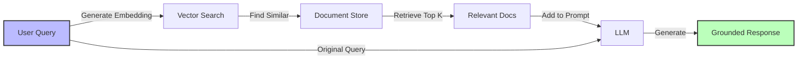

## Language Model Basics

### Large Language Model (LLM)

A neural network trained on massive text datasets to understand and generate human-like text. Modern LLMs like Claude 3.5 Sonnet can follow instructions, reason, and call functions.

**Key capabilities:**
- Text generation and completion
- Question answering
- Code generation
- Translation and summarization
- Function calling (tool use)

```typescript
import Anthropic from '@anthropic-ai/sdk';

const client = new Anthropic({
  apiKey: process.env.ANTHROPIC_API_KEY,
});

const response = await client.messages.create({
  model: 'claude-3-5-sonnet-20241022',
  max_tokens: 1024,
  messages: [{
    role: 'user',
    content: 'Explain async/await in TypeScript'
  }],
});

console.log(response.content[0].text);
```

### Token

The basic unit of text that an LLM processes. Tokens can be words, parts of words, or punctuation.

**Rules of thumb:**
- 1 token ≈ 4 characters in English
- 1 token ≈ ¾ of a word
- 100 tokens ≈ 75 words

```typescript
// Estimate tokens (rough approximation)
function estimateTokens(text: string): number {
  return Math.ceil(text.length / 4);
}

// More accurate using tiktoken library
import { encoding_for_model } from 'tiktoken';

function countTokens(text: string, model: string = 'gpt-4'): number {
  const encoding = encoding_for_model(model);
  const tokens = encoding.encode(text);
  encoding.free();
  return tokens.length;
}

const prompt = "Explain quantum computing";
console.log(`Estimated: ${estimateTokens(prompt)} tokens`);
console.log(`Actual: ${countTokens(prompt)} tokens`);
```

### Temperature

A parameter (0.0 to 1.0) controlling randomness in LLM outputs. Lower = more deterministic, higher = more creative.

**Guidelines:**
- **0.0-0.3**: Factual tasks, code generation, data extraction
- **0.4-0.7**: General conversation, balanced creativity
- **0.8-1.0**: Creative writing, brainstorming

```typescript
// Deterministic for structured output
const structuredResponse = await client.messages.create({
  model: 'claude-3-5-sonnet-20241022',
  max_tokens: 1024,
  temperature: 0.0, // Minimal randomness
  messages: [{
    role: 'user',
    content: 'Extract the email and phone from: Contact John at john@example.com or 555-0100'
  }],
});

// Creative for content generation
const creativeResponse = await client.messages.create({
  model: 'claude-3-5-sonnet-20241022',
  max_tokens: 1024,
  temperature: 0.9, // High creativity
  messages: [{
    role: 'user',
    content: 'Write a catchy tagline for a productivity app'
  }],
});
```

### Top-P (Nucleus Sampling)

An alternative to temperature that limits the model to the most probable tokens whose cumulative probability exceeds P.

```typescript
const response = await client.messages.create({
  model: 'claude-3-5-sonnet-20241022',
  max_tokens: 1024,
  top_p: 0.9, // Consider top 90% of probability mass
  messages: [{ role: 'user', content: 'Suggest a variable name' }],
});
```

## Prompting Techniques

### System Prompt

Instructions that set the LLM's behavior, personality, and constraints. Appears before the conversation.

```typescript
interface Message {
  role: 'user' | 'assistant' | 'system';
  content: string;
}

const systemPrompt = `You are a TypeScript expert assistant.

Your responses should:
- Use modern TypeScript features (ES2022+)
- Include type annotations
- Follow functional programming principles when appropriate
- Explain trade-offs in your recommendations

Never:
- Use 'any' types without justification
- Suggest deprecated APIs
- Omit error handling`;

const messages: Message[] = [
  { role: 'system', content: systemPrompt },
  { role: 'user', content: 'How should I handle API errors?' },
];
```

### Few-Shot Prompting

Providing examples of desired input/output pairs to guide the model's behavior.

```typescript
const fewShotPrompt = `Extract structured data from customer messages.

Example 1:
Input: "Hi, I'm Sarah Chen (sarah@gmail.com) and my order #12345 is late"
Output: {"name": "Sarah Chen", "email": "sarah@gmail.com", "orderId": "12345", "issue": "late_delivery"}

Example 2:
Input: "Received wrong item in order 67890, please contact me at mike@outlook.com"
Output: {"name": null, "email": "mike@outlook.com", "orderId": "67890", "issue": "wrong_item"}

Example 3:
Input: "Order 54321 arrived damaged. I'm John Smith, reach me at john.smith@company.com"
Output: {"name": "John Smith", "email": "john.smith@company.com", "orderId": "54321", "issue": "damaged"}

Now extract from:
Input: "${customerMessage}"
Output:`;
```

### Chain-of-Thought (CoT)

Asking the LLM to show its reasoning process step-by-step, improving answer quality.

```typescript
async function solveWithCoT(problem: string): Promise<string> {
  const response = await client.messages.create({
    model: 'claude-3-5-sonnet-20241022',
    max_tokens: 2048,
    messages: [{
      role: 'user',
      content: `${problem}

Think through this step-by-step:
1. What information do we have?
2. What information do we need?
3. What is the logical approach?
4. Execute the solution
5. Verify the answer

Provide your reasoning, then the final answer.`
    }],
  });

  return response.content[0].text;
}

// Usage
const answer = await solveWithCoT(
  "A company has 150 employees. 40% work remotely. Of remote workers, 60% are in engineering. How many remote engineers are there?"
);
```

### Zero-Shot Prompting

Asking the model to perform a task without any examples, relying purely on instructions.

```typescript
const zeroShotPrompt = `Classify the sentiment of this customer review as positive, negative, or neutral.
Respond with only one word: positive, negative, or neutral.

Review: "${review}"
Sentiment:`;
```

### Structured Output

Using JSON mode or function calling to force the LLM to return data in a specific format.

```typescript
import { z } from 'zod';

// Define schema
const CustomerDataSchema = z.object({
  name: z.string().nullable(),
  email: z.string().email(),
  orderId: z.string(),
  issue: z.enum(['late_delivery', 'wrong_item', 'damaged', 'other']),
  urgency: z.enum(['low', 'medium', 'high']),
});

type CustomerData = z.infer<typeof CustomerDataSchema>;

async function extractCustomerData(message: string): Promise<CustomerData> {
  const response = await client.messages.create({
    model: 'claude-3-5-sonnet-20241022',
    max_tokens: 1024,
    temperature: 0,
    tools: [{
      name: 'extract_customer_data',
      description: 'Extract structured customer support data',
      input_schema: {
        type: 'object',
        properties: {
          name: { type: 'string', description: 'Customer full name', nullable: true },
          email: { type: 'string', description: 'Customer email address' },
          orderId: { type: 'string', description: 'Order ID mentioned' },
          issue: {
            type: 'string',
            enum: ['late_delivery', 'wrong_item', 'damaged', 'other'],
            description: 'Type of issue'
          },
          urgency: {
            type: 'string',
            enum: ['low', 'medium', 'high'],
            description: 'Urgency level'
          },
        },
        required: ['email', 'orderId', 'issue', 'urgency'],
      },
    }],
    messages: [{ role: 'user', content: message }],
  });

  const toolUse = response.content.find(block => block.type === 'tool_use');
  if (!toolUse || toolUse.type !== 'tool_use') {
    throw new Error('No structured output generated');
  }

  // Validate with Zod
  return CustomerDataSchema.parse(toolUse.input);
}
```

## Embeddings & Vectors

### Embeddings

Numerical representations of text that capture semantic meaning. Similar concepts have similar embeddings.

```typescript
import Anthropic from '@anthropic-ai/sdk';

// Note: Anthropic doesn't provide embeddings API
// Use OpenAI or other providers for embeddings

import OpenAI from 'openai';

const openai = new OpenAI();

async function getEmbedding(text: string): Promise<number[]> {
  const response = await openai.embeddings.create({
    model: 'text-embedding-3-small',
    input: text,
  });

  return response.data[0].embedding;
}

// Usage
const embedding = await getEmbedding('TypeScript async patterns');
console.log(`Embedding dimension: ${embedding.length}`); // 1536
```

### Vector Database

A specialized database for storing and searching embeddings by similarity.

```typescript
import { ChromaClient } from 'chromadb';

const client = new ChromaClient();

// Create collection
const collection = await client.createCollection({
  name: 'documentation',
});

// Add documents with embeddings
await collection.add({
  ids: ['doc1', 'doc2', 'doc3'],
  documents: [
    'TypeScript supports async/await for asynchronous programming',
    'Use Promises for handling asynchronous operations',
    'Python uses async/await syntax similar to TypeScript',
  ],
  metadatas: [
    { language: 'typescript', topic: 'async' },
    { language: 'typescript', topic: 'promises' },
    { language: 'python', topic: 'async' },
  ],
});

// Search by similarity
const results = await collection.query({
  queryTexts: ['How do I handle async code in TypeScript?'],
  nResults: 2,
});

console.log(results.documents); // Most similar documents
```

### Cosine Similarity

A measure of similarity between two vectors, used to find semantically similar text.

```typescript
function cosineSimilarity(vecA: number[], vecB: number[]): number {
  if (vecA.length !== vecB.length) {
    throw new Error('Vectors must have same dimensions');
  }

  let dotProduct = 0;
  let normA = 0;
  let normB = 0;

  for (let i = 0; i < vecA.length; i++) {
    dotProduct += vecA[i] * vecB[i];
    normA += vecA[i] * vecA[i];
    normB += vecB[i] * vecB[i];
  }

  return dotProduct / (Math.sqrt(normA) * Math.sqrt(normB));
}

// Usage
const embedding1 = await getEmbedding('async await patterns');
const embedding2 = await getEmbedding('asynchronous programming');
const embedding3 = await getEmbedding('database queries');

console.log(cosineSimilarity(embedding1, embedding2)); // ~0.85 (high similarity)
console.log(cosineSimilarity(embedding1, embedding3)); // ~0.32 (low similarity)
```

## Retrieval-Augmented Generation (RAG)

### RAG

A technique for grounding LLM responses in external knowledge by retrieving relevant documents and including them in the prompt.



```typescript
interface RAGSystem {
  vectorDB: VectorDatabase;
  llm: Anthropic;
}

async function ragQuery(query: string): Promise<string> {
  // 1. Search for relevant documents
  const relevantDocs = await vectorDB.query({
    queryTexts: [query],
    nResults: 3,
  });

  // 2. Build context from retrieved documents
  const context = relevantDocs.documents
    .map((doc, i) => `[Source ${i + 1}]: ${doc}`)
    .join('\n\n');

  // 3. Query LLM with context
  const response = await client.messages.create({
    model: 'claude-3-5-sonnet-20241022',
    max_tokens: 1024,
    messages: [{
      role: 'user',
      content: `Answer the question using only the information provided in the sources below.
If the sources don't contain enough information, say so.

Sources:
${context}

Question: ${query}

Answer:`
    }],
  });

  return response.content[0].text;
}

// Usage
const answer = await ragQuery(
  'How do I handle errors in async functions?'
);
```

### Semantic Search

Finding documents by meaning rather than exact keyword matches.

```typescript
class SemanticSearchEngine {
  constructor(
    private vectorDB: VectorDatabase,
    private embeddingModel: EmbeddingModel
  ) {}

  async addDocuments(documents: Array<{ id: string; text: string; metadata?: Record<string, unknown> }>) {
    await this.vectorDB.add({
      ids: documents.map(d => d.id),
      documents: documents.map(d => d.text),
      metadatas: documents.map(d => d.metadata || {}),
    });
  }

  async search(query: string, options: {
    topK?: number;
    filter?: Record<string, unknown>;
  } = {}): Promise<SearchResult[]> {
    const results = await this.vectorDB.query({
      queryTexts: [query],
      nResults: options.topK || 5,
      where: options.filter,
    });

    return results.documents.map((doc, i) => ({
      id: results.ids[i],
      document: doc,
      score: results.distances[i],
      metadata: results.metadatas[i],
    }));
  }
}

// Usage
const searchEngine = new SemanticSearchEngine(vectorDB, embeddingModel);

await searchEngine.addDocuments([
  {
    id: '1',
    text: 'TypeScript async/await tutorial',
    metadata: { type: 'tutorial', language: 'typescript' }
  },
  {
    id: '2',
    text: 'Handling promises in JavaScript',
    metadata: { type: 'guide', language: 'javascript' }
  },
]);

const results = await searchEngine.search(
  'asynchronous programming patterns',
  { topK: 3 }
);
```

### Chunking

Splitting large documents into smaller pieces for more precise retrieval.

```typescript
interface Chunk {
  id: string;
  text: string;
  metadata: {
    documentId: string;
    chunkIndex: number;
    startPos: number;
    endPos: number;
  };
}

function chunkDocument(
  document: { id: string; text: string },
  options: {
    chunkSize: number;
    overlap: number;
  }
): Chunk[] {
  const chunks: Chunk[] = [];
  const { chunkSize, overlap } = options;
  let startPos = 0;
  let chunkIndex = 0;

  while (startPos < document.text.length) {
    const endPos = Math.min(startPos + chunkSize, document.text.length);
    const text = document.text.slice(startPos, endPos);

    chunks.push({
      id: `${document.id}_chunk_${chunkIndex}`,
      text,
      metadata: {
        documentId: document.id,
        chunkIndex,
        startPos,
        endPos,
      },
    });

    startPos += chunkSize - overlap;
    chunkIndex++;
  }

  return chunks;
}

// Usage
const document = {
  id: 'typescript_guide',
  text: 'Very long documentation text...',
};

const chunks = chunkDocument(document, {
  chunkSize: 500, // 500 characters per chunk
  overlap: 50,    // 50 character overlap between chunks
});
```

## Model Training & Adaptation

### Fine-Tuning

Training a model on domain-specific data to improve performance on specific tasks. Generally not needed for modern LLMs with good prompting.

**When to consider:**
- Extremely specialized domain language
- Need for specific output formatting
- Very high volume (fine-tuning cost < inference cost)

**When to avoid:**
- General tasks (prompting works better)
- Small datasets (< 500 examples)
- Rapidly changing requirements

```typescript
// Fine-tuning is typically done via provider APIs, not at runtime
// Example with OpenAI (Anthropic doesn't offer fine-tuning as of 2025)

import OpenAI from 'openai';
import fs from 'fs';

const openai = new OpenAI();

// Prepare training data
const trainingData = [
  {
    messages: [
      { role: 'system', content: 'You are a SQL expert assistant' },
      { role: 'user', content: 'Get all users who signed up last month' },
      { role: 'assistant', content: 'SELECT * FROM users WHERE created_at >= DATE_SUB(CURDATE(), INTERVAL 1 MONTH)' },
    ],
  },
  // ... more examples
];

// Upload training file
fs.writeFileSync('training.jsonl', trainingData.map(JSON.stringify).join('\n'));

const file = await openai.files.create({
  file: fs.createReadStream('training.jsonl'),
  purpose: 'fine-tune',
});

// Create fine-tuning job
const fineTune = await openai.fineTuning.jobs.create({
  training_file: file.id,
  model: 'gpt-3.5-turbo',
});
```

### Prompt Engineering

Iteratively refining prompts to achieve desired behavior without changing the model.

```typescript
class PromptTemplate {
  constructor(
    private template: string,
    private variables: string[]
  ) {}

  fill(values: Record<string, string>): string {
    let result = this.template;

    for (const variable of this.variables) {
      if (!(variable in values)) {
        throw new Error(`Missing variable: ${variable}`);
      }
      result = result.replace(`{{${variable}}}`, values[variable]);
    }

    return result;
  }

  static create(template: string): PromptTemplate {
    const variables = Array.from(
      template.matchAll(/\{\{(\w+)\}\}/g),
      match => match[1]
    );

    return new PromptTemplate(template, variables);
  }
}

// Usage
const template = PromptTemplate.create(`
Analyze this {{content_type}} and extract:
1. Main topic
2. Key points (3-5 bullets)
3. Sentiment (positive/negative/neutral)

{{content_type}}:
{{content}}

Analysis:
`);

const prompt = template.fill({
  content_type: 'customer review',
  content: 'The product works great but shipping was slow...',
});
```

## Performance & Cost

### Caching (Prompt Caching)

Reusing processed prompts to reduce latency and cost. Claude supports prompt caching for repeated prefixes.

```typescript
// Using Claude's prompt caching
const response = await client.messages.create({
  model: 'claude-3-5-sonnet-20241022',
  max_tokens: 1024,
  system: [
    {
      type: 'text',
      text: largeSystemPrompt, // This will be cached
      cache_control: { type: 'ephemeral' }
    }
  ],
  messages: [{ role: 'user', content: userQuery }],
});

// Subsequent requests with same system prompt hit cache
// Reduces latency and costs ~90% for cached portion
```

### Batching

Processing multiple requests together to improve throughput and reduce costs.

```typescript
async function batchProcess<T, R>(
  items: T[],
  processor: (item: T) => Promise<R>,
  options: {
    batchSize: number;
    delayBetweenBatches?: number;
  }
): Promise<R[]> {
  const results: R[] = [];
  const { batchSize, delayBetweenBatches = 0 } = options;

  for (let i = 0; i < items.length; i += batchSize) {
    const batch = items.slice(i, i + batchSize);

    const batchResults = await Promise.all(
      batch.map(item => processor(item))
    );

    results.push(...batchResults);

    if (delayBetweenBatches > 0 && i + batchSize < items.length) {
      await new Promise(resolve => setTimeout(resolve, delayBetweenBatches));
    }
  }

  return results;
}

// Usage
const documents = ['doc1', 'doc2', 'doc3', /* ... 100 more */];

const summaries = await batchProcess(
  documents,
  async (doc) => await summarizeDocument(doc),
  {
    batchSize: 10,
    delayBetweenBatches: 1000, // 1 second between batches
  }
);
```

### Rate Limiting

Controlling request frequency to stay within API limits.

```typescript
class RateLimiter {
  private queue: Array<() => void> = [];
  private activeRequests = 0;

  constructor(
    private maxRequestsPerMinute: number,
    private maxConcurrent: number
  ) {
    setInterval(() => {
      this.processQueue();
    }, 60000 / maxRequestsPerMinute);
  }

  async execute<T>(fn: () => Promise<T>): Promise<T> {
    if (this.activeRequests >= this.maxConcurrent) {
      await new Promise<void>(resolve => this.queue.push(resolve));
    }

    this.activeRequests++;

    try {
      return await fn();
    } finally {
      this.activeRequests--;
      this.processQueue();
    }
  }

  private processQueue() {
    if (this.queue.length > 0 && this.activeRequests < this.maxConcurrent) {
      const next = this.queue.shift();
      next?.();
    }
  }
}

// Usage
const limiter = new RateLimiter(50, 5); // 50 req/min, 5 concurrent

const result = await limiter.execute(async () => {
  return await client.messages.create({
    model: 'claude-3-5-sonnet-20241022',
    max_tokens: 1024,
    messages: [{ role: 'user', content: 'Hello' }],
  });
});
```

## Next Steps

Continue to:

- [Framework Glossary](/universities/agentic-workflows/glossary-frameworks) - LangChain, LangGraph, and alternatives
- [Tools & Integration Glossary](/universities/agentic-workflows/glossary-tools-integrations) - Function calling patterns

Or start building:

- [Factor 1: Natural Language to Tool Calls](/universities/agentic-workflows/factor-01-natural-language-to-tools)
