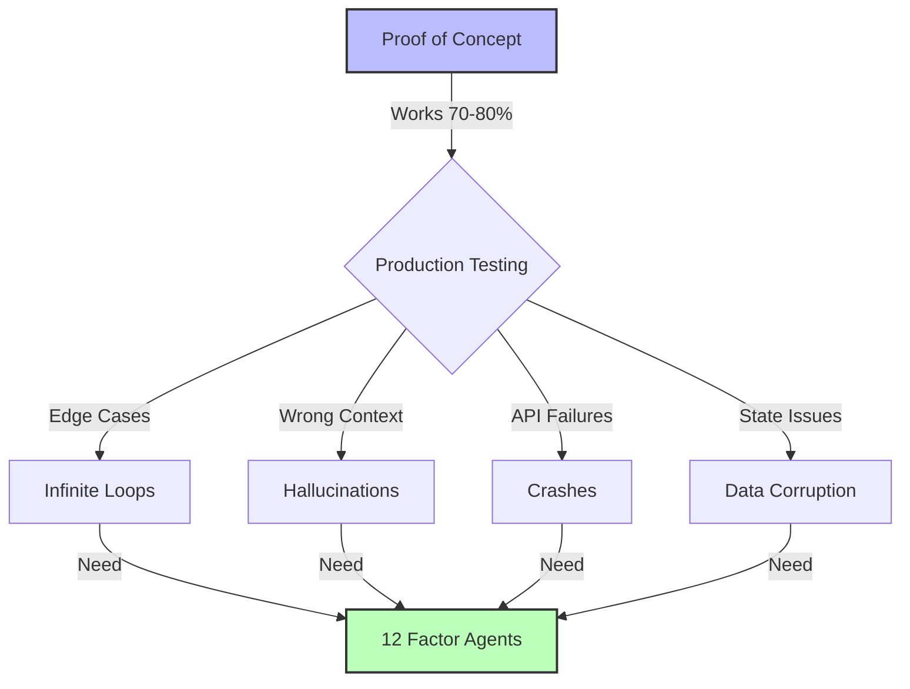

<script type="application/ld+json">
  {`{
  "@context": "https://schema.org",
  "@type": "Course",
  "name": "Agentic Workflows University",
  "description": "Complete guide to building production-ready AI agents using the 12 Factor Agents methodology",
  "provider": {
    "@type": "Organization",
    "name": "WithSeismic"
  }
}`}
</script>

<div className="grid grid-cols-1 md:grid-cols-3 gap-6 mb-12 not-prose">
  <Card title="Production-Ready" icon="rocket">
    Build agents that actually work in real environments
  </Card>
  <Card title="TypeScript-First" icon="code">
    Type-safe implementations with Zod, Zustand, and Anthropic
  </Card>
  <Card title="Workflow Replacement" icon="arrows-turn-to-dots">
    Replace repetitive processes with intelligent automation
  </Card>
</div>

## What Are Agentic Workflows?

Agentic workflows are AI-powered systems that autonomously execute multi-step processes by combining LLM reasoning with deterministic code. Unlike simple chatbots or one-off AI calls, agents can:

1. **Plan** - Break down complex tasks into actionable steps
2. **Execute** - Call tools and APIs to perform real work
3. **Adapt** - Handle errors and adjust plans based on feedback
4. **Coordinate** - Manage state across multiple operations
5. **Pause** - Request human input when needed

The key insight: **70-80% deterministic code + 20-30% LLM decision-making** produces the most reliable results.

## The Production Reality

Most "AI agent" demos break down in production. Here's why:



That last 20-30% requires systematic engineering. That's where the **12 Factor Agents** methodology comes in.

## The 12 Factor Agents Methodology

Created by [Dex Horthy](https://github.com/dexhorthy) at [HumanLayer](https://www.humanlayer.dev/), this framework distills production lessons from 100+ SaaS builders into actionable patterns.

### Core Principles

<AccordionGroup>
  <Accordion title="1. Natural Language to Tool Calls" icon="comments">
    Convert user intent into structured function calls
  </Accordion>
  <Accordion title="2. Own Your Prompts" icon="pen-to-square">
    Maintain direct control over prompt engineering
  </Accordion>
  <Accordion title="3. Own Your Context Window" icon="window-maximize">
    Actively manage what the LLM receives
  </Accordion>
  <Accordion title="4. Tools Are Just Structured Outputs" icon="screwdriver-wrench">
    Treat tool definitions as output schemas
  </Accordion>
  <Accordion title="5. Unify Execution State and Business State" icon="database">
    Keep agent state synced with your database
  </Accordion>
  <Accordion title="6. Launch/Pause/Resume with Simple APIs" icon="circle-pause">
    Support interruption and continuation
  </Accordion>
  <Accordion title="7. Contact Humans with Tool Calls" icon="user">
    Model human interaction as tool invocations
  </Accordion>
  <Accordion title="8. Own Your Control Flow" icon="diagram-project">
    Implement explicit control flow logic
  </Accordion>
  <Accordion title="9. Compact Errors into Context Window" icon="triangle-exclamation">
    Summarize failures concisely
  </Accordion>
  <Accordion title="10. Small, Focused Agents" icon="bullseye">
    Build narrow, specialized systems
  </Accordion>
  <Accordion title="11. Trigger from Anywhere" icon="bolt">
    Decouple triggers from platforms
  </Accordion>
  <Accordion title="12. Make Your Agent a Stateless Reducer" icon="rotate">
    Design as pure functions
  </Accordion>
</AccordionGroup>

We'll explore each factor in depth throughout this course.

## Your Technology Stack

This course focuses on a modern TypeScript stack that prioritizes type safety and reliability:

<CardGroup cols={2}>
  <Card title="Anthropic Claude" icon="brain">
    State-of-the-art reasoning and tool use
  </Card>
  <Card title="Zod" icon="shield-check">
    Runtime type validation for LLM outputs
  </Card>
  <Card title="Zustand" icon="box">
    Lightweight state management
  </Card>
  <Card title="XState" icon="diagram-project">
    State machines for control flow
  </Card>
</CardGroup>

### Why This Stack?

**Anthropic Claude** excels at function calling and following complex instructions. Their API provides strong guarantees around tool use.

**Zod** validates LLM outputs at runtime, catching hallucinations before they cause bugs:

```typescript
import { z } from 'zod';

// Define strict schemas for LLM outputs
const EmailSchema = z.object({
  to: z.string().email(),
  subject: z.string().min(1).max(200),
  body: z.string().min(1),
  priority: z.enum(['low', 'normal', 'high']),
});

// Validate before executing
const parsedEmail = EmailSchema.parse(llmOutput);
```

**Zustand** manages agent state without React complexity:

```typescript
import { create } from 'zustand';

interface AgentState {
  status: 'idle' | 'running' | 'paused' | 'completed';
  currentStep: number;
  history: Message[];
  updateStatus: (status: AgentState['status']) => void;
}

const useAgentStore = create<AgentState>((set) => ({
  status: 'idle',
  currentStep: 0,
  history: [],
  updateStatus: (status) => set({ status }),
}));
```

**XState** makes control flow explicit and testable:

```typescript
import { createMachine } from 'xstate';

const agentMachine = createMachine({
  id: 'agent',
  initial: 'idle',
  states: {
    idle: {
      on: { START: 'planning' }
    },
    planning: {
      on: {
        PLAN_READY: 'executing',
        ERROR: 'failed'
      }
    },
    executing: {
      on: {
        NEED_APPROVAL: 'awaitingHuman',
        STEP_COMPLETE: 'executing',
        ALL_COMPLETE: 'completed',
        ERROR: 'failed'
      }
    },
    awaitingHuman: {
      on: {
        APPROVED: 'executing',
        REJECTED: 'failed'
      }
    },
    completed: { type: 'final' },
    failed: { type: 'final' }
  }
});
```

## What You'll Learn

This course is organized into focused modules:

### Foundations

- [Agentic Workflows Glossary](/universities/agentic-workflows/glossary-core-concepts) - Core concepts and terminology
- [LLM & AI Terminology](/universities/agentic-workflows/glossary-llm-ai) - Prompts, embeddings, RAG, fine-tuning
- [Framework Glossary](/universities/agentic-workflows/glossary-frameworks) - LangChain, LangGraph, and alternatives
- [Tools & Integration Glossary](/universities/agentic-workflows/glossary-tools-integrations) - Function calling, APIs, schemas

### The 12 Factor Agents (Deep Dives)

- [Factor 1: Natural Language to Tool Calls](/universities/agentic-workflows/factor-01-natural-language-to-tools)
- [Factor 2: Own Your Prompts](/universities/agentic-workflows/factor-02-own-your-prompts)
- [Factor 3: Own Your Context Window](/universities/agentic-workflows/factor-03-own-your-context)
- [Factor 4: Tools Are Just Structured Outputs](/universities/agentic-workflows/factor-04-structured-outputs)
- [Factor 5: Unify Execution and Business State](/universities/agentic-workflows/factor-05-unify-state)
- [Factor 6: Launch/Pause/Resume APIs](/universities/agentic-workflows/factor-06-pause-resume)
- [Factor 7: Contact Humans with Tool Calls](/universities/agentic-workflows/factor-07-human-in-loop)
- [Factor 8: Own Your Control Flow](/universities/agentic-workflows/factor-08-control-flow)
- [Factor 9: Compact Errors into Context](/universities/agentic-workflows/factor-09-error-handling)
- [Factor 10: Small, Focused Agents](/universities/agentic-workflows/factor-10-focused-agents)
- [Factor 11: Trigger from Anywhere](/universities/agentic-workflows/factor-11-flexible-triggers)
- [Factor 12: Stateless Reducer Pattern](/universities/agentic-workflows/factor-12-stateless-reducer)

### Practical Implementation

- [Building Your First Agent](/universities/agentic-workflows/building-first-agent)
- [Debugging Agent Behavior](/universities/agentic-workflows/debugging-agents)
- [Production Deployment Checklist](/universities/agentic-workflows/production-deployment)
- [Human-in-the-Loop Patterns](/universities/agentic-workflows/human-in-loop-patterns)
- [Error Handling Strategies](/universities/agentic-workflows/error-handling-strategies)
- [Testing & Validation](/universities/agentic-workflows/testing-validation)

### Framework Comparisons

- [LangChain vs LangGraph vs CrewAI](/universities/agentic-workflows/framework-comparison)
- [When to Use Frameworks vs Custom Code](/universities/agentic-workflows/frameworks-vs-custom)
- [Framework Selection Guide](/universities/agentic-workflows/framework-selection)

### Real-World Use Cases

- [Customer Support Automation](/universities/agentic-workflows/usecase-customer-support)
- [Data Analysis Agents](/universities/agentic-workflows/usecase-data-analysis)
- [Content Generation Workflows](/universities/agentic-workflows/usecase-content-generation)
- [Workflow Automation Agents](/universities/agentic-workflows/usecase-workflow-automation)

## Who This Is For

**You should take this course if you:**

- Build productivity tools and want to add AI capabilities
- Have tried LangChain and found it too abstracted
- Need agents that work in production, not just demos
- Want type-safe, testable AI implementations
- Care about reliability more than novelty

**Prerequisites:**

- Intermediate TypeScript knowledge
- Understanding of async/await and Promises
- Basic familiarity with REST APIs
- Experience with state management (any library)

No prior AI/ML knowledge required. We'll teach you everything you need.

## The Productivity Focus

This course prioritizes **workflow replacement** over generic chatbots. You'll learn to build agents that:

- **Replace manual research** - Gather, synthesize, and summarize information
- **Automate data entry** - Extract structured data from unstructured sources
- **Handle routine communication** - Draft emails, messages, and responses
- **Manage scheduling** - Coordinate calendars and meetings
- **Process documents** - Analyze contracts, invoices, and reports
- **Monitor systems** - Watch for issues and take corrective action

Each use case includes:
1. Problem definition and workflow analysis
2. TypeScript implementation with full code
3. Testing strategies and edge cases
4. Production deployment considerations

## Getting Started

Start with the [Agentic Workflows Glossary](/universities/agentic-workflows/glossary-core-concepts) to build your vocabulary, then dive into [Factor 1: Natural Language to Tool Calls](/universities/agentic-workflows/factor-01-natural-language-to-tools) to begin building.

<Card
  title="Join the Community"
  icon="users"
  href="https://www.skool.com/entrepreneurs-in-residence-8755/about"
>
  Discuss agentic workflows with other builders in our Skool community
</Card>
