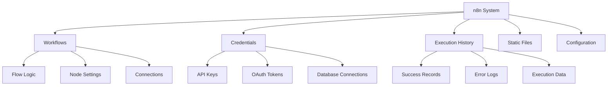

## The Philosophy of Backing Up Automation Systems

An uncomfortable truth: your n8n workflows will fail. Not because n8n is unreliable, but because the real world is messy. APIs go down, databases crash, servers lose power, and sometimes someone accidentally deletes that critical workflow that processes millions in transactions.

The question isn't *if* you'll need backups - it's *when* you'll need them and how much pain you'll experience when that moment comes.

## Understanding What Actually Needs Backing Up

Before diving into strategies, you need to understand what makes up your n8n system. It's about understanding the anatomy of your automation infrastructure, not just copying files.

### The Five Pillars of n8n Data



**Each pillar has different characteristics:**

1. **Workflows**: Your business logic - absolutely critical, changes frequently
2. **Credentials**: Sensitive data - needs encryption, changes rarely
3. **Execution History**: Audit trail - large volume, may be regulated
4. **Static Files**: Binary data - can be large, versioning challenges
5. **Configuration**: System settings - critical for recovery, often overlooked

Understanding these distinctions drives your backup strategy. You might backup workflows hourly but credentials only daily. Execution history might go to cold storage while workflows stay hot.

## The Economics of Backup Strategies

### RPO vs RTO: The Fundamental Trade-off

Every backup strategy balances two competing forces:

- **Recovery Point Objective (RPO)**: How much data can you afford to lose?
- **Recovery Time Objective (RTO)**: How long can you afford to be down?

The cruel reality: better RPO and RTO cost more money. A lot more.

```
Continuous replication (RPO: seconds, RTO: minutes)
  = $$$$ (expensive)

Hourly snapshots (RPO: 1 hour, RTO: 30 minutes)
  = $$ (moderate)

Daily backups (RPO: 24 hours, RTO: 2 hours)
  = $ (cheap)
```

**The Strategy Decision Framework:**

Ask yourself:
1. What's the cost per hour of downtime? (Lost revenue, reputation, penalties)
2. What's the cost per hour of data loss? (Re-work, compliance issues)
3. What's your budget for backup infrastructure?

A payment processor might need RPO of minutes and RTO of seconds. An internal reporting system might tolerate RPO of days and RTO of hours. Know your requirements before choosing your strategy.

## Database Backup Strategies: Beyond the Basics

### Strategy 1: The Simple Snapshot

The most straightforward approach - periodically dump your entire database.

**When This Works:**
- Small to medium databases (< 10GB)
- Can tolerate some data loss
- Simple recovery requirements

**The Approach:**
```
Every N hours:
1. Lock database briefly (or use consistent snapshot)
2. Dump entire database to file
3. Compress and store
4. Rotate old backups
```

**Why It Eventually Breaks:**
- Backup time grows linearly with data
- Recovery time can be hours for large databases
- All-or-nothing recovery (can't restore just workflows)

### Strategy 2: Continuous Archiving (WAL/Binary Logs)

Instead of periodic snapshots, continuously capture every change.

**When This Works:**
- Large databases
- Need point-in-time recovery
- Can't afford long recovery times

**The Approach:**
```
Continuously:
1. Archive transaction logs as they're written
2. Keep base backup + all logs since then
3. For recovery: restore base + replay logs to specific point

PostgreSQL: WAL archiving
MySQL: Binary log shipping
```

**The Trade-offs:**
- More complex setup
- Requires more storage (base + lots of logs)
- Enables precise recovery ("restore to 3:47 PM yesterday")

### Strategy 3: The Hybrid Approach

Combine snapshots with continuous archiving for the best of both worlds.

**The Smart Implementation:**
```
Weekly: Full database backup
Daily: Differential backup (changes since weekly)
Continuous: Transaction log archiving
```

This gives you multiple recovery options:
- Recent failure: Use logs (fast)
- Yesterday's failure: Use daily differential
- Corrupted database: Use weekly full backup

## Workflow Backup: It's Not Just About the JSON

Workflows are your business logic, but backing them up isn't as simple as copying JSON files.

### The Versioning Challenge

Consider this scenario:
```
Monday: Deploy workflow v1
Tuesday: Update to v2
Wednesday: Update to v3
Thursday: v3 causes issues
Friday: Need to restore to v2
```

**Simple file backup fails here** - you need version history, not just the latest state.

### Intelligent Workflow Backup Strategy

**Level 1: Capture Everything**
- Export all workflows via API
- Include metadata (active state, tags, categories)
- Preserve relationships and dependencies

**Level 2: Add Intelligence**
```javascript
// Conceptual approach, not literal code
for each workflow:
  calculate_hash(workflow_content)
  if hash_changed_since_last_backup:
    backup_workflow()
    store_version_metadata()
  track_relationships(workflow_dependencies)
```

**Level 3: Semantic Versioning**
- Track meaningful changes vs cosmetic ones
- Group related workflow changes
- Enable rollback of feature sets, not just individual workflows

### The Credentials Conundrum

Credentials are your most sensitive data, yet they're often backed up incorrectly (or not at all).

**Common Mistakes:**
- Backing up credentials in plain text (security disaster)
- Not backing them up at all (recovery disaster)
- Backing up encrypted but losing the key (permanent disaster)

**The Secure Strategy:**
```
1. Credentials stay encrypted at rest (always)
2. Backup includes encrypted credentials + key derivation info
3. Master key stored separately (HSM, key management service)
4. Test recovery regularly (encrypted backups you can't decrypt are worthless)
```

## Disaster Recovery: When Everything Goes Wrong

### The Disaster Recovery Playbook

Real disaster recovery isn't about having backups - it's about having a tested, documented process that scared, stressed people can execute at 3 AM.

**The Four Phases of Recovery:**

**Phase 1: Assessment (First 15 minutes)**
- What's broken? (Database? Server? Network?)
- What's the impact? (All workflows? Specific ones?)
- What's our recovery option? (Failover? Restore? Rebuild?)

**Phase 2: Communication (Concurrent with Phase 1)**
- Notify stakeholders
- Set expectations for recovery
- Establish communication cadence

**Phase 3: Recovery Execution**
```
Priority Order:
1. Core infrastructure (database, network)
2. Critical workflows (revenue-generating, compliance)
3. Important workflows (operational efficiency)
4. Nice-to-have workflows (internal tools)
```

**Phase 4: Validation**
- Test critical workflows with real data
- Verify integrations are functional
- Check for data consistency

### Recovery Strategies by Failure Type

**Database Corruption**
```
Strategy: Restore from backup + replay logs
Fallback: Restore last known good full backup
Last Resort: Rebuild from workflow exports
```

**Complete Server Failure**
```
Strategy: Failover to standby
Fallback: Restore to new infrastructure
Last Resort: Rebuild manually
```

**Accidental Deletion**
```
Strategy: Point-in-time recovery
Fallback: Restore from most recent backup
Last Resort: Recreate from documentation
```

**Ransomware/Security Breach**
```
Strategy: Restore from isolated, verified backups
Critical: Ensure backups weren't compromised
Required: Full security audit before restoration
```

## Monitoring and Health Checks: Preventing Disasters

The best disaster recovery is disaster prevention. Build early warning systems to catch problems before they escalate.

### The Health Check Hierarchy

**Level 1: Is it running?**
- Service responding to requests
- Database connections working
- Basic heartbeat check

**Level 2: Is it working correctly?**
- Test workflows executing successfully
- Queue processing normally
- Resource usage within bounds

**Level 3: Is it healthy for the long term?**
- Disk space trends
- Database growth rates
- Error rate patterns
- Performance degradation

### Building Effective Health Checks

**The Anti-Pattern:**
```
// Don't do this
if (service.isUp()) return "healthy"
```

**The Effective Pattern:**
```
// Conceptual approach
health_status = {
  database: check_database_connection_and_query_time(),
  disk_space: check_available_space_vs_growth_rate(),
  critical_workflows: test_execute_canary_workflows(),
  queue_depth: measure_backlog_vs_processing_rate(),
  recent_errors: analyze_error_patterns()
}

if any_critical_failing(health_status):
  trigger_alert()
  initiate_auto_remediation()
```

## Maintenance Strategies: Keeping the System Healthy

### The Maintenance Paradox

The more critical your system, the less downtime you can afford for maintenance. Yet the more critical your system, the more maintenance it needs. This paradox drives maintenance strategy.

### Rolling Updates: The Zero-Downtime Approach

**The Strategy:**
```
Given 3 n8n instances behind a load balancer:
1. Remove instance A from rotation
2. Update instance A
3. Test instance A thoroughly
4. Return A to rotation
5. Repeat for B and C
```

**Why This Works:**
- Never lose capacity completely
- Can rollback instantly if issues arise
- Testing happens on production infrastructure

**The Hidden Complexity:**
- Requires stateless workflows or sticky sessions
- Database schema changes need special handling
- Version compatibility during transition period

### Database Maintenance: The Forgotten Necessity

PostgreSQL and MySQL don't maintain themselves. Without regular maintenance, that blazing fast database becomes a sluggish bottleneck.

**The Maintenance Hierarchy:**

**Daily: Automatic Operations**
- Update statistics (query planner optimization)
- Clear old logs
- Monitor growth trends

**Weekly: Light Maintenance**
- Vacuum/optimize frequently updated tables
- Archive old execution data
- Update indexes statistics

**Monthly: Deep Maintenance**
- Full vacuum/optimize (requires locks)
- Index rebuilding
- Partition management

**The Execution History Problem:**

n8n stores every execution. Over time, this becomes massive.

**Strategy Options:**
1. **Aggressive Deletion**: Delete all after 7 days
2. **Tiered Archival**: Hot (7 days) → Warm (30 days) → Cold (archived)
3. **Selective Retention**: Keep failures longer than successes

Choose based on your audit requirements and storage costs.

## Security Considerations in Backup Strategies

### The Security-Availability Trade-off

Secure backups are harder to restore. Available backups are easier to compromise. Finding the balance is crucial.

**The Spectrum:**
```
Maximum Security                          Maximum Availability
      ←----------------------------------------→
Offline, encrypted,                    Online, unencrypted,
multi-factor access                     single-click restore
(Slow recovery)                         (Fast recovery)
```

### Encryption Strategy for Backups

**Level 1: Encryption at Rest**
- All backup files encrypted on disk
- Protects against physical theft
- Transparent to backup/restore process

**Level 2: Encryption in Transit**
- TLS for all backup transfers
- Protects against network interception
- Critical for cloud backups

**Level 3: Application-Level Encryption**
- Encrypt sensitive data before backup
- Credentials double-encrypted
- Survives backup system compromise

### Access Control for Backup Systems

**The Principle of Least Privilege:**
- Backup process: Write-only access to backup storage
- Restore process: Read-only access to backups
- Deletion: Separate process with audit logging
- Testing: Isolated environment with scrubbed data

## Testing Your Backup Strategy: The Reality Check

### The Testing Pyramid

**Level 1: Backup Verification**
- Did the backup complete?
- Is the file valid?
- Can it be read?

**Level 2: Restore Testing**
- Can you restore to a test environment?
- Does the restored system start?
- Basic functionality working?

**Level 3: Disaster Simulation**
- Full recovery drill with timer
- Include communication procedures
- Rotate team members (bus factor)
- Document lessons learned

### The Chaos Engineering Approach

**Controlled Failure Testing:**
```
Month 1: Delete a workflow "accidentally"
Month 2: Corrupt database table
Month 3: Lose server completely
Month 4: Simulate ransomware
```

Each test reveals weaknesses in your strategy. Fix them before real disasters strike.

## Making Backup Decisions: A Practical Framework

### The Decision Tree

```
Start: How critical is this n8n instance?
│
├─ Mission Critical (revenue/compliance impact)
│  ├─ RPO < 1 hour needed?
│  │  ├─ Yes → Continuous replication + WAL archiving
│  │  └─ No → Hourly snapshots + daily archives
│  └─ RTO < 1 hour needed?
│     ├─ Yes → Hot standby + automated failover
│     └─ No → Automated restore procedures
│
├─ Business Important (efficiency impact)
│  ├─ Daily backups sufficient?
│  │  ├─ Yes → Automated daily backups to cloud
│  │  └─ No → Multiple daily snapshots
│  └─ Manual recovery acceptable?
│     ├─ Yes → Documented restore procedures
│     └─ No → Scripted recovery process
│
└─ Development/Testing
   └─ Weekly backups + workflow version control
```

### Cost-Benefit Analysis

**Calculate Your Real Costs:**
```
Backup Infrastructure Cost =
  Storage (GB/month) +
  Compute (backup processing) +
  Network (transfer costs) +
  Human (setup/maintenance time)

Downtime Cost =
  Lost revenue/hour +
  Recovery labor cost/hour +
  Reputation damage +
  Compliance penalties

If Downtime Cost > 10x Backup Cost:
  Invest in better backup strategy
```

## Common Pitfalls and How to Avoid Them

### Pitfall 1: "RAID is a Backup"
**Reality**: RAID protects against drive failure, not data corruption, deletion, or ransomware.
**Solution**: RAID for availability, backups for recovery.

### Pitfall 2: "We Test Backups by Checking File Size"
**Reality**: Corrupted backups can be the right size.
**Solution**: Actually restore and verify functionality.

### Pitfall 3: "All Our Backups are in AWS"
**Reality**: Single provider = single point of failure.
**Solution**: 3-2-1 rule: 3 copies, 2 different media, 1 offsite.

### Pitfall 4: "We'll Figure Out Recovery When We Need It"
**Reality**: Disasters don't wait for you to be ready.
**Solution**: Document and practice recovery procedures.

### Pitfall 5: "Incremental Backups Save Space"
**Reality**: Complex incremental chains increase recovery time and failure risk.
**Solution**: Balance space savings with recovery complexity.

## Building Your Backup Strategy: A Step-by-Step Approach

### Step 1: Assess Your Requirements
- What's your acceptable data loss? (RPO)
- What's your acceptable downtime? (RTO)
- What's your budget?
- What are your compliance requirements?

### Step 2: Design Your Architecture
- Choose backup types (full/incremental/continuous)
- Select storage locations (local/cloud/both)
- Plan network topology
- Design security measures

### Step 3: Implement Incrementally
- Start with basic daily backups
- Add automation and monitoring
- Implement versioning and retention
- Add advanced features (continuous archiving)

### Step 4: Test and Refine
- Regular restore tests
- Disaster simulations
- Performance monitoring
- Continuous improvement

### Step 5: Document Everything
- Backup procedures
- Restore procedures
- Decision rationale
- Contact information
- Escalation paths

## The Future of n8n Backup Strategies

As n8n evolves and your usage grows, your backup strategy must evolve too. Consider these emerging patterns:

### GitOps for Workflows
Version control workflows in Git, deploy via CI/CD. This provides:
- Version history built-in
- Branching for experimentation
- Code review for workflow changes
- Automatic backup via Git

### Infrastructure as Code
Define entire n8n infrastructure in code:
- Reproducible environments
- Disaster recovery becomes "apply terraform"
- Testing via ephemeral environments
- Version control for infrastructure

### Distributed n8n Architectures
Multiple n8n instances with shared state:
- Geographic distribution
- Automatic failover
- Load balancing
- Reduced single points of failure

## Key Takeaways

1. **Backups are Insurance**: You hope to never need them, but you'll be grateful when you do
2. **Test Recovery, Not Just Backup**: A backup you can't restore is worthless
3. **Automate Everything**: Manual processes fail when you need them most
4. **Document for Your Future Stressed Self**: Clear, simple procedures save precious time
5. **Evolution, Not Revolution**: Start simple, improve continuously

Remember: The best backup strategy is the one that's actually implemented and tested. Start with something basic that works, then improve it over time. Perfect is the enemy of good when it comes to disaster recovery.

## Next Steps

<CardGroup cols={2}>
  <Card title="Production Deployment" href="./production-deployment" icon="rocket">
    Deploy n8n at scale
  </Card>
  <Card title="API Development" href="./api-integration" icon="code">
    Build on n8n's API
  </Card>
</CardGroup>