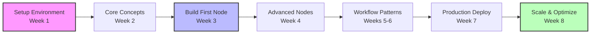

## Overview

<Info>
**What will I learn in this course?**
Transform from an n8n user into an n8n developer - build custom nodes, deploy production systems, and architect enterprise-grade automation workflows. This course teaches you to extend n8n as a platform, not just use it as a tool.
</Info>

Most n8n tutorials teach you how to drag and drop nodes. This course teaches you how to build them.

You'll learn to see n8n as a powerful platform you can extend and customize to solve any integration challenge - whether building internal tools, creating automation products for clients, or developing SaaS integration strategies.

## What You'll Learn

<Info>
**Course curriculum overview**
Master self-hosting, custom node development, advanced workflow patterns, and DevOps integration through hands-on projects and real-world patterns from production deployments.
</Info>

<CardGroup cols={2}>
  <Card title="Self-Hosting Mastery" icon="server">
    Deploy and manage your own n8n instances with confidence
  </Card>
  <Card title="Custom Node Development" icon="code">
    Create tailored nodes for your specific business needs
  </Card>
  <Card title="Advanced Workflows" icon="network-wired">
    Design complex, production-grade automation systems
  </Card>
  <Card title="DevOps Integration" icon="infinity">
    Implement CI/CD, backups, and monitoring strategies
  </Card>
</CardGroup>

## What Makes This Different

<Info>
**Course approach**
Developer-first methodology with production-ready patterns, code-centric learning, and battle-tested architectural strategies from real deployments handling millions of executions.
</Info>

This course focuses on:

- **Developer-first approach** - Learn n8n as a platform to build on, not just use
- **Production readiness** - Real-world deployment and scaling strategies
- **Code-centric learning** - Write TypeScript, create custom nodes, extend functionality
- **Architecture patterns** - Design maintainable, scalable workflow systems

## Hands-On Projects

<Info>
**What you'll build**
Custom nodes, data processors, CRM integrations, and production-ready deployments - practical solutions you can use immediately in client work or your own projects.
</Info>

### Project 1: HTTP Bin Node

Build your first custom node from scratch:
- Understand node structure and lifecycle
- Configure development environment with hot-reloading
- Implement HTTP requests with authentication
- Add error handling and retry logic
- Test, package, and distribute your node

### Project 2: Data Processor Node

Create a production-grade data transformation node:
- Handle multiple input types (JSON, CSV, XML)
- Implement streaming for large datasets
- Build custom transformation functions
- Design user-friendly configuration UI
- Add error recovery and comprehensive logging

### Project 3: Custom CRM Integration

Build a complete integration with real business value:
- Connect proprietary systems without waiting for official support
- Enforce business logic at the integration layer
- Create reusable components for complex workflows
- Implement proper error handling and monitoring

## Course Curriculum

<Info>
**Lesson structure**
4 lessons available now covering setup through production deployment, with 5 advanced lessons coming soon on architecture, security, and enterprise scaling.
</Info>

### Available Lessons

#### Lesson 1: Setting Up Your Development Environment

Deploy n8n using multiple strategies - Railway for production speed, Docker for containerization, and local setup for development control. Learn environment configuration, database selection, and CLI tools.

- Deploy n8n with Railway in under 5 minutes
- Master Docker & Docker Compose for consistent environments
- Configure n8n CLI for rapid development
- Choose between SQLite, PostgreSQL, and MySQL
- Understand environment variables and n8n configuration

#### Lesson 2: Building Custom n8n Nodes

Write TypeScript code to create custom nodes from scratch. Build production-grade nodes with proper error handling, authentication, and testing.

- Node architecture and execution lifecycle
- Create your first HTTP Bin node
- Build advanced Data Processor node
- Implement custom credentials
- Test and debug nodes effectively
- Package and publish to npm

#### Lesson 3: Advanced Workflow Patterns

Design scalable, maintainable workflow architectures using battle-tested patterns from production systems.

- Core workflow architecture principles
- Error recovery with retry logic
- Batch processing with pagination
- Event-driven architecture
- State machine implementation
- Dynamic workflow generation
- Parallel processing and optimization

#### Lesson 4: Backup, Recovery & Maintenance

Protect your automation infrastructure with comprehensive backup strategies and monitoring systems.

- Database backup strategies (PostgreSQL/MySQL)
- Automated workflow exports
- Disaster recovery procedures
- Health monitoring and alerting
- Rolling updates without downtime
- Security best practices

### Coming Soon

#### Lesson 5: n8n Architecture Deep Dive
- How n8n works under the hood
- Queue management with Redis
- Worker processes and scaling
- Execution modes explained

#### Lesson 6: Advanced Node Development
- Webhook nodes
- Polling triggers
- OAuth implementation
- Complex credential types
- File handling in nodes

#### Lesson 7: Production Deployment
- Kubernetes deployment
- Auto-scaling strategies
- Load balancing
- High availability setup

#### Lesson 8: API Development
- Using n8n's REST API
- Building external integrations
- Webhook security
- Rate limiting

#### Lesson 9: Security & Compliance
- Credential encryption
- Network security
- Access control
- GDPR compliance
- Audit logging

## Prerequisites

<Info>
**What you need to know**
Basic JavaScript/TypeScript, API fundamentals, and command line usage. Docker knowledge helps but isn't required - we'll teach you what you need.
</Info>

- Basic JavaScript/TypeScript knowledge
- Familiarity with APIs and HTTP
- Command line basics
- Docker fundamentals (helpful but not required)

## Required Tools

<Info>
**Development setup**
Node.js 18+, Docker Desktop, code editor (VS Code recommended), and Git. PostgreSQL or MySQL optional for advanced lessons.
</Info>

- Node.js 18+ and npm/yarn
- Docker Desktop
- VS Code or preferred IDE
- Git
- PostgreSQL or MySQL (optional)

## Course Structure

<Info>
**8-week learning path**
Four phases: Foundation (setup and architecture), Node Development (custom nodes), Advanced Workflows (patterns and optimization), Production Systems (deployment and scaling).
</Info>

### Phase 1: Foundation (Weeks 1-2)
Understand n8n's architecture and deploy multiple ways - locally, Docker, and Railway. Each deployment method teaches crucial concepts about how n8n operates in different contexts.

### Phase 2: Node Development (Weeks 3-4)
Build three progressively complex custom nodes:
- **HTTP Bin Node** - Basics of node structure, TypeScript patterns, and execution model
- **Data Processor** - Complex transformations, streaming, and professional UIs
- **Custom Credentials** - Secure authentication systems and organization infrastructure

### Phase 3: Advanced Workflows (Weeks 5-6)
Architect sophisticated workflow patterns with custom nodes:
- Error recovery pipelines that self-heal
- Event-driven systems that scale automatically
- State machines for complex business processes
- Performance optimization for millions of executions

### Phase 4: Production Systems (Weeks 7-8)
Learn what it takes to run n8n at scale:
- Comprehensive backup and recovery strategies
- Monitoring and alerting systems
- High-availability architectures
- Multi-tenant deployments for SaaS applications

## Major Projects

<Info>
**Capstone projects**
Four complete systems: custom CRM integration, ETL data pipeline, monitoring dashboard, and multi-tenant deployment for enterprise use.
</Info>

Throughout the course, you'll build:

1. **Custom CRM Integration Node** - Connect proprietary CRM systems to n8n
2. **Data Pipeline** - ETL workflow for processing large datasets
3. **Monitoring Dashboard** - Track workflow performance and errors
4. **Multi-tenant Setup** - Deploy n8n for multiple teams/clients

## Time Commitment

<Info>
**Course duration**
8-10 weeks total, 5-7 hours per week. Self-paced with weekly milestones to track progress and ensure you stay on target.
</Info>

- **Total Duration**: 8-10 weeks
- **Weekly Time**: 5-7 hours
- **Format**: Self-paced with weekly milestones

## Getting Started

<Info>
**First steps**
Begin with Lesson 1 to set up your development environment, then progress through the structured curriculum to become an n8n developer.
</Info>

Ready to become an n8n power developer? Start with setting up your development environment.

<Card title="Start Lesson 1" href="./setup-environment" icon="play">
  Set up your n8n development environment
</Card>

## Frequently Asked Questions

### Is this course suitable for beginners to n8n?

This course assumes you have basic n8n knowledge and want to advance to development. If you're completely new to n8n, start with our basic automation courses first to understand workflows and nodes.

### How hands-on is this course?

Very hands-on. You'll be writing code, deploying infrastructure, and building real projects from day one. Theory is kept to a minimum - we focus on practical skills you can apply immediately.

### Can I take this course if I only know basic JavaScript?

Yes, but you'll need to be comfortable learning as you go. We'll introduce TypeScript concepts as needed, but prior JavaScript experience is essential for success.

### Will I learn to deploy n8n in production?

Absolutely. We cover multiple deployment strategies including Railway, Docker, Kubernetes, and cloud providers. You'll learn monitoring, scaling, and maintenance for production systems.

### Are the custom nodes I build shareable?

Yes, you'll learn to package and publish your custom nodes to npm so others can use them. We also cover contributing to the n8n community.

### What if I get stuck on a lesson?

You have multiple support channels: Discord community, weekly Q&A sessions, code reviews, and instructor office hours. No one learns alone.

### How current is the course content?

n8n evolves rapidly, and we update the course regularly. You'll learn current best practices and emerging patterns used in production today.

### Can I use what I learn for client projects?

Definitely. Many students use their new skills for consulting, building internal tools, or creating n8n-based products. The skills are immediately applicable to real-world projects.

### What's the difference between this and n8n's official documentation?

Our course provides structured learning with real projects, while documentation is reference material. We focus on patterns, best practices, and production concerns not covered in basic docs.

### Do you offer any certification upon completion?

While we don't offer formal certification, you'll have a portfolio of working projects and deep knowledge that demonstrates your n8n development expertise to employers or clients.