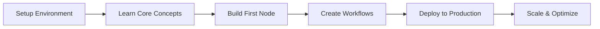

# n8n Developer Course

Master n8n from a developer's perspective - build custom nodes, create complex workflows, and deploy production-ready automation solutions.

## Course Objectives

<CardGroup cols={2}>
  <Card title="Self-Hosting Mastery" icon="server">
    Deploy and manage your own n8n instances with confidence
  </Card>
  <Card title="Custom Node Development" icon="code">
    Create tailored nodes for your specific business needs
  </Card>
  <Card title="Advanced Workflows" icon="network-wired">
    Design complex, production-grade automation systems
  </Card>
  <Card title="DevOps Integration" icon="infinity">
    Implement CI/CD, backups, and monitoring strategies
  </Card>
</CardGroup>

## What Makes This Course Different

This isn't just another n8n tutorial. We focus on:

- **Developer-first approach**: Learn n8n as a platform to build on, not just use
- **Production readiness**: Real-world deployment and scaling strategies
- **Code-centric learning**: Write TypeScript, create custom nodes, extend functionality
- **Architecture patterns**: Design maintainable, scalable workflow systems

## Course Modules

### Module 1: Foundation & Setup
- n8n architecture deep dive
- Self-hosting options (Docker, Kubernetes, bare metal)
- Database configuration (PostgreSQL, MySQL, SQLite)
- Environment configuration and security

### Module 2: Development Environment
- Setting up n8n for development
- TypeScript and Node.js essentials
- n8n CLI and development tools
- Testing workflows locally

### Module 3: Custom Node Development
- Node structure and lifecycle
- Building your first custom node
- Advanced node features (credentials, webhooks, polling)
- Publishing and distributing nodes

### Module 4: Advanced Workflows
- Workflow design patterns
- Error handling and retries
- Sub-workflows and workflow orchestration
- Performance optimization

### Module 5: Integration & APIs
- REST API mastery
- GraphQL integration
- Webhook handling
- OAuth implementation

### Module 6: Data & Storage
- Database operations
- File handling and processing
- Data transformation techniques
- Caching strategies

### Module 7: DevOps & Production
- CI/CD pipeline setup
- Backup and recovery strategies
- Monitoring and logging
- Scaling n8n horizontally

### Module 8: Security & Best Practices
- Credential management
- Network security
- Workflow access control
- Compliance considerations

## Prerequisites

- Basic JavaScript/TypeScript knowledge
- Familiarity with APIs and HTTP
- Command line basics
- Docker fundamentals (helpful but not required)

## Tools You'll Need

- Node.js 18+ and npm/yarn
- Docker Desktop
- VS Code or preferred IDE
- Git
- PostgreSQL or MySQL (optional)

## Learning Path

## Project-Based Learning

Throughout the course, you'll build:

1. **Custom CRM Integration Node**: Connect your proprietary CRM to n8n
2. **Data Pipeline**: ETL workflow for processing large datasets
3. **Monitoring Dashboard**: Track workflow performance and errors
4. **Multi-tenant Setup**: Deploy n8n for multiple teams/clients

## Time Commitment

- **Total Duration**: 8-10 weeks
- **Weekly Time**: 5-7 hours
- **Format**: Self-paced with weekly milestones

## Support & Community

- Private Discord channel for course participants
- Weekly Q&A sessions
- Code review and feedback
- Access to instructor's office hours

## Get Started

Ready to become an n8n power developer? Let's begin with setting up your development environment.

<Card title="Start Module 1" href="./setup-environment" icon="play">
  Set up your n8n development environment
</Card>