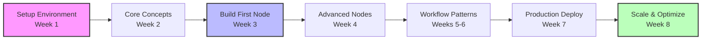

## How Does This Course Transform My n8n Skills?

<Info>
This course transforms you from an n8n user who drags and drops existing nodes into an n8n developer who builds custom nodes and extends the platform to solve any integration challenge.
</Info>

Most n8n tutorials teach you how to drag and drop nodes. This course teaches you how to build them. You'll learn to see n8n not just as an automation tool, but as a powerful platform you can extend and customize to solve any integration challenge.

Whether you're building internal tools for your team, creating automation products for clients, or developing a SaaS integration strategy, this course gives you the skills to leverage n8n at its full potential. We'll start with the fundamentals of self-hosting and gradually work our way up to building production-grade custom nodes and enterprise workflow architectures.

## Why Was This Course Created?

<Info>
This course exists to bridge the gap between using n8n and mastering it. The key difference is learning to extend n8n with custom code, transforming you from workflow builder to workflow architect.
</Info>

After years of working with n8n in production environments, we've seen the gap between using n8n and truly mastering it. The difference? Understanding how to extend n8n with custom code. This course bridges that gap, taking you from workflow builder to workflow architect.

## What Will I Learn in This Course?

<Info>
You'll master self-hosting, custom node development, advanced workflow patterns, and DevOps integration to become a complete n8n developer.
</Info>

<CardGroup cols={2}>
  <Card title="Self-Hosting Mastery" icon="server">
    Deploy and manage your own n8n instances with confidence
  </Card>
  <Card title="Custom Node Development" icon="code">
    Create tailored nodes for your specific business needs
  </Card>
  <Card title="Advanced Workflows" icon="network-wired">
    Design complex, production-grade automation systems
  </Card>
  <Card title="DevOps Integration" icon="infinity">
    Implement CI/CD, backups, and monitoring strategies
  </Card>
</CardGroup>

## How Is This Course Different from Other n8n Training?

<Info>
This course takes a developer-first approach, focusing on production readiness, code-centric learning, and architectural patterns rather than just basic usage.
</Info>

We focus on:

- **Developer-first approach**: Learn n8n as a platform to build on, not just use
- **Production readiness**: Real-world deployment and scaling strategies
- **Code-centric learning**: Write TypeScript, create custom nodes, extend functionality
- **Architecture patterns**: Design maintainable, scalable workflow systems

## What Real Projects Will I Build?

<Info>
You'll build practical solutions including custom nodes, data processors, CRM integrations, and production-ready deployments that you can use immediately in your work.
</Info>

Here's what you'll create in this course - real solutions you can use immediately:

### Your First Custom Node (Week 2)

Building your first node is a pivotal moment in your n8n journey. Here's exactly what we'll do:

1. **Understand the Node Structure**: Before writing any code, we'll explore how n8n nodes work internally - the lifecycle, the data flow, and the TypeScript patterns
2. **Set Up the Development Environment**: Configure your local n8n instance for node development with hot-reloading and debugging
3. **Create the HTTP Bin Node**: Start with a simple node that makes HTTP requests, teaching you the basics of properties, parameters, and execution
4. **Add Advanced Features**: Implement authentication, error handling, retry logic, and custom options
5. **Test and Debug**: Use n8n's built-in testing framework to ensure your node works reliably
6. **Package and Distribute**: Learn how to share your nodes with your team or the community

You'll understand *why* each piece of code exists and how to modify it for your own needs.

### The Data Processor Node (Week 3)

Once you've built your first node, we'll tackle something more complex:

- Handle multiple input types (JSON, CSV, XML)
- Implement streaming for large datasets
- Add custom transformation functions
- Create a configuration UI that non-developers can use
- Build in error recovery and logging

By the end of this lesson, you'll be able to create nodes that solve real business problems, not just tutorial examples.

## Why Are Custom Nodes So Important?

<Info>
Custom nodes unlock n8n's true potential by letting you integrate proprietary systems, enforce business logic, create reusable components, and build products on top of n8n's infrastructure.
</Info>

Most people don't realize that the built-in nodes are just the beginning. When you can build custom nodes, you can:

- **Integrate proprietary systems** without waiting for official support
- **Enforce business logic** at the integration layer
- **Create reusable components** that encapsulate complex workflows
- **Build products** on top of n8n's infrastructure

Instead of chaining 10 nodes together to process data, you can create one custom node that does exactly what you need, with proper error handling, logging, and performance optimization.

## What Lessons Are Included in the Course?

<Info>
The course includes both available lessons (setup, custom nodes, workflow patterns, backup strategies) and upcoming advanced topics (architecture deep dive, production deployment, security).
</Info>

### Available Now

#### Lesson 1: Setting Up Your Development Environment

The foundation of everything starts here. We'll explore multiple deployment strategies because each teaches you something different about n8n's architecture. Railway shows you the fastest path to production, Docker teaches you about containerization and dependencies, and local development gives you the control needed for serious node development.

**What you'll learn:**
- Deploy n8n with Railway in under 5 minutes (and understand what's happening behind the scenes)
- Master Docker & Docker Compose for consistent development environments
- Configure n8n CLI for rapid development and testing
- Understand environment variables and how they control n8n's behavior
- Choose between SQLite, PostgreSQL, and MySQL based on your scaling needs

#### Lesson 2: Building Custom n8n Nodes

This is the heart of the course. We start simple but quickly ramp up to professional-grade node development. You'll write actual TypeScript code, not just configuration files, and understand how n8n's execution engine processes your nodes.
- Understanding node architecture
- Creating your first custom node
- Building an HTTP Bin test node
- Advanced Data Processor node
- Custom credentials implementation
- Testing and debugging nodes
- Publishing nodes to npm

#### Lesson 3: Advanced Workflow Patterns
- Core workflow architecture principles
- Error recovery pipelines
- Batch processing with pagination
- Event-driven architecture
- State machine implementation
- Dynamic workflow generation
- Parallel processing patterns
- Performance optimization

#### Lesson 4: Backup, Recovery & Maintenance
- Database backup strategies (PostgreSQL/MySQL)
- Automated workflow exports
- Incremental backup implementation
- Disaster recovery procedures
- Health monitoring systems
- Rolling updates and maintenance
- Security best practices

### Coming Soon

#### Lesson 5: n8n Architecture Deep Dive
- How n8n works under the hood
- Queue management with Redis
- Worker processes and scaling
- Execution modes explained

#### Lesson 6: Advanced Node Development
- Webhook nodes
- Polling triggers
- OAuth implementation
- Complex credential types
- File handling in nodes

#### Lesson 7: Production Deployment
- Kubernetes deployment
- Auto-scaling strategies
- Load balancing
- High availability setup

#### Lesson 8: API Development
- Using n8n's REST API
- Building external integrations
- Webhook security
- Rate limiting

#### Lesson 9: Security & Compliance
- Credential encryption
- Network security
- Access control
- GDPR compliance
- Audit logging

## What Do I Need to Know Before Starting?

<Info>
You need basic JavaScript/TypeScript knowledge, API familiarity, and command line basics. Docker knowledge is helpful but not required.
</Info>

- Basic JavaScript/TypeScript knowledge
- Familiarity with APIs and HTTP
- Command line basics
- Docker fundamentals (helpful but not required)

## What Tools Do I Need for This Course?

<Info>
You'll need Node.js 18+, Docker Desktop, a code editor (VS Code recommended), Git, and optionally PostgreSQL or MySQL for advanced lessons.
</Info>

- Node.js 18+ and npm/yarn
- Docker Desktop
- VS Code or preferred IDE
- Git
- PostgreSQL or MySQL (optional)

## How Is the Course Structured?

<Info>
The course is structured in four phases over 8 weeks: Foundation (setup and architecture), Node Development (building custom nodes), Advanced Workflows (complex patterns), and Production Systems (scaling and monitoring).
</Info>

### Phase 1: Foundation (Weeks 1-2)
Start by understanding n8n's architecture and setting up a proper development environment. You'll deploy n8n multiple ways - locally, with Docker, and on Railway - so you understand the trade-offs of each approach. This isn't busywork; each deployment method teaches you something crucial about how n8n operates in different contexts.

### Phase 2: Node Development (Weeks 3-4)
This is where the course really differentiates itself. You'll build three progressively complex nodes:
- **HTTP Bin Node**: Learn the basics of node structure, TypeScript patterns, and n8n's execution model
- **Data Processor**: Handle complex data transformations, implement streaming, and create professional UIs
- **Custom Credentials**: Build secure authentication systems that integrate with your organization's infrastructure

### Phase 3: Advanced Workflows (Weeks 5-6)
With custom nodes in your toolkit, you'll architect sophisticated workflow patterns:
- Error recovery pipelines that self-heal
- Event-driven systems that scale automatically
- State machines for complex business processes
- Performance optimization techniques for handling millions of executions

### Phase 4: Production Systems (Weeks 7-8)
Finally, you'll learn what it takes to run n8n at scale:
- Implement comprehensive backup and recovery strategies
- Set up monitoring and alerting systems
- Design high-availability architectures
- Build multi-tenant deployments for SaaS applications

## What Projects Will I Complete?

<Info>
You'll complete four major projects: a custom CRM integration node, a data pipeline for large datasets, a monitoring dashboard, and a multi-tenant setup.
</Info>

Throughout the course, you'll build:

1. **Custom CRM Integration Node**: Connect your proprietary CRM to n8n
2. **Data Pipeline**: ETL workflow for processing large datasets
3. **Monitoring Dashboard**: Track workflow performance and errors
4. **Multi-tenant Setup**: Deploy n8n for multiple teams/clients

## How Much Time Does This Course Require?

<Info>
The course takes 8-10 weeks total, requiring 5-7 hours per week. It's self-paced with weekly milestones to track your progress.
</Info>

- **Total Duration**: 8-10 weeks
- **Weekly Time**: 5-7 hours
- **Format**: Self-paced with weekly milestones

## What Support Is Available?

<Info>
You get access to a private Discord channel, weekly Q&A sessions, code reviews, and instructor office hours for comprehensive support throughout the course.
</Info>

- Private Discord channel for course participants
- Weekly Q&A sessions
- Code review and feedback
- Access to instructor's office hours

## How Do I Get Started?

<Info>
Start by setting up your development environment in Lesson 1, then progress through the structured curriculum to become an n8n power developer.
</Info>

Ready to become an n8n power developer? Let's begin with setting up your development environment.

<Card title="Start Lesson 1" href="./setup-environment" icon="play">
  Set up your n8n development environment
</Card>

## Frequently Asked Questions

### Is this course suitable for beginners to n8n?

This course assumes you have basic n8n knowledge and want to advance to development. If you're completely new to n8n, start with our basic automation courses first to understand workflows and nodes.

### How hands-on is this course?

Very hands-on. You'll be writing code, deploying infrastructure, and building real projects from day one. Theory is kept to a minimum - we focus on practical skills you can apply immediately.

### Can I take this course if I only know basic JavaScript?

Yes, but you'll need to be comfortable learning as you go. We'll introduce TypeScript concepts as needed, but prior JavaScript experience is essential for success.

### Will I learn to deploy n8n in production?

Absolutely. We cover multiple deployment strategies including Railway, Docker, Kubernetes, and cloud providers. You'll learn monitoring, scaling, and maintenance for production systems.

### Are the custom nodes I build shareable?

Yes, you'll learn to package and publish your custom nodes to npm so others can use them. We also cover contributing to the n8n community.

### What if I get stuck on a lesson?

You have multiple support channels: Discord community, weekly Q&A sessions, code reviews, and instructor office hours. No one learns alone.

### How current is the course content?

n8n evolves rapidly, and we update the course regularly. You'll learn current best practices and emerging patterns used in production today.

### Can I use what I learn for client projects?

Definitely. Many students use their new skills for consulting, building internal tools, or creating n8n-based products. The skills are immediately applicable to real-world projects.

### What's the difference between this and n8n's official documentation?

Our course provides structured learning with real projects, while documentation is reference material. We focus on patterns, best practices, and production concerns not covered in basic docs.

### Do you offer any certification upon completion?

While we don't offer formal certification, you'll have a portfolio of working projects and deep knowledge that demonstrates your n8n development expertise to employers or clients.