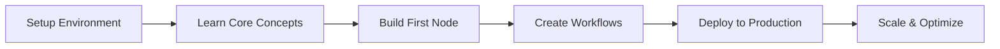

Master n8n from a developer's perspective - build custom nodes, create complex workflows, and deploy production-ready automation solutions.

## Course Objectives

<CardGroup cols={2}>
  <Card title="Self-Hosting Mastery" icon="server">
    Deploy and manage your own n8n instances with confidence
  </Card>
  <Card title="Custom Node Development" icon="code">
    Create tailored nodes for your specific business needs
  </Card>
  <Card title="Advanced Workflows" icon="network-wired">
    Design complex, production-grade automation systems
  </Card>
  <Card title="DevOps Integration" icon="infinity">
    Implement CI/CD, backups, and monitoring strategies
  </Card>
</CardGroup>

## What Makes This Course Different

This isn't just another n8n tutorial. We focus on:

- **Developer-first approach**: Learn n8n as a platform to build on, not just use
- **Production readiness**: Real-world deployment and scaling strategies
- **Code-centric learning**: Write TypeScript, create custom nodes, extend functionality
- **Architecture patterns**: Design maintainable, scalable workflow systems

## Course Lessons

### Available Now

#### Lesson 1: Setting Up Your Development Environment
- Deploy n8n with Railway (quickest method)
- Local development with Docker & Docker Compose
- n8n CLI setup and commands
- Environment variables and configuration
- Database setup (PostgreSQL/MySQL)

#### Lesson 2: Building Custom n8n Nodes
- Understanding node architecture
- Creating your first custom node
- Building an HTTP Bin test node
- Advanced Data Processor node
- Custom credentials implementation
- Testing and debugging nodes
- Publishing nodes to npm

#### Lesson 3: Advanced Workflow Patterns
- Core workflow architecture principles
- Error recovery pipelines
- Batch processing with pagination
- Event-driven architecture
- State machine implementation
- Dynamic workflow generation
- Parallel processing patterns
- Performance optimization

#### Lesson 4: Backup, Recovery & Maintenance
- Database backup strategies (PostgreSQL/MySQL)
- Automated workflow exports
- Incremental backup implementation
- Disaster recovery procedures
- Health monitoring systems
- Rolling updates and maintenance
- Security best practices

### Coming Soon

#### Lesson 5: n8n Architecture Deep Dive
- How n8n works under the hood
- Queue management with Redis
- Worker processes and scaling
- Execution modes explained

#### Lesson 6: Advanced Node Development
- Webhook nodes
- Polling triggers
- OAuth implementation
- Complex credential types
- File handling in nodes

#### Lesson 7: Production Deployment
- Kubernetes deployment
- Auto-scaling strategies
- Load balancing
- High availability setup

#### Lesson 8: API Development
- Using n8n's REST API
- Building external integrations
- Webhook security
- Rate limiting

#### Lesson 9: Security & Compliance
- Credential encryption
- Network security
- Access control
- GDPR compliance
- Audit logging

## Prerequisites

- Basic JavaScript/TypeScript knowledge
- Familiarity with APIs and HTTP
- Command line basics
- Docker fundamentals (helpful but not required)

## Tools You'll Need

- Node.js 18+ and npm/yarn
- Docker Desktop
- VS Code or preferred IDE
- Git
- PostgreSQL or MySQL (optional)

## Learning Path

## Project-Based Learning

Throughout the course, you'll build:

1. **Custom CRM Integration Node**: Connect your proprietary CRM to n8n
2. **Data Pipeline**: ETL workflow for processing large datasets
3. **Monitoring Dashboard**: Track workflow performance and errors
4. **Multi-tenant Setup**: Deploy n8n for multiple teams/clients

## Time Commitment

- **Total Duration**: 8-10 weeks
- **Weekly Time**: 5-7 hours
- **Format**: Self-paced with weekly milestones

## Support & Community

- Private Discord channel for course participants
- Weekly Q&A sessions
- Code review and feedback
- Access to instructor's office hours

## Get Started

Ready to become an n8n power developer? Let's begin with setting up your development environment.

<Card title="Start Lesson 1" href="./setup-environment" icon="play">
  Set up your n8n development environment
</Card>